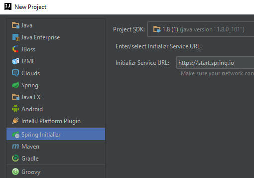
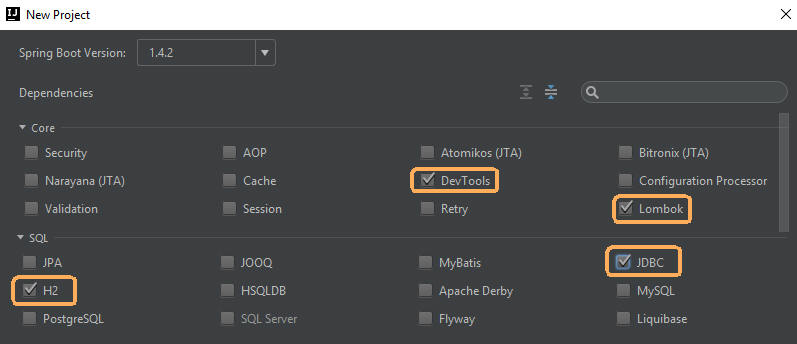
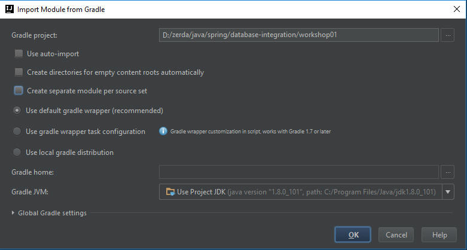

#Database Integration
There are several tools through which, with Spring, one can access data tables which take much of the effort out of defining and editing data in tables.  We review JPA which built upon Hibernate.

## Materials & Resources

### Training
| Material | Time |
|:---------|-----:|
|[Spring Boot to create a program with data base connectivity (Code Taming)](https://www.youtube.com/watch?v=oBqTpe5ciMo)|4:10|
|[JPA Spring (DotInterview)](https://youtu.be/IZfbg89KGRY) - terrible audio, but covers all the elements|7:09|
|[Accessing data with JPA (spring.io)](https://spring.io/guides/gs/accessing-data-jpa/) - we'll repeat this exercise in class|reading 10:00|
|[Accessing a relational DB (spring.io)](http://spring.io/guides/gs/relational-data-access/)|reading 15:00|
|[JPA with Lombok, MySql (Marinho)](https://www.youtube.com/watch?v=8FC_h1xuh-s) - we'll repeat this exercise in class also|45:00|

Recall previous units on ORM, SQL and Project Lombok.

### Optional
| Material | Time |
|:---------|-----:|
|[JpaRepository (Ubilife)](https://www.youtube.com/watch?v=PMMyTCjGFjI) - explain JpaRepository which extends CrudRepository, showing how a `public interface` is extended and then used to have create, update and find functionality. |18:51|
|[An Intro to Spring (SpringDeveloper/Olivier)](https://www.youtube.com/watch?v=jIae_pcG-9M)|1:27:19|
|[How to create a Spring Boot, REST &amp; JPA Project in IntelliJ (Michalski)](https://www.youtube.com/watch?v=I1ydigiZ25g)|8:00|
|[Spring Data JPA Query Definition Strategies (LeanStack)](https://www.youtube.com/watch?v=S5vZP_03ENY) - more on built-in Query building and manually defined queries (`@NamedQuery`).|24:29|
|[JdbcTemplate (spring.io)](http://docs.spring.io/spring-framework/docs/2.5.x/api/org/springframework/jdbc/core/JdbcTemplate.html) - catalogue of the different methods and data types available from the library|reference|
|[Database Access with MVC (Romanian.03)](https://www.youtube.com/watch?v=C3bNEz9opuU)|19:37|

## Review
- Hibernate - JPA extended from it; can be used to supply the DDL 
  - Cardinality: `@OneToOne`, `@OneToMany`, `@ManyToMany`
  - `@JoinColumn`
- H2
- CrudRepository
- JpaRepository  
  - data access layer
  - public interface ... extends JpaRepository (`object class`, `key data type`)  
  - adds pages
- JPA
  - @Entity
  - @Table (name = "&lt;name to use&gt;")
  - @Id
  - @Column
  - @GeneratedValue
    - (strategy=GenerationType.AUTO)
  - Generated Queries
    - FindBy########()
    - FindOne()
    - FindAll()
  - Generated Methods
    - save (T entity)
	- Iterable<T> save(Iterable <? extends T> entities)
	- exists (ID id)
	- count()
	- delete (ID id); delete (T entity), delete (Iterable <? extends T> entities), deleteAll()
- JDBC
  - batchUpdate()
  - query()
  - execute()
- @SpringBootApplication
  - @Configuration
  - @EnableAutoConfiguration
  - @ComponentScan

### Reminders from earlier lessons
- slf4j / aka Lombok
- LoggerFactory
- SQL
  - replacing values marked by `?`

### Additional
- `@NamedQuery`
  
## Workshops
We saw previously how to use the web-based Spring Tool Suite (STS) to build; in this series of W/S's will use the built-in, IntelliJ tool to talk to STS called Spring Initializr.  We'll use this to prepare the environment.

Start by creating a new project and choosing Spring Initializr:-

Next, you're generating a Gradle Project (note there're 2 Gradle options).  You should name it appropriately and set the group and package.

Depending upon the workshop's objectives, we're chosing
- DevTools
- Lombok (as that gives us messages to the console (CommandLineRunner and Logger (org.slf4j)).
- H2 which allows us to do SQL using the in-memory SQL Engine
- JDBC which allows us to talk to an SQL database, or 
- JPA which allows us to talk to an SQL database 

Lastly, we're generating this to use the gradle wrapper (giving us a Gradlew.bat and bootRun).  We specifically unticked "Create separate module per source set":

The Workshops are:-
- [Data Project with JDBC / Spring Boot Gradle build](./workshop/Workshop01.md) - using Spring Initialzr in IntelliJ to create a project, practice understanding JPA and using H2.
- [JPA with MySQL](./workshop/Workshop02.md)
- [JPA, MySQL and relationships between Objects](./workshop/Workshop03.md) - explore JPA 
- [JPA Querying with MySQL](./Workshop/Workshop04.md)
- [Read data from MySQL using JDBC](./Workshop/Workshop05.md) 

#Links
- [Parent - Java Spring](../README.md)
- [Prev - Beans (IoC)](../ioc-bean/README.md)
- [Next - Project](../project-calorie/README.md)
