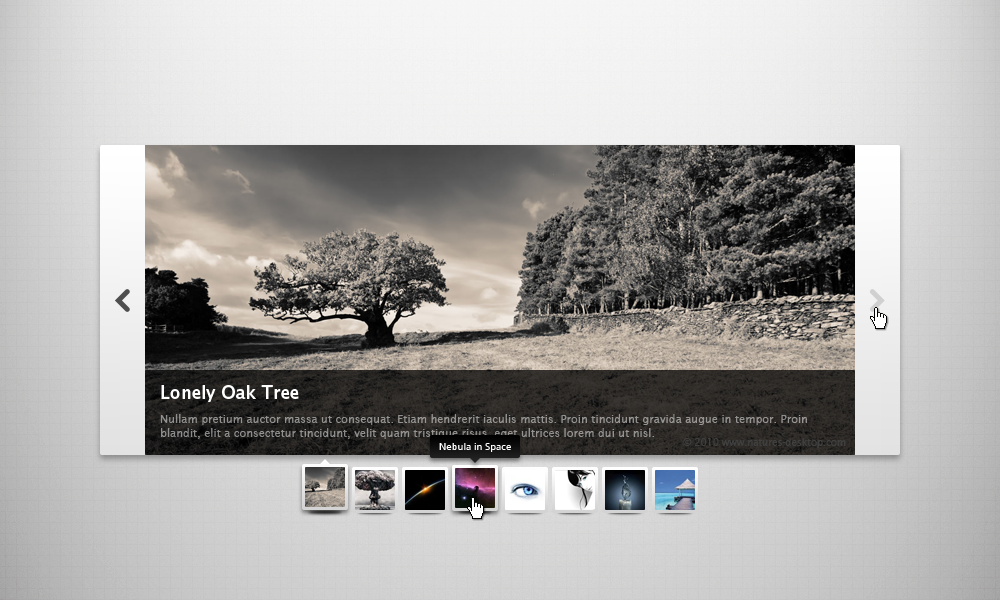

# JavaScript image slider

## Project
Image slider

## Demo description
Create a fully functional image gallery using HTML, CSS and JavaScript

[Arrow asset](slider.png)

### User stories
- As it is an image gallery, it should look nice, the design should be very similar to the example above. Plus, it should have a title as well.   
- Main block: Here should appear the currently picked photo in a bigger size. On its bottom, there should be a half-transparent box with title and description.
- At first, the first picture of our collection should appear in the main block, and the related thumbnail should be signed somehow (border/shadows etc.).
- By clicking on the arrow buttons on the sides, the content of the main block (so the photo and its description) chould change to the next's or the previous' of our collection. At the same time, the current thumbnail's outline/box-shadow should change.
- If your current photo is the last in our photo list: by clicking the next arrow, the first picture should be shown.
- It should behave the same way with the first photo of the list and the previous arrow button.
- By clicking on a thumbnail the user choose the related photo to be shown.
- The thumbnails' active state, and the currently showed picture, should behave syncronized with the arrow buttons.

**Extras**:
- If you hover any of the thumbnails the cursor should be a pointer.
- If you hover any of the thumbnail, a pop-up should appear whith the title of the picture.
- There could be 2 arrow buttons even for the thumbnail list, so that the thumbnail list could behave like a slider.
- The gallery can be controlled by the arrow keys.

## How to do dis?

### Plan ALL the things!
- Imagine what you have to do
- Create sketch-up(s)
- Design your code, what will be where
- Plan your functions and variables

### Create your own stories
- Not necessarily in gitub projects, but its a nice thing to do
- Break down the functions to simple ones, like:
    - Show the main image
    - Replace the main image with js
    - ...
