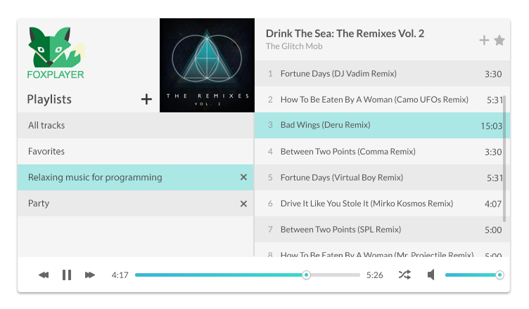

# Foxplayer (full stack project)

A browser based local music player

### [Full specification](specification.md)

# Project breakdown

A detailed birds-eye explanation and gudie how to proceed with the app development day by day.

## Day 1: Create experiments and build UI

### Stories

Save your prototype experiments in an `experiments` folder

#### The `<audio>` tag
- Learn about the <audio> tag:
	- https://www.sitepoint.com/essential-audio-and-video-events-for-html5/
	- https://developer.mozilla.org/en/docs/Web/Guide/Events/Media_events
	- https://www.w3.org/2010/05/video/mediaevents.html
- Create an Audio prototype in a separate HTML file
- Use this MP3 file: [Purple drift](music/Organoid_-_09_-_Purple_Drift.mp3)
- Add the following events: `load`, `start`, `end`, `progress`
- `console.log` the event name + "happened" to the console

#### Pick a slider library
- Use either:
	- https://refreshless.com/nouislider/examples/
	- https://github.com/Stryzhevskyi/rangeSlider
- Pick the one that you:
	- like the syntax more
	- think it's easier to modify
	- like the API better
- Style/skin it according to the design
- Create a separate HTML file to test out the slider
- You'll need to update the slider position programatically
- You'll use the slider to indicate the position of the track and set the volume

#### Create a modal dialog
- Use the [VEX modal library](http://github.hubspot.com/vex/docs/welcome/) to display a <select> element with 3 options of your choice
- Add a "Save track" and a "Cancel" button to it
- The "Save track" should be the primary button (blue)
- If the user presses the "Save track", console.log the value of the <select> input

#### Build the UI with HTML+CSS
- Center the app to the center of the page
- Responsivity is optional since it'll be a bit tricky to run this on mobile (yet)
- Connect the widgets from your experiments
- Use the assets from the `img` folder

## Day 2: Finalize UI and create a mock backend service

This day you'll work in pairs: https://www.agilealliance.org/glossary/pairing/

### Stories

#### Mock a backend service
- Check out the specification and create the saffolding of the backend using Express
- Mocking means that you have to crate a "fake" service, like `/tracks` that returns the expected format in JSON

#### Backend testing
- Write `tape` test that ensure that you indeed return the correct data structure with your API endpoints

#### Event listeners
- Add event listeners to all interactive parts of the UI accoring to the specification
- console.log that the events are successfully registered

#### Frontend AJAX calls 
- Create the AJAX calls to the mock backend service
	- Implement tests

#### Build the Audio object
- Wrap the following functionality to a function constructor:
	- Play audio
	- Pause audio
	- Load an MP3 file
	- Skip to percent (0 - 100%)
	- Sets the volume (0 - 100%)
- You can build an experiment on this and reuse the same file that contains the audio object later
- You can thank me for that later

#### Frontend testing
- Add unit testing to the audio object :)
- Use Mocha https://mochajs.org/

#### Create the playlist functionality
- This will be a model that stores your tracks
- First on the app initialization load all the playlists from the backend
- If the user clicks on one, update the tracks on the right
- The playlist should store a single list of tracks that can be played
- It should be responsible for playing the next track
	- Think of the shuffle feature
	- Think of the circular nature of the playlist

#### Follow the specification
- Read the specification and fill in the missing gaps

## Day 3: Database and functional REST API

### Stories

#### Design the database

Here's a suggested schema, implement it in MySQL

- You'll need two tables
	- Playlists
		- id: INT
		- playlist: TINYTEXT
		- system: TINYINT(1) // For the favorites functionality, default 0
	- Tracks
		- id: INT
		- path: TINYTEXT
		- playlist_id: INT

Insert the "Favorites" playlist by hand (like animals do) and set "system" to 1

#### REST API
- Implement the REST API [according to the specification](specification.md)
- For extracting ID3 tags from MP3 files, use https://github.com/leetreveil/musicmetadata

#### Run tests
- Run the tests you created yesterday (of course you did, didn't you?) ;)

## Day 4: Finalize frontend with live data

### Stories

#### Load track artwork from Last.fm
- Your API key is: `ee125f318852fc7d1c2f4e21458a0035`
- Use the `artist.getInfo` API method: http://www.last.fm/api/show/artist.getInfo
- On each track loading, request the band photo (large, square one)
- If the same artist is playing again, don't fetch a new API call
	- http://www.last.fm/api/tos
	- "You will implement suitable caching in accordance with the HTTP headers sent with web service responses. You will not make more than 5 requests per originating IP address per second, averaged over a 5 minute period, without prior written consent. You agree to cache similar artist and any chart data (top tracks, top artists, top albums) for a minimum of one week."

#### Close the gaps
- Check the frontend again
- Re-read the specification
- Check the frontend again
- Ask somebody from *another table* to test your app
- Check the frontend again

## Day 5: Polishing

### Stories

- have fun adding things like:
	- waveform visualization
	- more keyboard shortcuts
	- loading animation
	- animated fox head
	- YouTube support
	- Sorting tracks
	- Sorting tracks by drag and drop
	- etc.
