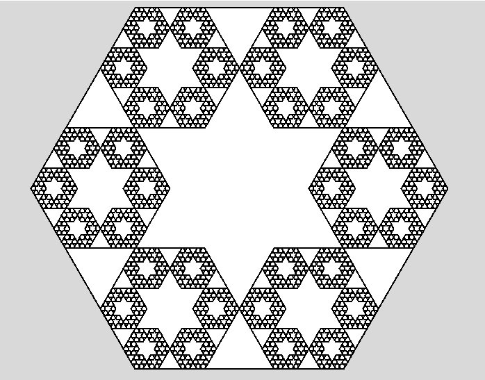

# Project: Fractals
Recreate this triangle fractal:

## Optional
Recreate this hexagonal fractal:

## Things to pay attention to
- Keep your functions clear and readable
- Name your functions and variables descriptively - eg. draw_triangle instead of recfn
- Separate different responsibilities into different functions -
eg. a function to draw one triangle, a function to calculate the triangle's position, etc.
- Use constants for reused values - eg. the size of the canvas, the ratio for the triangle's size, etc
