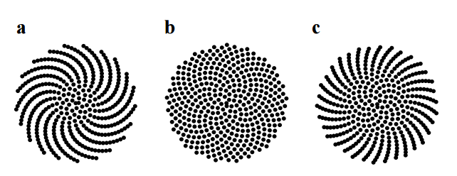

# Phyllotaxis spiral
*Cognitive apprenticeship material idea*

## Objectives
- Show them that already exciting thing could be built with the skillset they have learnt in the first days
- Show them a working summary of how and when we use functions, arrays, arraylists, function arguments, returning values
- By thinking out loud show them how we start to solve a problem, how we design the solution, how we break the task to smaller pieces
- Explain that simple code can simulate organic looking systems
- How to convert from polar to cartesian coordinate system

## Inspiration 

This outline is based on this *11min* video by Daniel Schiffmann: https://www.youtube.com/watch?v=KWoJgHFYWxY

## Materials
I used the following materials in this exercise:
- simple for loops
- math functions like `sin` and `cos`
- drawing an ellipse

## Live coding suggestions
### Before coding:
- Tell them the objectives
- Ask them to focus on the best practices, the ideas, the ways of thinking and NOT to understand the actual working of everything (it's not expected for them to be able to reproduce this right now)
- Ask them to keep attention, don't ask questions during the session, write notes about the things they learnt, noticed, we'll discuss these together after the live coding
- You can explain the math before coding, you have the time, the code is really simple

## Specification

### The angle

Show them the [`137.5` degree in Google images](https://www.google.hu/search?q=137.5+degrees&espv=2&source=lnms&tbm=isch&sa=X&ved=0ahUKEwjo9fzd4PzSAhVhM5oKHT3MBdoQ_AUICCgB&biw=1366&bih=638)

### Explain the math

 - What does it mean to convert from polar to cartesian?
 - Show the research paper: http://algorithmicbotany.org/papers/abop/abop-ch4.pdf

### Implement the conversion

 - The phyllotaxis equations describe the system in polar coordinates:
    - `angle = n * 137.5`
    - `r = c * sqrt(n)` 
    - `c` is a constant that massively affects the drawn image
 - Now that you have these, `n` will be the dot you can draw on the screen:
    - `x = r * cos(angle)`
    - `y = r * sin(angle)`

### Set up a canvas

 - Do whatever it takes to draw a circle at a given x, y position with a given size

### Make it rain

 - Use the converted coordinates to draw as many circles as you wish while incrementing `n`

