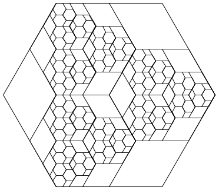

# Recursion
What happens when a function calls itself? [Learn more here]()

## Materials & Resources
| Material | Time |
|:---------|-----:|
| [Buckys C++ Programming Tutorials - 31 - Recursion](https://www.youtube.com/watch?v=4agL-MQq05E) | 8:18 |
| [C++ Programming [15] - Recursion (Factorials)](https://www.youtube.com/watch?v=AbxyL_r1cJQ)| 12:07 |
| [How Recursion Works](https://www.youtube.com/watch?v=ozmE8G6YKww) | 11:40 |
| [Data Structures Using C++: Illustration of Recursive Function Calls (Call Stack)](https://www.youtube.com/watch?v=k0bb7UYy0pY) | 6:47 |
| [Reverse a linked list using recursion](https://www.youtube.com/watch?v=KYH83T4q6Vs) | 8:54 |
| [Print elements of a linked list in forward and reverse order using recursion](https://www.youtube.com/watch?v=K7J3nCeRC80) | 14:23 |
| [Recursion basics - using factorial](https://www.youtube.com/watch?v=_OmRGjbyzno) | 8:40 |
| [Why recursion is not always good](https://www.youtube.com/watch?v=GM9sA5PtznY) | 8:26 |
| | |
| [Fractals](https://www.youtube.com/watch?v=WFtTdf3I6Ug) | |
| [Green Fox Teaching Materials on Recursion](https://github.com/greenfox-academy/teaching-materials/tree/master/python/recursion) | ∞ |

### Optional
*If you've got time and/or want to dig deeper, consider the following:*

| Material | Time |
|:---------|-----:|
| [Benoit BM Mandelbrot: Fractals and the art of roughness](https://www.ted.com/talks/benoit_mandelbrot_fractals_the_art_of_roughness?language=en) | 17:09 |


## Material Review
 - recursion

## Workshop

### Factorial with loop
```c_cpp
#include <iostream>

using namespace std;

int main()
{
    int counter = 1;
    int number = 10;

    int factorial = number;
    while (counter != number)
    {
        factorial = factorial * (number - counter);
        counter++;

    }

    cout << "The factorial of " << number << "! is: " << factorial << endl;
    return 0;
}
```

### Factorial with recursion
```c_cpp
#include <iostream.h>

int factorial(int);

void main(void) {
	int number = 10;

	cout << number << " factorial is: " << factorial(number) << endl;
}

int factorial(int number) {
	if (number == 1) {
        return 1;
    	}else {
        return number*factorial(number-1);
    	}
}
```

### Exercises
For the last 2 graphic exercise, you can use [draw.h](workshop/draw.h) & [draw.cpp](workshop/draw.cpp)!

- [1.cpp](workshop/1.cpp)
- [2.cpp](workshop/2.cpp)
- [3.cpp](workshop/3.cpp)
- [4.cpp](workshop/4.cpp)
- [5.cpp](workshop/5.cpp)
- [6.cpp](workshop/6.cpp)
- [7.cpp](workshop/7.cpp)
- [8.cpp](workshop/8.cpp)
- [9.cpp](workshop/9.cpp)
- [10.cpp](workshop/10.cpp)
- 11: reproduce this:   

- [12.cpp](workshop/12.cpp)
- 13: reproduce this:   

