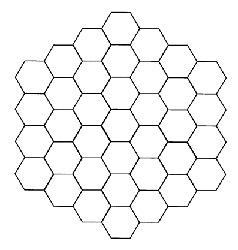

# Graphics in Python

## Objectives
* draw on a canvas using Tkinter

## Materials & Resources
| Material | Time |
|:---------|-----:|
| [Python GUI with Tkinter - 1 - Introduction](https://www.youtube.com/watch?v=RJB1Ek2Ko_Y&index=1&list=PL6gx4Cwl9DGBwibXFtPtflztSNPGuIB_d) | 8:37 |
| [Python GUI with Tkinter - 13 - Shapes and Graphics](https://www.youtube.com/watch?v=O12aT42okYE&list=PL6gx4Cwl9DGBwibXFtPtflztSNPGuIB_d&index=13) | 9:51 |
| [Python Tkinter Canvas docs](http://www.tutorialspoint.com/python/tk_canvas.htm) | |

### Optional
*If you've got time and/or want to dig deeper, consider the following:*

| Material | Time |
|:---------|-----:|
| [Canvas Widgets](http://www.python-course.eu/tkinter_canvas.php) | |

## Material Review
 - Tkinter
 - GUI
 - canvas
 - shapes
    - line
    - rectangle
    - polygon
    - oval
    - image
    - arc
 - options
    - height
    - width
    - bg
    - bd
    - fill

## Workshop
* cheatsheet for the tasks with all the canvas methods: http://www.python-course.eu/tkinter_canvas.php

### TKinter
```python
from tkinter import *

root = Tk()

# here goes the drawing part

root.mainloop()

```

### Canvas
```python
from tkinter import *

root = Tk()

canvas = Canvas(root, width='200', height='100')
canvas.pack()

teal_line = canvas.create_line(0, 0, 200, 50, fill='light sea green')
lime_box = canvas.create_rectangle(50, 50, 100, 90, fill='lime green')
olive_oval = canvas.create_oval(120, 10, 180, 90, fill='olive drab')

root.mainloop()
```

### Exercises

- [01 Middle lines](line-in-the-middle/line-in-the-middle.py)
- [02 Colored box](colored-box/colored-box.py)
- [03 Diagonals](diagonals/diagonals.py)
- [04 To the center](go-to-center/go-to-center.py)
- [05 Horizontal](horizontal-lines/horizontal-lines.py)


- [06 Square in the center](centered-square/centered-square.py)
- [07 Fill with rectangles](four-rectangles/four-rectangles.py)
- [08 Square positioning](position-square/position-square.py)
- [09 Centered boxes](center-box-function/center-box-function.py)
- [10 Rainbow boxes](rainbow-box-function/rainbow-box-function.py)


-
| [11 Purple steps](purple-steps/purple-steps.py) |
|:--------------:|
|  |
-
| [12 Purple steps 3d](purple-steps-3d/purple-steps-3d.py) |
|:--------------:|
|  |

- [13 Checkerboard](checkerboard/checkerboard.py)
- [14 Everything goes to center](function-to-center/function-to-center.py)

-
| [15 Line play](line-play/line-play.py) |
|:--------------:|
|  |

- [16 Line play quarters](line-play-quarters/line-play-quarters.py)
-
| [17 Envelope star](envelope-star/envelope-star.py) |
|:--------------:|
|  |

- [18 Connect the dots](connect-the-dots/connect-the-dots.py)
- [19 Starry night](starry-night/starry-night.py)

-
| [20 Triangles](triangles/triangles.py) |
|:--------------:|
|  |

-
| [21 Super Hexagon](super-hexagon/super-hexagon.py) |
|:--------------:|
|  |


## Individual Workshop Review
Please follow the style guide: [Google Python Style Guide](https://google.github.io/styleguide/pyguide.html)
