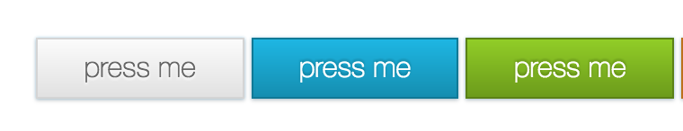

# Advanced CSS Colors & Styling

## Objectives
Get familiar with advanced CSS styling techniques through some CSS3 properties and values.

## Materials
| Material | Time |
|:---------|-----:|
| [CSS Tutorial For Beginners 47 - Color](https://www.youtube.com/watch?v=YYMCcm4EM2M) | 6:28 |
| [CSS Tutorial For Beginners 48 - Opacity](https://www.youtube.com/watch?v=tYXQHuoaihU) | 7:11 |
| [CSS Tutorial For Beginners 49 - CSS Gradients](https://www.youtube.com/watch?v=wTk4Wuckd0U) | 9:06 |
| [CSS Tutorial For Beginners 50 - Box Shadow](https://www.youtube.com/watch?v=Q1uowGztXGs) | 4:25 |
| [CSS Tutorial For Beginners 43 - Rounded Corners](https://www.youtube.com/watch?v=7WPgQVMayWI) | 7:20 |
| [CSS Tutorial For Beginners 20 - Hover, Active & Visited Effects](https://www.youtube.com/watch?v=XT2PFpOyDzY) | 4:17 |
| [CSS Tricks Almanac: Outline](https://css-tricks.com/almanac/properties/o/outline/) | |
| [CSS Tricks Almanac: Text-shadow](https://css-tricks.com/almanac/properties/t/text-shadow/) | |

## Material Review
 - colors
 - opacity
 - gradients
 - box-shadow
 - outline
 - text-shadow
 - border-radius

## Workshop
### Exercise: Fancy Buttons

- Build these buttons with HTML and CSS
- Give the buttons different mouseover states - the design is up to you!

## Individual Workshop Review
Please follow the styleguide: [Our HTML & CSS styleguide](../../styleguide/html-css.md)

- What HTML element did you use for the button and why?
- Are you sure you don't have unnecessary duplications in your code?
