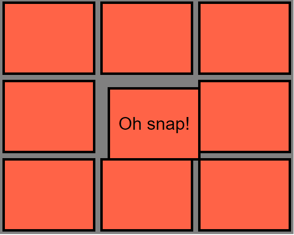

# CSS Layout
Practice layout and positioning with CSS

## Materials & Resources
- https://css-tricks.com/box-sizing/
- CSS positioning playlist: https://www.youtube.com/playlist?list=PL4cUxeGkcC9hudKGi5o5UiWuTAGbxiLTh
- CSS flex-box playlist: https://www.youtube.com/playlist?list=PL4cUxeGkcC9i3FXJSUfmsNOx8E7u6UuhG

### Optional
*If you've got time and/or want to dig deeper, consider the following:*
- https://css-tricks.com/all-about-floats/
- https://css-tricks.com/snippets/css/a-guide-to-flexbox/
- http://alistapart.com/article/css-positioning-101
- http://www.barelyfitz.com/screencast/html-training/css/positioning/

## Material Review
- box sizing
- display:
  - block
  - inline
  - inline-block
  - none
- float
- clear
- after, before
- clearfix
- vendor prefix
- position:
  - static
  - relative
  - absolute
  - fixed
- z-index
- flex-box
  - purpose
  - orientation
  - positioning
- overflow

## Workshop
Build these simple layouts in HTML and CSS

 - Create a separate directory for each exercise.
 - Make sure you are using the simplest selectors possible.
 - Avoid code duplication.
 - Use paint, gimp, or something similar to figure out the sizes and colors.
 - You can use any [lorem ipsum generator](http://mashable.com/2013/07/11/lorem-ipsum/#CMethzbNGkqX) for the texts, it is not necessary to have the same
 - Duck: 

### Exercise 1

### Exercise 2

 - It should be centered on the page.
 - It should have fixed width.
 - Consider the roles of the boxes:
   - Aqua (light blue): Header
   - Orange: Left sidebar (not main content)
   - Red: Main Content
   - Black: Fixed content on the bottom right of the Main content
   - Purple: Right sidebar (not main content)
   - Blue: Footer

### Exercise 3

 - It should be wall to wall with fluid width.
 - The sidebars should have fixed with.

### Exercise 4

 - You can reuse the 1st exercise as background

### Exercise 5

 - Pay attention to the spacing, it will help you eventually
 - The middle rectangle is intentionally off placed
 - Try different approaches to center text in the rectangles

### Exercise 6

 - Header should be fixed at the top
 - Use a class to highlight the active state in the navigation

## Individual Workshop Review
Please follow the styleguide: [Our HTML & CSS styleguide](../../styleguide/html-css.md)

- Did you create a separate directory for each exercise?
- How complex are your CSS selectors? Can you write a shorter one that still works?
- Are you sure you don't have unnecessary duplications in your code?
