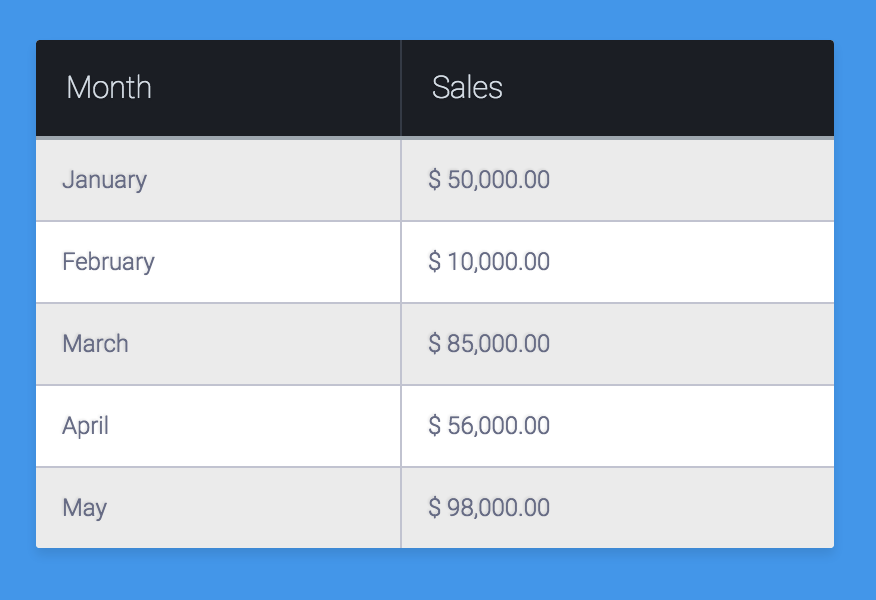

# HTML Tables

## Materials
| Material | Time |
|:---------|-----:|
| [Table element on MDN](https://developer.mozilla.org/en/docs/Web/HTML/Element/table) | |
| [CSS Tricks: A Complete Guide to the Table Element](https://css-tricks.com/complete-guide-table-element/) | |

## Material Review
- table
- border-collapse
- nth-child

## Workshop
### Exercise: Fancy Table

- Build this table with HTML and CSS

## Individual Workshop Review
Please follow the styleguide: [Our HTML & CSS styleguide](../../styleguide/html-css.md)

- What HTML element did you use for the button and why?
- Are you sure you don't have unnecessary duplications in your code?
