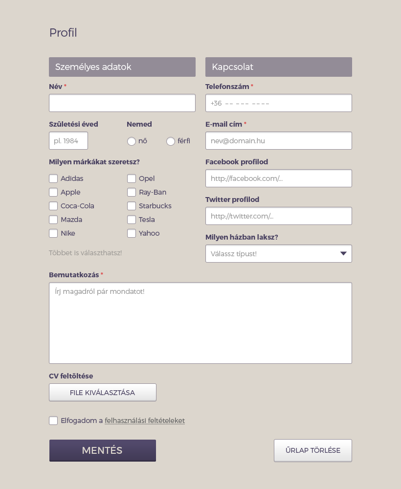

# HTML Forms

## Materials for this day
 - https://developer.mozilla.org/en-US/docs/Web/Guide/HTML/Forms/My_first_HTML_form
 - https://css-tricks.com/video-screencasts/99-overview-of-html5-forms-types-attributes-and-elements/
 - http://www.smashingmagazine.com/2011/11/extensive-guide-web-form-usability/

### Videos
| Material | Time |
|:---------|-----:|
| [Styling HTML 5 Forms #1 - Introduction](https://www.youtube.com/watch?v=HiHHvTcHiEk) | 6:26 |
| [Styling HTML 5 Forms #2 - Styling Radio Buttons](https://www.youtube.com/watch?v=hOU4Aqci2zs) | 6:58 |
| [Styling HTML 5 Forms #3 - Styling Checkboxes](https://www.youtube.com/watch?v=9mW9RDMF-wU) | 5:37 |
| [Styling HTML 5 Forms #4 - Styling Text Inputs](https://www.youtube.com/watch?v=3Bhrx2DumvI) | 6:18 |
| [Styling HTML 5 Forms #5 - Styling Select Boxes](https://www.youtube.com/watch?v=IPtyr11fjcI) | 3:37 |
| [Styling HTML 5 Forms #6 - Validation Styles](https://www.youtube.com/watch?v=nO94Y1YgQUo) | 6:05 |

#### [Full playlist](https://www.youtube.com/playlist?list=PL4cUxeGkcC9g5_p_BVUGWykHfqx6bb7qK)

## Assignment Review
 - `<form>` element
 - `action` attribute
 - `method` attribute
 - `<input>` element
 - `type` attribute
   - text
   - email
   - tel
   - number
   - date
   - search
   - color
   - range
 - `value` attribute 
 - `name` attribute
 - `<textarea>` element
 - `<label>` element
   - `for` attribute
 - custom attribures
   - placeholder
   - autofocus
   - maxlength
   - min, max, step
   - required
   - novalidation
 - submit
 - validation
 
## Workshop
 - Build a following design
 - Make sure you are using the simpliest selectors as possible.
 - Try to avoid code duplication.
 - Use paint, gimp, or something similar to figure out the sizes and colors.

[psd file](form.psd)

