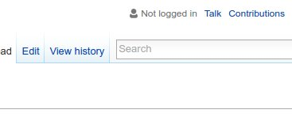
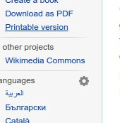
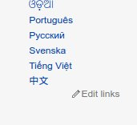
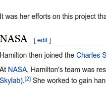
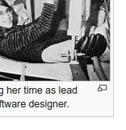
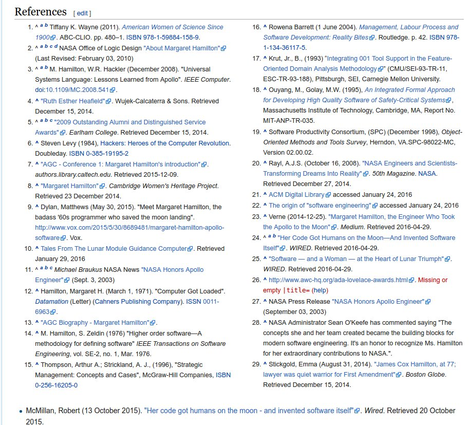
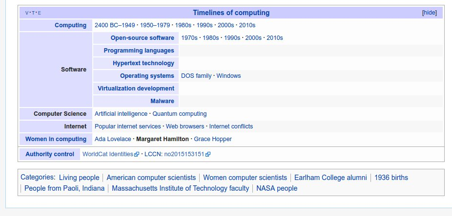
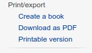
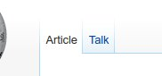

# Project: Wikipedia article
Build the [Margaret Hamilton Wikipedia page](https://en.wikipedia.org/wiki/Margaret_Hamilton_(scientist))

## How to get started
- Start by examining the page, figure out the biggest components
- Create a box for the Header, Main content, Sidebar and Footer
- Try to resize the browser window: Your version should resize and work the same way as the original (Except the resize of the sidebar, it can remain the same size)
- Figure out the component blocks in the Header, Main content, Sidebar and Footer, like: Logo, Navigations, Search bar, Infobox in the content, Footer links
- Create boxes for these as well and roughly do the positioning
- Fill these components with the right content
- Start to style these components (main colors, backgrounds, typography, paddings, borders and margins first)

### Optional details
Only start to work on these details if you are ready with everything else. **These are not mandatory!**

#### User icon

#### Gear icon

#### Edit links

#### Edit on headings

#### Full screen icon on images

#### References

#### Bottom table

#### Gradient border under sidebar boxes
(Normal border is enough)

#### Gradient border between top menu
(Normal border is enough)

