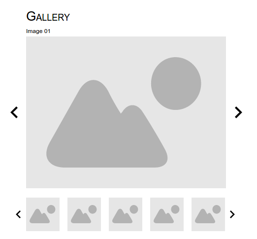
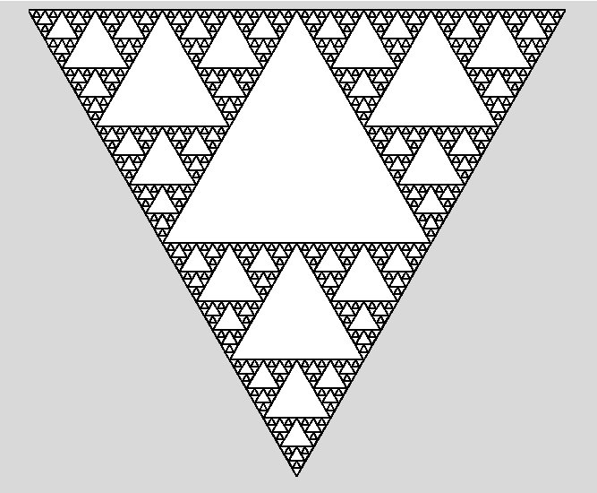

# Java GUI Project options

## Upgrade your TodoApp with GUI Simple version
- Create an input field for the text input
- Create Buttons for the Actions (Add, Remove, Complete)
- Create a TextArea where you list the Todos
- Basically just replace the Scanner input with the input fields content
- Place the method calls into the appropriate ActionListeners
- Always list everything in the text area, instead of souting
- After executed command empty the input field

## Simple image gallery
- Create a layout like this:

- Add 5 or more images to the project
- Add ActionListeners to the thumbnails and the Arrows

## Memory game
- Create a simple memory game with 4x4 or 6x6... images turned down
- Turn up two, if they are the same, remove them (or replace them with an empty image / `null`)
    - Don't consider animating, just switch the images
- You can use a GridLayout
- Create the images with ActionListener
    - You have to store the first turned image in a temp variable
    - Somehow you should identify if the previously turned (stored in the temp) is the same as the currently turned (which comes from the event)
    - Remove them, if they are the same
        - and also remove the ActionListener from the images (`.setActionListener(null)`)
    - Turn back, if not
    - Empty the temp variable

## Tic-tac-toe (3x3)
- Create a simple Tic-tac-toe game
- 3x3 Buttons or Labels with ActionListeners
- Somehow you should know if X or O is next, so when a button is clicked you can tell to replace it with an X or O
- after every turn you should check if the game is ended
    - is there a winner?
    - is it a draw?
- remove the ActionListener from the button (`.setActionListener(null)`), so in the next turns it cant be selected again

## Draw Fractals with Graphics
- With overriding the `paintComponent` method
- Create fractals using recursive functions

## Upgrade TodoApp with GUI Complicated version
- Full GUI
- Todos are in separate panels
    - Label for text description
    - Button for complete, remove
    - Completed todos shown somehow differently
- Panel for adding a new Todo
    - input field
    - Add button
    - Or even KeyListener for `ENTER` or `RETURN`
