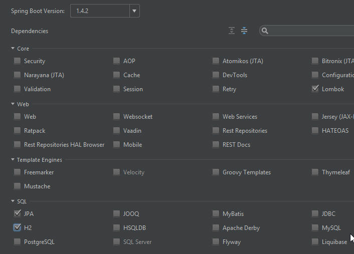

#Workshop03 - Spring Boot Gradle build for JPA

Similiar to Workshop01, we IntelliJ Spring Initilizr this time to build a JPA sample.  Using the code found in "[Accessing data using JPA (spring.io)](https://spring.io/guides/gs/accessing-data-jpa/)" we'll explore the use of `@Repository`, `@Entity` another data related Annotations.


## Set up the situation
Follow the steps as outlined in [Workshop01](.\workshop01.md), however this time, instead of JDBC, select JPA.


Copy over the following code (to save some time):
```java
package com.greenfox;
import java.util.List;
import org.springframework.data.repository.CrudRepository;

public interface CustomerRepository extends CrudRepository<Customer, Long> {
    List<Customer> findByLastName(String lastName);
}
```

```java
package com.greenfox;

import javax.persistence.Entity;
import javax.persistence.GeneratedValue;
import javax.persistence.GenerationType;
import javax.persistence.Id;

@Entity
public class Customer {

    @Id
    @GeneratedValue(strategy=GenerationType.AUTO)
    private Long id;
    private String firstName;
    private String lastName;

    protected Customer() {}

    public Customer(String firstName, String lastName) {
        this.firstName = firstName;
        this.lastName = lastName;
    }

    @Override
    public String toString() {
        return String.format(
                "Customer[id=%d, firstName='%s', lastName='%s']",
                id, firstName, lastName);
    }
}
```

```java
package com.greenfox;
import org.slf4j.Logger;
import org.slf4j.LoggerFactory;
import org.springframework.boot.CommandLineRunner;
import org.springframework.boot.SpringApplication;
import org.springframework.boot.autoconfigure.SpringBootApplication;
import org.springframework.context.annotation.Bean;

@SpringBootApplication
public class Application {

	private static final Logger log = LoggerFactory.getLogger(Application.class);

	public static void main(String[] args) {
		SpringApplication.run(Application.class);
	}

	@Bean
	public CommandLineRunner demo(CustomerRepository repository) {
		return (args) -> {
			// save a couple of customers
			repository.save(new Customer("Jack", "Bauer"));
			repository.save(new Customer("Chloe", "O'Brian"));
			repository.save(new Customer("Kim", "Bauer"));
			repository.save(new Customer("David", "Palmer"));
			repository.save(new Customer("Michelle", "Dessler"));

			// fetch all customers
			log.info("Customers found with findAll():");
			log.info("-------------------------------");
			for (Customer customer : repository.findAll()) {
				log.info(customer.toString());
			}
			log.info("");

			// fetch an individual customer by ID
			Customer customer = repository.findOne(1L);
			log.info("Customer found with findOne(1L):");
			log.info("--------------------------------");
			log.info(customer.toString());
			log.info("");

			// fetch customers by last name
			log.info("Customer found with findByLastName('Bauer'):");
			log.info("--------------------------------------------");
			for (Customer bauer : repository.findByLastName("Bauer")) {
				log.info(bauer.toString());
			}
			log.info("");
		};
	}
}
```

When you run this you'll get, ignoring the datetime, and source, the following:-

```
 Customers found with findAll():
 -------------------------------
 HHH000397: Using ASTQueryTranslatorFactory
 Customer[id=1, firstName='Jack', lastName='Bauer']
 Customer[id=2, firstName='Chloe', lastName='O'Brian']
 Customer[id=3, firstName='Kim', lastName='Bauer']
 Customer[id=4, firstName='David', lastName='Palmer']
 Customer[id=5, firstName='Michelle', lastName='Dessler']
 
 Customer found with findOne(1L):
 --------------------------------
 Customer[id=1, firstName='Jack', lastName='Bauer']
 
 Customer found with findByLastName('Bauer'):
 --------------------------------------------
 Customer[id=1, firstName='Jack', lastName='Bauer']
 Customer[id=3, firstName='Kim', lastName='Bauer']
 
```

As with the Workshop01 effort, using the Debugger, step through the process and understand what is happening, then answer the questions for yourself:-
- what causes the `CommandLineRunner demo` to run?  Hint: it has to do with the Bean Factory and how Beans are all created.
- what causes CustomerRepository to save the Customer data?  
- where is the data actually saved?  Hint, it's a temporary data store which disappears when the program ends.
- what does @Entity do?
- what does the @Id annotation tell Spring?
- what does @GeneratedValue mean?  What does the `(strategy=GenerationType.AUTO)` communicate?
- what does `findOne(1L)` mean?  What would happen is the value were 10L?
- where does the function `findByLastName` come from?
- on the fetch customers by last name, what is the variable called?  What is the field's actual name?
- what does `@SpringBootApplication` stand in for?  Where is the `@ComponentScan` directive?
- in a typical Java application, you'd have to write a class to implement `CustomerRepository`, why is it so minimal here?
- what is the `CrudRepository` that CustomerRepository extends?  What is "CRUD"?  What methods and fields does it contain?
- why in the `Customer.java` is the empty Constructor (aka `Customer(){}`) empty and protected?

## Exercise
## Exercise

To get some practice and a better understanding


# Links
[Next Workshop - ](../Workshop02.md)