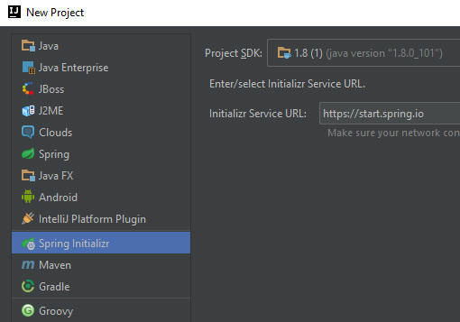
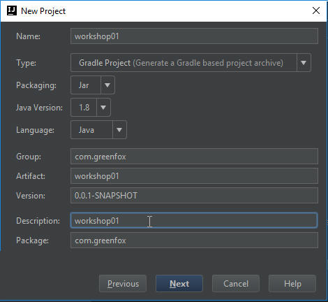
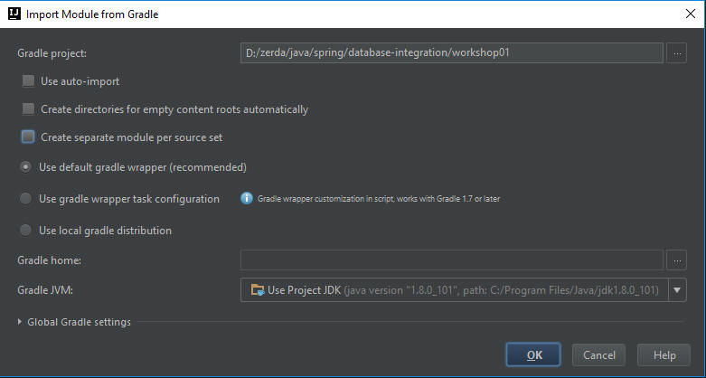

#Workshop01 - Data Project with JDBC / Spring Boot Gradle build

We saw previously how to use the web-based Spring Tool Suite (STS) to build; let's use the built-in, IntelliJ version to get a starter environment.

## Set up the situation
Start by creating a new project and choosing Spring Initializr:-


Next, you're generating a Gradle Project (note there're 2 Gradle options).  You should name it appropriately and set the group and package.


For this first effort, we're choosing 
- Lombok (as that gives us messages to the console (CommandLineRunner and Logger (org.slf4j)).
- H2 which allows us to do in memory SQL
- JDBC which allows us to talk to an SQL database


Lastly, we're generating this to use the gradle wrapper (giving us a Gradlew.bat and bootRun).  We specifically unticked "Create separate module per source set":


This will give us an environment where we can try out the source code found "[Guide: Relational DB access (spring.io)](http://spring.io/guides/gs/relational-data-access/)".  From there, you'll copy over 2 .java classes: Application.java and Customer.java.

You will have to resolve some of the references, and you will get one complaint which is unfounded (and perhaps already fixed in the latest version?) on the jdbcTemplate.  (Having [checked this](//http://stackoverflow.com/questions/26889970/intellij-incorrectly-saying-no-beans-of-type-found-for-autowired-repository), its an IntelliJ error).

You're now ready to test.

If you just run this the regular way ("RUN Window"), or go to the terminal and type `gradlew bootRun`, you'll get the following output:

```
2016-12-11 15:25:58.541  INFO 4152 --- [  restartedMain] com.greenfox.Application                 : Starting Application on EHOFER-PC with PID 4152 ... 2016-12-11 15:25:58.550  INFO 4152 --- [  restartedMain] com.greenfox.Application                 : No active profile set, falling back to default profiles: default
2016-12-11 15:25:58.639  INFO 4152 --- [  restartedMain] s.c.a.AnnotationConfigApplicationContext : Refreshing org.springframework.context.
2016-12-11 15:26:00.808  INFO 4152 --- [  restartedMain] o.s.b.d.a.OptionalLiveReloadServer       : LiveReload server is running on port 35729
2016-12-11 15:26:00.883  INFO 4152 --- [  restartedMain] o.s.j.e.a.AnnotationMBeanExporter        : Registering beans for JMX exposure on startup
```
which is then followed by messages from the logger telling you about data that was added to the DB.
```
2016-12-11 15:26:00.906  INFO 4152 --- [  restartedMain] com.greenfox.Application                 : Creating tables
2016-12-11 15:26:01.262  INFO 4152 --- [  restartedMain] com.greenfox.Application                 : Inserting customer record for John Woo
2016-12-11 15:26:01.264  INFO 4152 --- [  restartedMain] com.greenfox.Application                 : Inserting customer record for Jeff Dean
2016-12-11 15:26:01.264  INFO 4152 --- [  restartedMain] com.greenfox.Application                 : Inserting customer record for Josh Bloch
2016-12-11 15:26:01.265  INFO 4152 --- [  restartedMain] com.greenfox.Application                 : Inserting customer record for Josh Long
2016-12-11 15:26:01.315  INFO 4152 --- [  restartedMain] com.greenfox.Application                 : Querying for customer records where first_name = 'Josh':
2016-12-11 15:26:01.325  INFO 4152 --- [  restartedMain] com.greenfox.Application                 : Customer[id=3, firstName='Josh', lastName='Bloch']
2016-12-11 15:26:01.326  INFO 4152 --- [  restartedMain] com.greenfox.Application                 : Customer[id=4, firstName='Josh', lastName='Long']
2016-12-11 15:26:01.328  INFO 4152 --- [  restartedMain] com.greenfox.Application                 : Started Application in 3.248 seconds (JVM...
2016-12-11 15:26:01.335  INFO 4152 --- [       Thread-7] s.c.a.AnnotationConfigApplicationContext : Closing
2016-12-11 15:26:01.341  INFO 4152 --- [       Thread-7] o.s.j.e.a.AnnotationMBeanExporter        : Unregistering JMX-exposed beans on shutdown
```

## Step through the code
Using the debugger, set a break point at `jdbcTemplate.execute("DROP TABLE customers IF EXISTS");` and then step through the code to see what it's doing at every line.  Answer these questions:-
- `jdbcTemplate.execute("DROP TABLE customers IF EXISTS");` - what's happening
- `jdbcTemplate.execute("CREATE TABLE customers(` - again, what's happening
  - what is the datatype of `id`?  
  - what does `SERIAL` mean?
  
## Java 8 construct for quickly setting a collection  
```java
// Split up the array of whole names into an array of first/last names
	List<Object[]> splitUpNames = Arrays
	    .asList("John Woo", "Jeff Dean", "Josh Bloch", "Josh Long")
		.stream()
		.map(name -> name.split(" "))
		.collect(Collectors.toList());
```		

The comment explains the objective:-
- Fill `splitUpNames` with a list of Values that comes from the final step `.collect(Collectors.toList())`.  
- The list is first set up as 2 word pairs inside of parenthesises
- These are passed as a `stream` (so each word like "John Woo" is a separate token to `map` which can run a loop
- `map` uses a lambda (nameless) function that processes each value delivered by `stream` (recall that they are supplied as quoted tokens like "Jeff Dean") into 2 pieces (recall a Map has a Key and Value.  When the value is delivered by `stream`, the lambda refers to the temporary variable for the value delivered as `name` (of type String), and as String has a `split` function, in uses such to split values at the white space
- this is then converted to a list by `.collect()` who takes the output of `Collectors.toList() function

Think (don't do) about how this would have been written in what you already know in Java (don't spend more than 5 minutes on this!).

## Use Java 8 to stream to print out each tuple (means row of data)
`splitUpNames.forEach(name -> log.info(String.format("Inserting customer record for %s %s", name[0], name[1])));`

As we've now seen this Java 8 format, this should be a bit more reasonable:-
- splitUpNames - this is the set of couplets (that is a pair of data items such as "John" and "Woo")
- it has a `forEach` function, the same as you already know for(Object[] name: splitUpNames)
- `name` is the variable name given in the lambda (nameless function)
- in the loop that results, it's going to run `log.info` (like sout, but to where ever the `log` currently points)

This is what gives us the 4 messages earlier about `Inserting customer record for John Woo.

## jdbcTempalte batchUpdate
This does the SQL Insert.  As a batch, this function also loops through the rows in `splitUpNames`, inserting each pair individually.  And it runs as a *batch* meaning that all must go in, or else the sql command is aborted and the database is returned to its prior state.

## jdbcTemplate.query
```java
jdbcTemplate
  .query(
     "SELECT id, first_name, last_name FROM customers WHERE first_name = ?"
	 , new Object[] { "Josh" }
	 ,
		(rs, rowNum) 
		-> 
		new Customer(rs.getLong("id"), rs.getString("first_name"), rs.getString("last_name"))
    )
  .forEach(
     customer 
	 -> 
	 log.info(customer.toString())
	);
```

Split out above, we have:-
- `.query` this takes some sql and returns a RowMapper (found in the [jdbcTemplate guide](http://docs.spring.io/spring-framework/docs/2.5.x/api/org/springframework/jdbc/core/JdbcTemplate.html) in the Optional Materials; specifically the one that returns a `List`; and it must be a `List` as is followed by a `.forEach()` )
- the 2 fields it generates is a `rs` (a complex data type with column names that come from the database), and `rowNum` the row number.
- these are the inputs to another Java 8 Lambda which calls the `Customer` object which will be used to show the results
- `.forEach()` takes the data (which is now in an List<Customer>) and, putting them in a temporary variable aptly name `customer`, and calls the `customer` class's `toString()` function which is logged by `log.info`.

Demonstrate to yourself that you understand.
- how would you add the row number to the "output"?
- how would you query fro all customers whose name begins "J"?
- could you sout the data
- how would you rewrite the code just to hold last names?

  


# Links
[Next Workshop - ](../Workshop02.md)