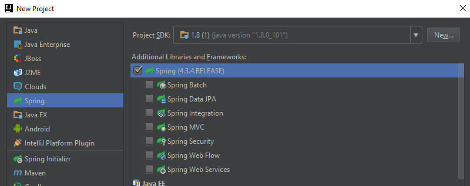

#Workshop01 - Bean Factory, getting started

Create the standard *Hello World*, ala Spring.  This will appear in your sout and not in a browser window.

To get this to work, when you start the project you need to be sure that you've informed IntelliJ that you're working with Spring.

This is explained [here (by jetbrains)](https://www.jetbrains.com/help/idea/2016.2/enabling-spring-support.html).  And we include a snapshot:-



Here, you need to inform the engine that you want to work with Spring; select only the top level.  You'll not need any of the extra libraries.

Create a package directory: `com.greenfoxacademy.java.lesson.beans`.

You'll need 2 classes
```java
package com.greenfoxacademy.java.lesson.beans;
public class HelloWorld {
    private String message;

    public void setMessage(String message){
        this.message  = message;
    }

    public void getMessage(){
        System.out.println("Your Message : " + message);
    }
}
```

```java
package com.greenfoxacademy.java.lesson.beans;
import org.springframework.context.annotation.*;

@Configuration
public class HelloWorldConfig {

    @Bean
    public HelloWorld helloWorld(){
        return new HelloWorld();
    }
}
```

And at the `src` level:-
```java
import com.greenfoxacademy.java.lesson.beans.*;
import org.springframework.context.ApplicationContext;
import org.springframework.context.annotation.*;

public class App {

    public static void main(String[] args) {
        ApplicationContext ctx =
                new AnnotationConfigApplicationContext(HelloWorldConfig.class);

        HelloWorld helloWorld = ctx.getBean(HelloWorld.class);

        helloWorld.setMessage("Hello World!");
        helloWorld.getMessage();
    }
}
```

Output, as pretty much expected:
```
RED STUFF
Hello World!
RED STUFF
```

# Links
[Next Workshop - ](../Workshop02.md)