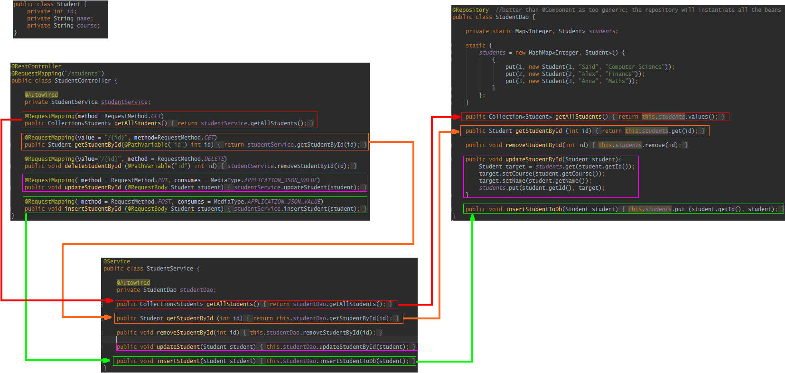

# Spring MVC - Workshop 01
This tutorial follows the video "[Learn Spring Boot (Djalas)](https://www.youtube.com/watch?v=Ke7Tr4RgRTs)" identified in the Optional Materials for the day.

## Set up the basic program
### SpringInitialzr
- Name = Workshop01
- Type = Gradle
- Group = com.greenfox
- Description = Spring MVC Workshop 01

Wanted
- Boot Version = (default)1.4.3
- Lombok (though you might do things by hand)
- Web
- Thymeleaf
- JPA
- H2

Import
- use auto-import
- create directories
- create separate moduel per source set
- use gradel wrapper

### Settings
Remember to tick on Annotations (especially if you intend to use Lombok)
- File -> Project Settings -> Build, Execution, Deployment -> Compiler  -> Annotation Processors : Enable Annotation Processing
- Apply
- Okay

### Set up the base directories
- src
  - main
    - java
	  - com.greenfox
	    - Controller
		- Dao
		- Entity
		- Services

If by chance you craeted a "Workshop01Application" in "com.greenfox" then refactor it to Main.

### Student Controller, Dao, Entity &amp; Service Definition
Starting around 10m30 in the video, copy the steps and understand.

If you have a problem with the `put` statement, consider the `{}`'s.  This is an inline (so there are 2 sets).

Also note, when you paste in the Collection<Student> bit from the buffer (as he suggested around 14m30), IntelliJ will pop up automatically to ask the classes to import.

At 16m30 add in the MVC glue (@RestController, @Repository, @Service, @AutoWired).

### Run basic Test &amp; Extend with Delete
- Check that LocalHost:8080/students - returns the list of students
- Add the method to return a particular student id "ocalhost:8080/students/1"
- Add the delete/remove functionality/method

_Notes_
- to restart the server, the IntelliJ short cut is control-F5.
- IntelliJ will automatically insert a template for a required method to class being referenced when you press Alt-Enter.

To test with different methods, get an HTTP Client.Postman as explained at 28m43 (to get, look at [Chrome Webstore](chrome.google.com/webstore/search/postman)).  You can either:-
- Launch - no signup necessary
- Add to your widgets - if so, it will be added then to [Chrome](chrome://apps)

### Add "Update" functionality
Starting around 31m15.

_Notes_
- Put in the code, but don't immediately test as he makes some mistakes, so watch until he gets it right and then replicate.
- When using Postman, to switch to sending the `Body` with `Put` you need to set `raw` and you need to change `TEXT` to `JSON` in the type of body sent.
- the MediaType is of org.springframework.HTTP
- He has an error in his naming!  He repeats the name of the StudentController.deleteStudentById while it should be called something like Update; but he gets away with it as the signatures of the method are different (37m38)

### Add "Create" functionality
Starting around 39m30.

Run the various tests.

## Draw out the logic using boxes
Here's an example that one might find helpful to navigate what was done in this workshop.  

It maps out what calls what, and the commands that are useful for each step.  Consider going back through the steps and tracing out the linkages, elements passed and note the annotations.

#Links
- [Parent - Spring MVC](../README.md)
- [Next - WS2 Refactor the Database ](./Workshop02.md)
- [Previous - Reddit](./reddit.md)
