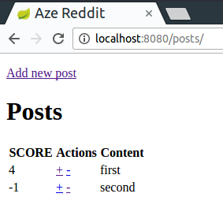
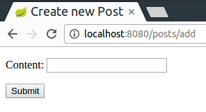

# The Reddit
We'll create a simple reddit clone application, where the users can create posts and upvote / downvote existing posts. Later on you can extend this functionality.





### Create a new Project
- Set up a new project
- You'll need these dependencies:
```
compile('org.springframework.boot:spring-boot-starter-data-jpa')
compile('org.springframework.boot:spring-boot-starter-thymeleaf')
runtime('org.springframework.boot:spring-boot-devtools')
runtime('mysql:mysql-connector-java')
```
- Create a package to work in (eg. `com.greenfox.aze.reddit`)
- Create a `RedditApp` class containing the `main` method to start SpringBoot.

### The Home Controller
- Create a package for controllers
- Create a Controller with one endpoint for the entry point of our website
    - the first and default root endpoint: `"/"`
    - add `@ResponseBody` to the method for now
    - return a Hello World
- Check it out!

### The Posts Controller, templates
- Think about how many endpoints will be needed:
    - Each different display (which needs different data) needs one `RequestMethod.GET` type of endpoint
    - Every action will also need one (the method may vary, go with the default GET for now)
- In an ideal architecture everything in the posts controller should be available under the `/posts` endpoint (eg. `/posts/add`...)
- Also listing the posts should be done here
    - this action usually called `index`, it's always a `GET` and the endpoint is `"/"`
    - create an HTML template for this, a simple `Hello World` in the body will do for now
    - hence our home controller will only redirect to here (you'll need to remove the ResponseBody annotation to do that)
- Check your index page out (even the redirect)
- If you haven't thought about adding a new post as a separate display, well do it now :)
    - create the endpoint and a template
    - Create the link at the index template which navigates to this endpoint
- Check if the navigation works with the link

### The Post
- Setup a new database called `reddit`
- Setup your database connection with the `application.properties` file
- It should look like this
```
spring.datasource.url=jdbc:mysql://localhost/reddit
spring.datasource.username=aze
spring.datasource.password=asd
spring.datasource.driver-class-name=com.mysql.jdbc.Driver
spring.jpa.hibernate.ddl-auto=create-drop
```
- Later you can change the last line to your liking, but we will develop this incrementally, so spring will need to recreate the db if our Post class is changed
- Create a package for our models
- Create a `Post` class, with a necessary `id`, `content` and `score` fields
    - You can add anything else if you'd like to
    - Add setters and getters for these fields

### Wiring in
- Create a package for our services
- Create a PostRepository based on the CRUDRepository
- Wire it in the PostsController
- In your index method pass all the posts to the template
```java
model.addAttribute("posts", repository.findAll());
```
- Add some data manually (in Java or directly in the database)
- Do the table for the listing in the template, then check it out!

### Adding
- The template and the endpoint should be created at this point
- Add a form (if you haven't already) to the template
- Set the action for the form to an endpoint which is a `RequestMethod.POST`
- If you set up the form template right, it can actually create the needed object (of Post class) for you
    - hint: google handling form submission spring
- In your controller you only need to save the passed object with the repository
- And redirect back to the posts, letting the user see the created post

### Vote
- Create the endpoints if you haven't already (for upvote and downvote separately)
- The end of them is easier, since its the same as when adding.
- The voting urls should look like this: `/posts/5/upvote` for upvoting the post with the id 5
- Then you'll have this id as a parameter in your controller's method, so you can find the actual Post object
- Increment or decrement the score
- Save it and redirect

### Extending functionality
- Make it cleaner
    - In the controllers there shouldn't be any model related logic, just calling methods
    - The Post should have the ability to change it's score
    - You can create a service which actually does the needed things with the repository, so in the controller methods just one service call remains
    - Ask the mentors if its clean enough :)
- Add a date to the posts and display it
    - a constructor will be needed there at least
- List always the best 10 post (at first)
    - so you'll need to upgrade your repository
    - and also handle pagination so the user can see the other posts
- Add users
    - When entering the site ask a username and create the posts for the users
        - User model will be needed
        - Post model will be updated
        - You'll need to somehow tell who is the current user
    - Pro version: try to follow Vega 1-2 to handle actual login
- Make it pretty
    - Wire in Bootstrap and make everything nicer

## Links
- [Parent - Java Spring](../README.md)
- [Next - Optional](./Workshop01.md)
