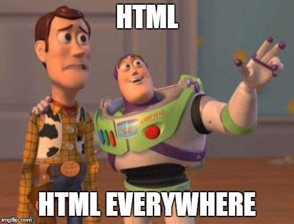

# Thymeleaf, Models, Views
*Subtitle*

## Materials & Resources

### Training
| Material | Time |
|:-------- |-----:|
| [Getting started with the Standard dialects in 5 minutes](http://www.thymeleaf.org/doc/articles/standarddialect5minutes.html)| 5:34 |
| [Introduction to Using Thymeleaf in Spring](http://www.baeldung.com/thymeleaf-in-spring-mvc) | 7:00 |
| [Spring Forms with Thymeleaf](http://www.thymeleaf.org/doc/tutorials/2.1/thymeleafspring.html#creating-a-form) | 8:42 |
| [Spring RequestMapping](http://www.baeldung.com/spring-requestmapping) | 7:26 |
| [Handling Form Submission](https://spring.io/guides/gs/handling-form-submission/) | 6:59 |

### Optional
| Material | Time |
|:-------- |-----:|
| [Using Thymeleaf (From Paragraph 3 to 7)](http://www.thymeleaf.org/doc/tutorials/2.1/usingthymeleaf.html) | 35:00 |

## Material Review
- @Controller
- @RequestMapping
- @RequestParam
  - required
- @PathVariable
- Model
- xmlns:th="http://www.thymeleaf.org"

## Workshop

### Thymeleaf Exercises

Solve all the exercises from Exercise 1 to 13 on http://itutorial.thymeleaf.org/

### Hello Templates

- Create a new Spring project using Spring initializer (add Spring MVC and Thymeleaf)
- Create a new package called com.greenfoxacademy in src/main/java
- Create a `HelloController` class and add a new action to this controller which is mapped to `/helloWorld`
- Add a new param called `name` to the action which is not required and its default is "Thymeleaf"
- Create a new template which body will be `<h1>Hello Thymeleaf</h1>` or `<h1>Hello {name}</>` if `name` is specified
- Extend the following and add the current date and time to the template

### Todos

- Extend the previous project and add a Todo (id:int, title:String, isUrgent:Boolean, isDone:boolean) class
- Create a new controller called `TodoController` which maps to `/todo` (hint: @RequestMapping to Controller?)
- Add a new action to the previous controller which maps to `/` and `/list`
- Add [TodoService.java](workshop/TodoService.java) to the project (don't forget the package)
- Use `getTodos()` from `TodoService` to get all the Todos
- Create a new template in the `src/main/resources/templates/todo` folder and in its html body display the `todos` list (hint: `th:each`, `ul`)

### Extend Listing

- Extend the previous listing action with a parameter (querystring) for listing the active todos (parameter name can be `active`; active means !isDone)

### Todo Details View

- Extend the previous project and add a todo detail action and view
- On the detail page show the following attributes:
  - id
  - title
  - isUrgent (checkbox, disabled)
  - isDone (checkbox, disabled)
- It has to be accessible from an url like this: `http://localhost/todo/details/1` (1 is the id of the Todo)

### Create a Link

- Extend the previous project and create a link from the `list` page to the `details` page for every Todo

### Create an "Add New Todo" Page

- Extend the previous project and add a create todo view and action (hint: you need two different actions(GET, POST))
- Add a link to the `list` page which redirects to the `add new todo` page

#Links
- [Parent - Java Spring](../README.md)
- [Prior - Intro, Boot, HelloWorld](../intro-to-spring/README.md)
- [Next - Beans, Config](../ioc-bean/README.md)
