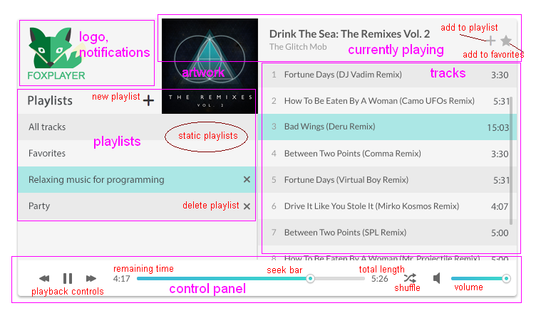

# Foxplayer specification

Please pay extra attention to the words `must` `should` and `may`, `might`. The first two must be implemented as the spec says. The rest is more like a recommendation, you can diverge from it if you feel like, but keep in mind you have to deliver.



# Frontend

Let's break down the main pats of the player:

 - Logo & notification
 - Control panel
 - Playlists
 - Currently playing
 	- Artwork
 - Tracks

Not visible parts: 

 - Modal dialogs
 	- Add track to playlist
 	- Crate playlist

## Global hotkeys
 - `SPACE` must toggle play / pause
 - `N` might play the next track
 - `P` might play the previous track
 - `ESC` might mute the volume

## Logo & notifications
 - The logo should be clickable and it should select and display the *All tracks* playlist
 - If you want to display notifications, like errors to the user you might place it in this spot

## Control panel
 - Sticks to the bottom width is 100%, flexible

### Playback controls
 - Prev / Next buttons should cycle through the playlist
 - Pause and play should toggle each other

### Time displays
 - Remaining time
 - Total length time

### Seekbar
 - It should be the slider that you picked from the stories
 
### Shuffle
 - A toggle button
 - If active it must be blue
 - When active, the next track should be a random choice, but the one that actually plays

### Volume
 - Use the same slider that you picked for the seekbar
 - Clicking on the speaker icon might mute the volume
 - It controls the global volume 
 - A new track must always be set to this value


## Playlists
 - There are two playlists that are there by default
 - They cannot be deleted
 - User crated playlists must have a delete button

### All tracks
 - Contains all tracks that the user has in the `root` music folder
 - The user can't remove tracks from here
 - This playlist cannot be deleted

### Favorites
 - Contains all tracks that the user move here by pressing the *star icon* on the "currently playing" panel
 - This playlist cannot be deleted

### New playlist
 - Clicking this creates a new playlist
 - The user does this by opening a modal dialog (VEX from stories)
 	- The modal dialog must have a single input field
 	- It must have a "create playlist" and a "cancel" button

### Clicking on the playlist
 - The active playlist must get a highlight color
 - The tracks should update on the right panel
 - The tracks section will have a more elaborate description of what to display


## Artwork
 - Display the currently playing artist from Last.fm
 - Description is in the stories section
 - If the artist can't be found, use the [music placeholder](img/music-placeholder.png) image instead


## Currently playing
 - It must display the *track title*
 - It must display the *Artist*
 - Depending on how you implement ID3 metadata loading you might display this immediately or after an AJAX call
 - You might request this data on the client side or the server can be responsible for this 
 - Browser based solution https://github.com/aadsm/JavaScript-ID3-Reader
 - Note that this might be slow for loading all track ID3 in the tracks panels

### Add to playlist
 - Opens a modal dialog
 - Reuse the code from the modal experiment you did on the first day
 - The playlist should not change when the user closes the modal dialog

### Add to favorite
 - It immediately adds the currently playing track to the special "favorites" playlist
 - The star is immediately turned to light blue
 - When a new track starts to play, this icon must turn to light blue if the track is part if of the favorites playlist


## Tracks
 - A simple list of tracks
 - By default it must display the "All tracks" playlist
 - You might only display the file names, like "hello.mp3"
 	- In this case you won't display the duration
 	- If you display the metadata, like track name / artist / duration, use this library: https://github.com/leetreveil/musicmetadata
		- use the format: Artist - Title ([hh:]mm:ss)
 - You *might* add [something like iSroll](http://iscrolljs.com/#scrollbars) to make the scrollbars look pretty

### Clicking on a track
 - Highlight the track
 - Immediately start to play the track
 - Don't foget to:
 	- Reset the seek bar
 	- Reset the timer displays on the control panel
 	- Update the currently playing panel
 	- Update the artwork


# Backend
 - Implement the backend via a single Node.js app. 
 - You should be able to start it via typing `npm start` to the console. 
 - The user must configure the music directory in the `index.js` file by setting a constant to an existing directory.


## Best practices
 - Add logging for each API calls to help debugging frontend development
 - Save all dependencies with `npm install coolackage --save`

## REST API
 - This is REST-ful application so you should create the following endpoints

### Playlists

`GET /playlists`
 - Lists all the playlists

`POST /playlists`
 - Creates a new playlist
 - Required field is only a "playlist" property that contains the name of the playlist
 - System playlist cannot be created by the client
 - Return playlists in the order they were added

`DELETE /playlists/:id`
 - Deletes the given playlist
 - if the `id` parameter is not present or is not enumerable return an error in JSON format. You might explain the error briefly.
 - If the system field is set to 1, you mustn't delete the playlist


### Playlist tracks

The `id` URL parameter is always required since it identifies the playlist you want to have some operation with.

`GET /playlis-tracks/`
 - Without a `playlist_id` it should return all tracks in the `root` folder. Subfolders should be explored recursively.

`GET /playlis-tracks/:playlist_id`
 - Lists all the tracks added to the playlist

```
[
	{ "id": 21, "title": "Halahula", "artist": "Untitled artist", "duration": 545, "path": "c:/music/halahula.mp3" },
	{ "id": 412, "title": "No sleep till Brooklyn", "artist": "Beastie Boys", "duration": 312.12, "path": "c:/music/beastie boys/No sleep till Brooklyn.mp3" }
]
```

`POST /playlist-tracks/:playlist_id`
 - Adds the track to the playlist provided `playlist_id`
 - System playlist cannot be created by the client

`DELETE /playlist-tracks/:playlist_id/:track_id`
 - Deletes the given track with the `track_id` from the playlist with the `playlist_playlist`
 - If one of the `id` parameter is not present or is not enumerable return an error in JSON format. You might explain the error briefly.


### Bonus material

Don't forget to occasionaly enjoy the silence https://www.youtube.com/watch?v=aGSKrC7dGcY
