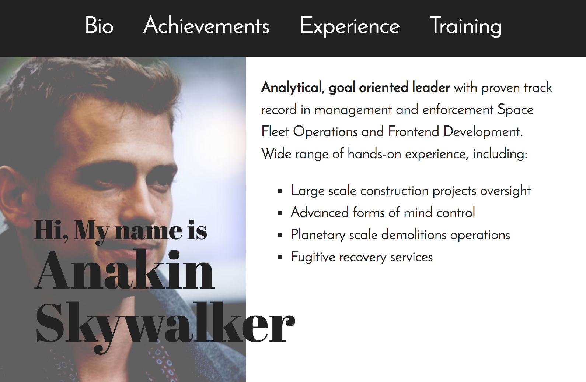

# Build Your own CV II

## Project work

You already know Mr Skywalker's CV. Now, with all the new tools, like layout, and advanced styling, in your hand, spice it up a little, and make it your own.

Get at least 2 XPs from this list:
- any layout that is more complex than 1 single column:
  - flexbox for 1XP
  - fixed positioning for 1XP
- personalised design for 1XP:
  - pick your own colors, considering contrast levels and legibility
  - pick your own fonts, considering legibility

Some ideas to get you started:
- give Mr. Skywalker's CV two columns and a header - [CV template](assets/full-page.png) to follow   
- Modify the content to your own data, your own CV and profile image
- change the layout to have more than 1 column, or irregularly positioned Boxes
- add navigation with links to the sections
- add background colors to the different sections
- pick new color combinations from here: http://clrs.cc/a11y/
- pick new font combinations from here: http://fontpair.co/
- check the [CV ideas](https://www.pinterest.com/hugabuga/cv-inspiration/) list for inspiration
