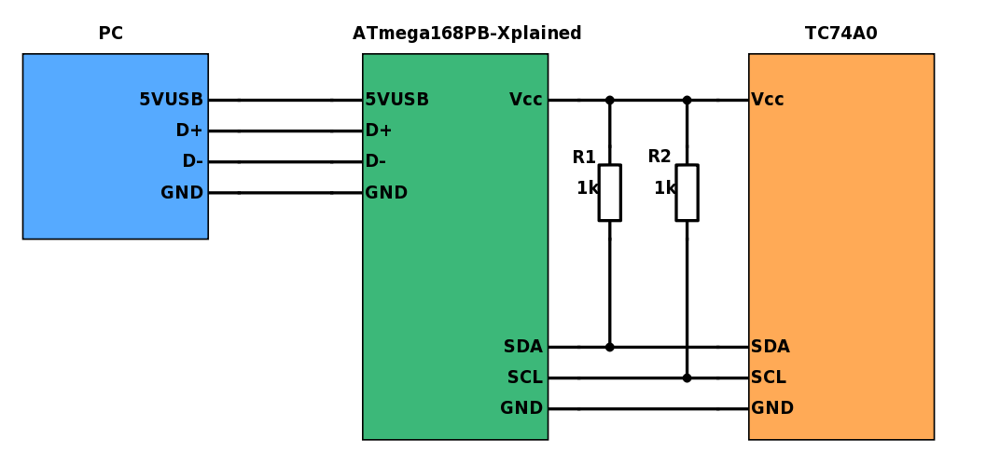

# Closed loop control
*Create a program on the MCU which can control the fan speed*

## Objectives
 - Create a bigger project
 - Get familiar with control loops

## Materials & Resources

- [Proportional control](https://en.wikipedia.org/wiki/Proportional_control)
- [RS232 library](https://www.youtube.com/watch?v=4jgBy1aOltU&t=11s) video

### Advanced Control loops
- [The PID controller](https://en.wikipedia.org/wiki/PID_controller)
- [Calculate average in given period](#calculate-average-in-given-period)
https://www.youtube.com/watch?v=WsUau1GTNF0

## Workshop
This project is based on the [PWM](https://github.com/greenfox-academy/teaching-materials/tree/master/workshop/hardware/PWM), [AC-peripheral](https://github.com/greenfox-academy/teaching-materials/tree/master/workshop/hardware/AC-peripheral) and a litle bit on [ADC workshop](https://github.com/greenfox-academy/teaching-materials/tree/master/workshop/hardware/SPI-communication-ADC).

This program will be control the fan speed, first with open loop control, at the end of the project with closed loop control. The speed need to be measured as we did in the AC workshop, the required speed need to be adjusted with a potentiometer and measured with the ADC.

</img>

### Basic tasks
- [Make it work](#Make it work)
- [Open loop control](#Open loop control)
- [Closed loop control, P](#Closed loop control, P)
- [Closed loop control, PI](#Closed loop control, PI)
- [Connect all the thing](#Connect all the thing)

### Advanced tasks
- [Set read filename](#set-read-filename)
- [Calculate average in given period](#calculate-average-in-given-period)

### Make it work
Just make it work:
 - The serial port
 - Read and print out the ADC value
 - Set up and validate the PWM peripheral
 - Set up and validate the AC peripheral, measure the fan speed, print it out

</img>

All the hardware (fan, potentiometer, AC, resistors, capacitors, the FET, the wiring) and all the codes, librarys need to be tested and together in one big project.

### Open loop control
 Just make it work:
  - The serial port
  - Read and print out the ADC value
  - Set up and validate the PWM peripheral
  - Set up and validate the AC peripheral, measure the fan speed, print it out
  These peripherals need to be together in one project.

### Connect all the thing

</img>

## Solution
[Solution](#)
