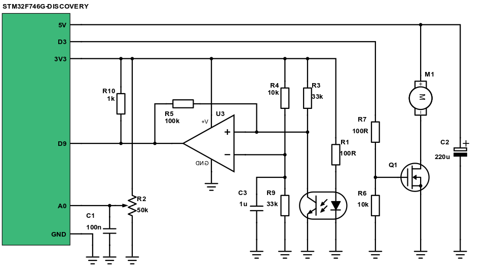

# Closed loop control
*Create a program on the 32F746GDISCOVERY as you did last week on Atmega.*

## Objectives
 - Get familiar with STM32CubeF7 library
 - Implement the closed loop control on an other microcontroller platform

## Materials & Resources
Use this document as a reference during the project. It's the documentation of
the STM32F7 HAL.

| Material | Duration |
|:---------|-----:|
| [Description of STM32F7 HAL and Low-layer drivers](http://www.st.com/content/ccc/resource/technical/document/user_manual/45/27/9c/32/76/57/48/b9/DM00189702.pdf/files/DM00189702.pdf/jcr:content/translations/en.DM00189702.pdf) | - |

### Interrupts in STM32F7xx
All Cortex M7 based MCUs has a so called [Nested Vectored Interrupt Controller (NVIC)](http://infocenter.arm.com/help/index.jsp?topic=/com.arm.doc.dai0179b/ar01s01s01.html). This is basically a module in the CPU, that can handle multiple interrupt requests.
Please read more about it [here](http://micromouseusa.com/?p=279).

How to set up an interrupt in the STM32F746G-DISCOVERY board?
- Choose which peripheral's interrupt would you like to use
  - let's say we want to use the TIM4 timer's interrupt
    - when an input capture event occurs
    - and when an overflow occurs
- The peripheral has to be initialized in interrupt mode
  - In our case we have to call the
    - `HAL_TIM_Base_Start_IT(...)` function to start the timer and enable overflow interrupt
    - `HAL_TIM_IC_Start_IT(...)` function to start the timer and enable input capture interrupt
- Peripheral interrupts must be enabled in NVIC
  - In our case
    - `HAL_NVIC_EnableIRQ(TIM4_IRQn)`
- The correct interrupt handler function has to be written
  - The correct function name could be found in the `startup_stm32f746xx.s` file
    - Just search for the chosen peripheral name
    - In our case we search for `TIM4`
    - And we can find the `TIM4_IRQHandler`
  - All interrupt handler function has no parameters and has no return value
    - `void TIM4_IRQHandler(){}`
- The IRQ handler function has to call the proper HAL IRQ handler function
  - In our case that is the `HAL_TIM_IRQHandler()`
  - This function has a parameter (`TIM_HandleTypeDef *htim`)
  - This timer handler says the HAL which timer caused the interrupt event
  - So in our case we have to call this function with the TIM4 timer handle as parameter,
  which was used in the initialization
- The HAL will then call the callback function which have to be also written
  - In our case
    - `HAL_TIM_PeriodElapsedCallback(TIM_HandleTypeDef *htim)`
    - `HAL_TIM_IC_CaptureCallback(TIM_HandleTypeDef *htim)`
  - We can use the htim parameter to determine which timer has overflow or input
  capture events

Always search for example code in the `CubeF7/Projects` folder!

### MSP init functions
The `stm32f7xx_hal_msp.c` contains special init function. When you call a peripheral
HAL init function (for example `HAL_TIM_IC_Init()`) the HAL will call an MSP init function
(in our example the `HAL_TIM_IC_MspInit()`) function. This function has to be written
by the user (yes, you). This function can be used to initialize the GPIO which is
related to the peripheral (input/output setup, pullups-pulldowns, etc.) and to enbale
the peripheral's interrupt (with `HAL_NVIC_EnableIRQ()`).

### How to code a P controller
You basically need:
- a reference input, which represents the desired output value
- the controller output, which controls a hardware
- the output signal, which is generated by the hardware

Let's say we have the following variables:

| variable name | functionality |
|:---------|:-----|
| ```ref``` | the reference input |
| ```ctrler_out``` | the output of the controller |
| ```process_variable``` | the output signal of the hardware, which is measured by a sensor |
| ```ctrler_out_min``` | the minimum output of the controller |
| ```ctrler_out_max``` | the maximum output of the controller |
| ```P``` | the P constant |


At first you have to calculate the error from the reference input and from the sensor
value. The next step is to multiply the error with the P constant, than load the result
value to the output. In real life, the output signal has a minimal and maximal value.
We have to limit the output to these levels.

The pseudocode of a P controller would look like:
```c_cpp
err = ref - process_variable;
ctrler_out = P * err;

if (ctrler_out < ctrler_out_min)
    ctrler_out = ctrler_out_min;
else if (ctrler_out > ctrler_out_max)
    ctrler_out = ctrler_out_max;
```

### How to code a PI controller
You basically need:
- a reference input, which represents the desired output value
- the controller output, which controls a hardware
- the output signal, which is generated by the hardware

Let's say we have the following variables:

| variable name | functionality |
|:---------|:-----|
| ```ref``` | the reference input, or setpoint |
| ```ctrler_out``` | the output of the controller |
| ```process_variable``` | the output signal of the hardware, which is measured by a sensor |
| ```ctrler_out_min``` | the minimum output of the controller |
| ```ctrler_out_max``` | the maximum output of the controller |
| ```P``` | the P constant |
| ```I``` | the I constant |


At first you have to calculate the error from the reference input and from the sensor
value. The next step is to calculate the output, which consists of
- the proportional component
- the integral component.

The proportional component is the error multiplied with the P constant.
The integral component is the sum of all previous error multiplied with the I constant.

In real life, the output signal has a minimal and maximal value.
We have to limit the output to these levels.

In case of limiting, the integral part has to be decreased by the error to avoid [integral windup](https://en.wikipedia.org/wiki/Integral_windup).

The pseudocode of a PI controller would look like:
```c_cpp
err = ref - process_variable;
integral = integral + err;
ctrler_out = P * err + I * integral;

if (ctrler_out < ctrler_out_min) {
    ctrler_out = ctrler_out_min;
    integral = integral - err;
}
else if (ctrler_out > ctrler_out_max) {
    ctrler_out = ctrler_out_max;
    integral = integral - err;
}
```

## Workshop
The input reference voltage will be adjusted with a potentiometer (which is measured with the ADC), the controller output signal will be the duty cycle of the PWM signal (which adjusts the fan rotation speed). This time the rotational speed will be measured with an external
analog comparator.

### Circuit
Build the following circuit! Keep in mind, that there are some differences compared
to the ATmega168PB based circuit.

[LM393 datasheet](http://www.ti.com/lit/ds/symlink/lm393-n.pdf)

</img>

### Tasks
- Peripherals to use
  - ADC usage
  - PWM usage
  - Input capture usage

- Control loops
  - Open loop control
  - Closed loop P control
  - Closed loop PI control

### Peripherals to use
- Make sure that you can write things onto the LCD screen
- Make sure that you can write float numbers onto the screen
  - Use the `BSP_LCD_DisplayStringAtLine()` function
  - Use the [`sprintf()`](http://www.cplusplus.com/reference/cstdio/sprintf/) function to
  make strings from numbers

#### ADC usage
At first try to use the ADC. A potentiometer is connected to the STM32F746G-DISCOVERY A0 pin.
In the user manual try to find out which ADC and which channel is connected to that pin.

After that open the `stm32f7xx_hal_adc.c`, where you can find a guide how to
initialize and use the ADC. You can always use the [Description of STM32F7 HAL and Low-layer drivers](http://www.st.com/content/ccc/resource/technical/document/user_manual/45/27/9c/32/76/57/48/b9/DM00189702.pdf/files/DM00189702.pdf/jcr:content/translations/en.DM00189702.pdf) document,
which contains all the HAL comments in a pdf documentation.

Your task is to:
- Initialize the ADC low level resources by implementing the `HAL_ADC_MspInit()`
  - Turn on the ADC clock
  - Turn on the GPIO clock
  - Initialize the STM32F746G-DISCOVERY A0 pin as analog input
    - The **A0 is not equal with GPIOA0!**
    - it is connected to an MCU pin, which has a different name!
  - You does not want to use interrupts or DMA
- Initialize the ADC with `HAL_ADC_Init()`
- Configure the channel with `HAL_ADC_ConfigChannel()`
- Measure with the ADC in polling mode
  - Start the ADC peripheral using `HAL_ADC_Start()`
  - Wait for end of conversion using `HAL_ADC_PollForConversion()`
  - To read the ADC converted values, use the `HAL_ADC_GetValue()` function

Put the measured value on the LCD screen!

#### PWM usage
The second task is to configure a timer in PWM mode, which will control the
fan. Which timer? Take a look at the schematic. The fan switching MOSFET is
connected to D3. Now try to find which MCU pin is connected to the D3 pin in
the board's user manual.

After you found the timer number and the channel you can start to initialize it.
This time we only give you a tiny bit of hint. Try to find out how to initialize
the timer in PWM mode:
- based on the ADC init
- based on the `stm32f7xx_hal_tim.c` how-to comments
- based on the [Description of STM32F7 HAL and Low-layer drivers](http://www.st.com/content/ccc/resource/technical/document/user_manual/45/27/9c/32/76/57/48/b9/DM00189702.pdf/files/DM00189702.pdf/jcr:content/translations/en.DM00189702.pdf)

The goal is to put out a PWM signal and make the duty cycle adjustable by the potentiometer.

#### Input capture usage
The RPM signal is connected to D9, so you have to set up a timer into input capture mode
which is triggered by that signal. The first thing to do is to check the user manual and
find out which timer and which channel is connected to D9.

After that the initialization procedure comes. Try to find out how to initialize
the timer in IC mode:
- based on the previous inits
- based on the `stm32f7xx_hal_tim.c` how-to comments
- based on the [Description of STM32F7 HAL and Low-layer drivers](http://www.st.com/content/ccc/resource/technical/document/user_manual/45/27/9c/32/76/57/48/b9/DM00189702.pdf/files/DM00189702.pdf/jcr:content/translations/en.DM00189702.pdf)

Keep in mind that this time you will need interrupts! The overflow and input capture
interrupts are both needed, so you will have to call both `HAL_TIM_IC_Start_IT()` and
`HAL_TIM_Base_Start_IT`! You also has to write the proper interrupt handler functions,
which was described in the material review section.

The goal is to write a `float get_freq()` function

### Control loops
#### Open loop control
Let's use multiple peripherals together. The task is to make an open loop RPM controller.
- Read the ADC value and set a PWM signal according to it. So, if the ADC measures 5V, then set 100% PWM duty cycle. Similarly, if the ADC measures 0V then set 0% PWM duty cycle.
- Print out the PWM duty cycle and the measured PRM of the ventilator to the terminal with UART.

Why this control technique is bad? Our open loop "controller" doesn't care about what RPM is the ventilator turning (if it's turning at all), so it' not really CONTROLS the hole progress, it just sets the PWM and something will happen. No feedback from the ventilator is used.

#### Closed loop P control
Let's use feedback from the ventilator. The task is to make a proportional controller, which will regulate the PWM duty cycle according to the measured RPM and the reference
RPM value.

- Use the P controller pseudocode to make your controller
- Try to run the control algorithm periodically
- Play with the P value
- The algorithm run period and the P value determines how will the controller work
    - A good starting value for the period is 10ms
    - A good starting value for the P value is 0.1
- You should print out the duty cycle and the measured RPM to the terminal at least
    - This is useful to check what is going on inside the MCU

Try to apply force to the fan. Ideally, a controller should rise the duty cycle,
and the fan will produce bigger torque to keep the rotational speed constant. The
P controller can't do this exactly. Why?

#### Closed loop PI control
The task is to make a proportional ant integrating controller, which will regulate the PWM duty cycle according to the measured RPM and the reference
RPM value.

- Use the P controller pseudocode to make your controller
- Try to run the control algorithm periodically, play with the period value
- Play with the P, I value
- The algorithm run period, the P and the I value determines how will the controller work
    - A good starting value for the period is 10ms
    - A good starting value for the P value is 0.05
    - A good starting value for the I value is 0.01
- You should print out the duty cycle and the measured RPM to the terminal at least
    - This is useful to check what is going on inside the MCU

Try to apply force to the fan again. The PI controller should compensate out the
disturbance and the RPM should remain constant. Of course, if you apply too much force
100% duty cycle will be set and the motor maybe can not produce enough counterforce to
keep the RPM constant. This is not the controller's fault, simply the fan is not
strong enough.

### Advanced tasks:
- Make the P, I values adjustable via UART, play with it

## Solution
[Solution](#)
