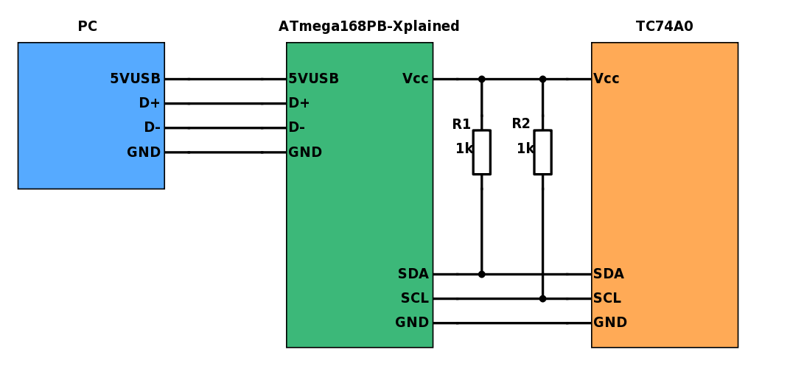

# Temperature logger
*Create a program on the MCU and on your PC which can communicate with each other*

## Objectives
 - Read and interpret user stories
 - Create a bigger project


## Materials & Resources

- [time.h](http://www.cplusplus.com/reference/ctime/)
- [RS232 library](https://github.com/Marzac/rs232)

## Workshop
This project is based on the [I2C workshop](https://github.com/greenfox-academy/teaching-materials/tree/master/workshop/hardware/I2C-communication).

A program should be written which can log temperature data on a PC. The ATmega168PB Xplained board
is used as a gateway between the PC and the temperature sensor.

</img>

The program can take few different commands. Please use the `getch()` function
to implement them.

### Tasks
- [Print usage](#print-usage)
- [Add new task](#add-new-task)
- [List tasks](#list-tasks)
- [Write to file](#write-to-file)
- [Read from file](#read-from-file)
- [Empty the list](#empty-the-list)
- [Remove task](#remove-task)
- [Add task error handling](#add-task-error-handling)
- [Remove task error handling](#remove-task-error-handling)

### Print usage
 - At application startup the following message should be shown:

```
Todo application
====================
Commands:
 h      Show the command list
 l      List available ports
 p      Set port name
 w      Set write filename
 o      Open port
 s      Start logging / Stop logging
 c      Close port
 r      Set read filename
 a      Calculate average in given period
 ```

### Show the command list
- if the user presses the "h" button
- the program should print out the command list (like at startup)

### List available ports
- if the user presses the "l" button
- the program should list out the available serial ports

### Set port name
- if the user presses the "p" button
- the program should ask the user to enter a port name
- the user input errors should be handled

### Set write filename
- if the user presses the "w" button
- the program should ask the user to enter a file name
- this file will be used as the log file
- the user input errors should be handled

### Open port
- if the user presses the "o" button
- the program should open the previously set COM port
- the errors should be handled

### Start logging / Stop logging
- if the user presses the "s" button
- the program should start logging from the opened port into the set write file
- if the program is already logging, then the logging should be stopped
- the errors should be handled
- the logfile shold look like this:

```
2017-05-31 10:46:22 23.6°C
2017-05-31 10:46:23 23.7°C
2017-05-31 10:46:24 23.8°C
2017-05-31 10:46:25 23.9°C
2017-05-31 10:46:26 23.2°C
2017-05-31 10:46:27 23.5°C
2017-05-31 10:46:28 23.4°C
```

### Close port
- if the user presses the "c" button
- the program should close the opened port
- the errors should be handled

### Set read filename
- if the user presses the "r" button
- the program should ask the user to enter a file name
- this file will be used as the input file for the average calculation
- the user input errors should be handled

### Calculate average in given period
- if the user presses the "a" button
- the program should ask the user to enter a date period
- the program then reads data from the read file and calculates the average temperature in the given period
- the errors should be handled

## Solution
[Solution](#)
