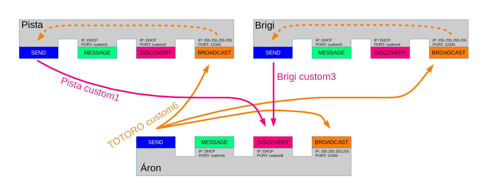

# The TOTORO chat
*Create a chat program*

## Objectives

</img>

## Materials & Resources

| Material | Duration |
|:---------|---------:|
|[Threads](https://simple.wikipedia.org/wiki/Thread_(computer_science))| - |
|[Broadcast example](https://cboard.cprogramming.com/c-programming/131008-udp-broadcast-client-server.html)| - |

You will have to use multiple threads in the application. You will only need to
run different tasks simultaneously. The easiest way to do that is to use the
`_beginthread()` function which is provided by `process.h`.

```
#include <process.h>

void thread_to_run()
{
  while (1) {
    //it does something
  }
}

void main()
{
  _beginthread(thread_to_run, 0, NULL);
  while (1) {
    // it does simething else
  }
}
```

## Workshop
This is a quite long project, at first read the whole specification. Try to figure out
what kind of data storing technique (for example structure, array etc.) would fit
for this project. Try to make a concept in your head about how you will implement the
application.

The TOTORO chat application is a chat program which can send/receive messages
to/from another running applications on the local network.

</img>

It can discover other users on the local network using broadcast messages. If
the program wants to discovery other users it will send a broadcast message
(UDP message to `255.255.255.255:1234`): `TOTORO discovery_port_number`. The
TOTORO part of the message informs other applications that someone want to discover
the users. The discovery_port_number is the port number where the application listens
for the discovery answers.

If an application receives a broadcast message which contains `TOTORO discovery_port_number`
it will send a TCP message to `ip_of_discovery_request:discovery_port_number` with
the following message: `my_name message_port_number`.

The appplication can receive TCP messages on two sockets:
- MESSAGE
  - IP is automatically generated by the DHCP server
  - port can be a custom number
  - this socket receives the messages from other users
- DISCOVERY
  - IP is automatically generated by the DHCP server
  - port can be a custom number
  - this socket receives the discovery request answers from other users

The program can receive UDP messages on a socket:
- BROADCAST
  - IP is 255.255.255.255, this is the broadcast IP
  - port is 12345, this can not be modified!

The program should run the servers on multiple threads:
- Message listener thread
  - It is a TCP socket server
  - It listens on the MESSAGE socket
- Discovery listener thread
  - It is a TCP socket server
  - It listens on the DISCOVERY socket
- Broadcast listener thread
  - It is an UDP socket server
  - It listens on the BROADCAST socket

The program can store the discovered user information:
- name of the user
- IP of the user
- port where the user listens for incoming messages

### Basics functionalities
- [Storage for users](#storage-for-users)
- [Message listener thread](#message-listener)
- [Broadcast listener thread](#broadcast-listener-thred)
- [Discovery listener thread](#discovery-listener-thread)
- [Command interpreter](#command-interpreter)

### Commands
- [Print help info](#print-help-info)
- [Exit](#exit)
- [Set name](#set-name)
- [List users](#listen-users)
- [Send discovery request](#send-discovery-request)
- [Send message](#send-message)

### Advanced features
- [Save and Load user info](#save-and-load-user-info)
- [Message logging](#message-logging)
- [Logged message reading](#logged-message-reading)

### Storage for users
- the program can store user information
  - name (maximum 255 characters)
  - IP address
  - port number
- you can assume that no more than 50 users will be present at any time
  - so you can store the users in an 50 long array
  - dynamic memory handling not needed

### Message listener thread
- the program runs the message listener TCP server on a separate thread
  - `socket()`
  - `bind()`
  - `listen()`
  - `accept()`
  - `recv()`
- the server listens for incoming messages
- if a message arrives the program will print it on the screen:
  - `user_name_of_the_sender: message`

### Broadcast listener thread
- the program runs the broadcast listener UDP server on a separate thread
  - `socket()`
  - `setsockopt()`
  - `bind()`
  - `recvfrom()`
- the server listens for incoming broadcast messages
  - these messages are discovery requests
- if a message arrives the program will send the user name and the port of the message listener
  - `user_name message_listener_port`

### Discovery listener thread
- the program runs the discovery listener TCP server on a separate thread
  - `socket()`
  - `bind()`
  - `listen()`
  - `accept()`
  - `recv()`
- the server listens for incoming discovery responses
  - other applications will send theri user name and message listener port
- if a message arrives the program will save the data as a new user into the user storage
  - user name
  - IP
  - port

### Command interpreter
- the program can be controlled with the keyboard
- use the `getch()` function to get single character from the console
- use the `kbhit()` function to check if the user hit a button

### Print help info
- if the user hits the `h` button
- the program clears the screen and prints out the following message
```
TOTORO CHAT
====================
Commands:
 h   Display this help info
 e   Exit
 n   Set user name
 l   List known users
 d   Send discovery request
 m   Send message
 ```

### Exit
- if the user hits the `e` button
- the program exits

### Set name
- if the user hits the `n` button
- the program will ask for a new name

### List users
- if the user hits the `l` button
- the program will list the known users with their IP and port in the following format
```
IP              port      name
192.168.0.101   1457      Pista
192.168.0.105   54789     Brigi
```

### Send discovery request
- if the user hits the `d` button
- the program will send a discovery request as a broadcast UDP message
- the messages is `TOTORO port_where_the_program_waits_for_response`

### Send message
- if the user hits the `m` button
- the program will ask the user to enter message in the following format:
  - `user_name_of_the_recipient message`
- if the user entered the message the program will send the message to the user

### Save and Load user info
- the program can save the user storage to a file
- also the program can load the user storage from a file

### Message logging
- the program can log the sent and received messages to a file

### Logged message reading
- the program can load the message log file and can display it on the screen

## Solution
[Solution](https://github.com/greenfox-academy/teaching-materials/tree/master/project/hardware/solutions/totoro-chat)
