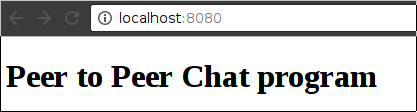
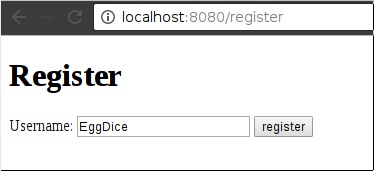
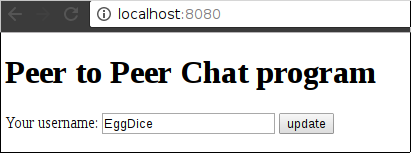
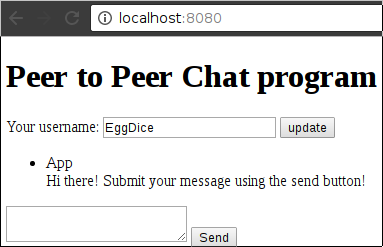

# Peer to Peer Chat application

*Write a chat application that connects to other peer applications and chat your
fellow Green Foxers*

## Tasks

### Main page

Create a main page containing a heading that is accessable from the `/` route.

The application should conenct to a local SQL database.

### Production environment

Deploy your application to heroku, and set up the database using the heroku postgre addon.

The application should be accesable by its heroku hostname.

### Logging

Each http request should be logged to the standard out, also if any error has happened in the routes
it should log the error to the standard error.
The log message should have the following fields:

 - **Path**: The path of the endpoint like: `/`
 - **Method**: The method of the endpoint like: `GET`
 - **Date and Time**: It should print the date in a format like this: `2017-05-16 21:47:19.040`
 - **Log Level**: `INFO` on http requests and `ERROR` on any occured error
 - **Request Data**: It should log all the request params from the endpoint

The log should look like this:
`2017-05-16 21:47:19.040 INFO Request /message POST text=apple`

The logs should be configurable by an environment variable called `CHAT_APP_LOGLEVEL`

About environment variables: [Windows](https://www.youtube.com/watch?v=bEroNNzqlF4), [Linux + Mac](https://www.youtube.com/watch?v=pjh9rU9h22Q)

Reading environment variables in java: [This article](https://docs.oracle.com/javase/tutorial/essential/environment/env.html)

If the environment is set to `ERROR` it should only print the error messages, any other cases it should print both error and info level mesages.

Try your environment variables on heroku as well: [This article](https://devcenter.heroku.com/articles/config-vars)

[Read the logs](https://devcenter.heroku.com/articles/logging) on heroku not just on your local machine, to
achive it first install the [heroku toolbelt](https://devcenter.heroku.com/articles/heroku-cli)

### Client Id, Peer address

Each application should store a unique id (string), that is different from each of the other.
Each application should store an IP address of an other application that it will connect to.
Both of the values should be loaded from environment variables like:
`CHAT_APP_UNIQUE_ID`, `CHAT_APP_PEER_ADDRESSS`

Please use your github username as your unique id.

### Register

Create a new page at the `/register` path.

If the register button is clicked it should create a new user in the database and redirect to the main page.

If the username is not specified it should show an error on the top of the page: "The username field is empty".

If the user is not present in the database then the main page should redirect to the register page.
If the user is present in the database the register page should redirect to the main page.

### Username

Create a form under the title that consists a text input and an update button.

The text input should store the username of the user, if the update button is clicked, then it should update the username.
After the update the application should redirect to the main page.

If the username is not specified it should show an error on the top of the page: "The username field is empty".

### Save new message

Add a list of messages to your main page, each message should have a user and a text field.

The page should have a default message in its list: 

 - Username: App
 - Text: Hi there! Submit your message using the send button!

All the other messages should appear under this message.

Under the messages there should be a form that can add a new message.

If the send button is clicked it should store a new message in the database and it should show up in the list.
Each message should have a stored:

 - Username
 - Text
 - Random generated id (between 1000000 - 9999999)

### Receive new message

### Broadcast new message

### Receive own message

### Try it with your fellowa

### Better looking frontend

### Auto refresh

### List of users
