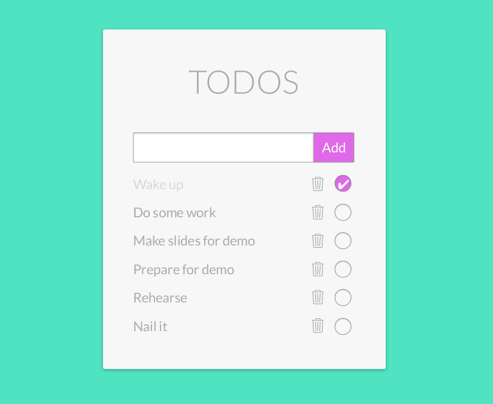

# Fullstack TODO application

To practice everything you learnt during the Javascript-orientation period, here is a fullstack excersize to deepen your knowledge.

The project: create a fullstack todo application with database. The app's aim, to get, and store todo's in a database. The user needs to have the access to her/his data's, so to the todo items and to their state (done or not). The user needs the features: changes todo's state or deleting items from the list.

Don't waste too much time with the UI, concentrate on the functionality. The main thing is to practice the client-server communication, sending and receiving proper http requests and building/handling database. In addition, writing tests where they are really needed.

### Specification     
[**Frontend**](todo-frontend.md)  
[**Backend**](todo-backend.md)  

#### Extras:
 -  Beautiful design
 -  Add opportunity to tag todo's (topic, priority ..)
 -  Add opportunity to create deadlines
 -  Filter todo's
 -  ...
