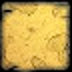
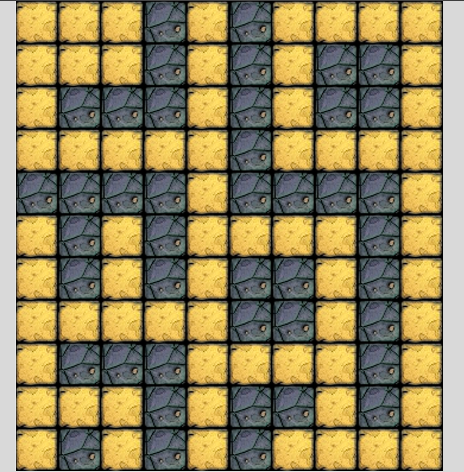

# Introduction

*Stories should be followed by implementation. Completing a story means you made a little progress on the project.*

*Keep in mind, that you have to develop the complete game. So when working on a specific story, you should be able to reuse the implementation later in other parts of the game.*

# Draw a screen with tiles

#### 1) Draw a single tile
 - Given the launched game
 - Then it should show a tile like this:   

 |Floor tile|
 |----------|
 ||

#### 2) Fill the screen with the tile
 - Given the launched game
 - Then it should show a map of tiles like this:

 

#### 3) Add wall tiles
 - Given the launched game
 - When the map is rendered on the screen
 - Then it should show floor and wall type tiles as well like on this layout (you can arrange wall differently if you wish):

Floor tile | Wall tile
---------- | ---------
 | 

# Place a character on it and move with key bindings

#### 1) Add the Hero
 - Given the launched game
 - When the map is rendered on the screen
 - Add the player character called the hero
 - Then it should show a hero on the top-left corner:

| Hero |
| ------ |
|  |

 

### Interactions

The player should be able to move the hero by using their arrow keys.

#### 1) Move around
 - Given the launched game
 - When *any* of the arrow keys are pressed by the user
 - Then the hero should move to that direction

#### 2) Hero direction
 - Given the launched game
 - When the hero is moved by the arrow keys
 - Then the hero should face the direction where he went

| Hero Up | Hero Right | Hero Down | Hero Left |
| ------- | ---------- | --------- | --------- |
|  |  |  |  |

#### 3) Map boundaries
 - Given the hero on any edge of the map
 - When the hero is moved by the arrow keys towards the edge
 - Then it should not move or leave the map, only its direction should change if necessary

#### 4) Walls
 - Given the hero next to a wall tile
 - When the hero is moved by the arrow keys towards the wall tile
 - Then it should not move, only its direction should change if necessary

# Extend with different kinds of characters

#### Skeletons
 - Given the launched game
 - When the map is rendered on the screen
 - Then 3 skeletons should be on the map, somewhere on floor type tiles

| Skeleton |
| ---------- |
|  |

#### Boss
 - Given the launched game
 - When the map is rendered on the screen
 - Then a boss should be on the map, somewhere on floor type tiles

| Boss |
| ---- |
|  |

# Create HUD, fight & game logic

#### Stats
 - Given the launched game
 - When the map is rendered on the screen
 - Then stats should appear below the map in a white box as black strings
   - It should contain:
      - The level of the Hero
      - The max HP (_health point_) of the Hero
      - The current HP of the Hero
      - The DP (_defend point_) of the Hero
      - The SP (_strike point_) of the Hero
   - Like this: `Hero (Level 1) HP: 8/10 | DP: 8 | SP: 6`

#### Strike
- Characters are able to strike as detailed in the [specification](specification.md)

#### Battle logic
- After a hero character performed a strike the defender should strike back the same way

#### Next area
- When the enemy with the key is killed, the hero should enter the new level automatically

# Optional features

#### Update characters on moving hero
- The characters should only move when the player moves the hero

#### Random map
- When map is created the placement of walls should be random
- Make sure that all floor tiles are connected

#### Leveling
- Add more hp / damage to the hero according to the specification
- Add more hp / damage to the monsters
- Implement random events which happen when entering the new area

#### Monsters moving around
- Move the monsters around regardless of player moving hero or not
- Speed the up level by level
