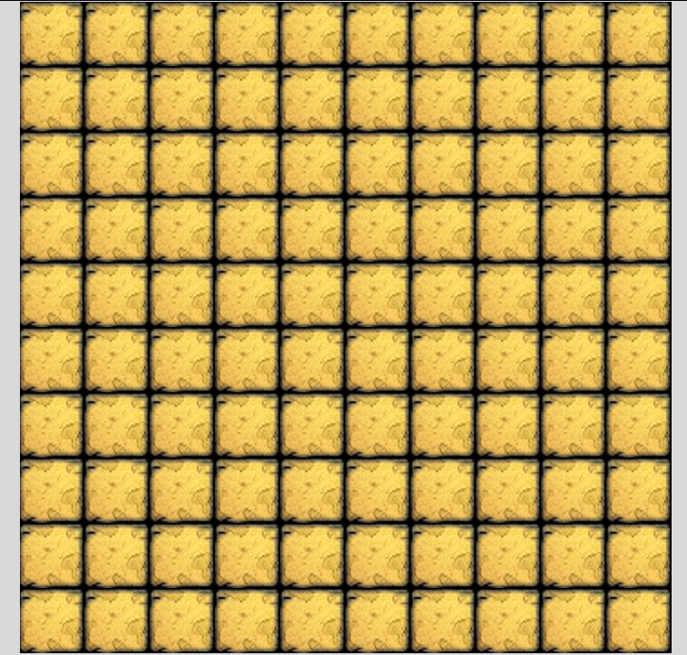
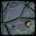
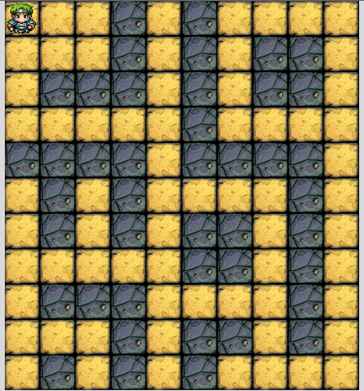

# TkWanderer Project Stories

#### Draw a screen with tiles

##### Tile
 - Given a terminal opened in the project directory
 - When the game is ran by executing `python main.py`
 - Then it should show a tile like this: 

##### Map
 - Given a terminal opened in the project directory
 - When the game is ran by executing `python mai/n.py`
 - Then it should show a map of tiles like this: 

##### Walls
 - Given the launched game
 - When the map is rendered on the screen
 - Then it should show floor  and wall type tiles as well: 

#### Place a character on it and move with key bindings

##### Hero
 - Given the launched game
 - When the map is rendered on the screen
 - Then it should show a hero on the top-left corner: 

 

##### Move down
 - Given the launched game
 - When the "down arrow key" is pressed by the user
 - Then the hero should move down one tile

##### Move around
 - Given the launched game
 - When any of the arrow keys are pressed by the user
 - Then the hero should move to that direction

##### Hero direction
 - Given the launched game
 - When the hero is moved by the arrow keys
 - Then the hero should face the direction where he went
    - Up: 
    - Right: 
    - Down: 
    - Left: 

##### Map boundaries
 - Given the hero on any edge of the map
 - When the hero is moved by the arrow keys towards the edge
 - Then it should not move, only its direction should change if necessary

##### Walls
 - Given the hero next to a wall tile
 - When the hero is moved by the arrow keys towards the wall tile
 - Then it should not move, only its direction should change if necessary

#### Extend with different kinds of characters

##### Skeletons
 - Given the launched game
 - When the map is rendered on the screen
 - Then 3 skeletons  should be on the map, somewhere on floor type tiles

##### Boss
 - Given the launched game
 - When the map is rendered on the screen
 - Then a boss  should be on the map, somewhere on floor type tiles

#### Create fight & game logic

##### Stats
 - Given the launched game
 - When the map is rendered on the screen
 - Then stats should appear below the map in a white box as black strings
   - It should contain:
      - The level of the Hero
      - The max HP of the Hero
      - The current HP of the Hero
      - The DP of the Hero
      - The SP of the Hero
   - Like this: `Hero (Level 1)   HP: 8/10 | DP: 8 | SP: 6`

##### Strike

##### Level up

#### Optional features

##### Random map
