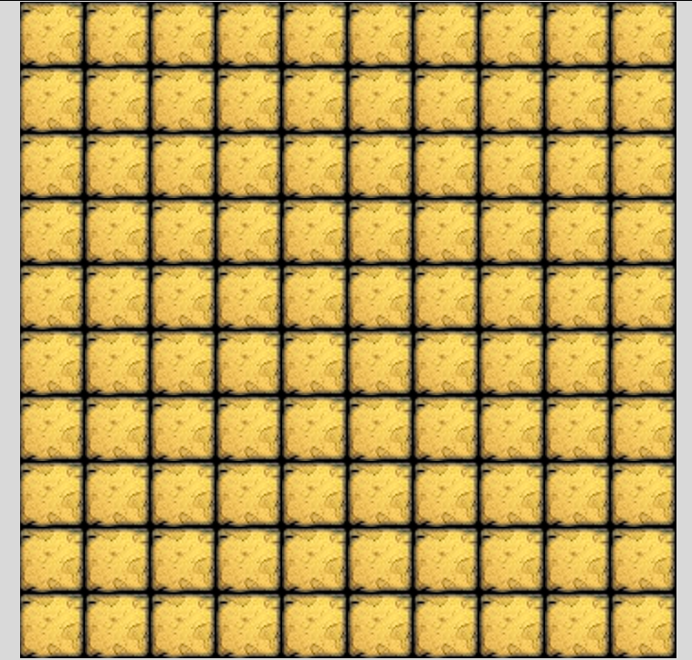
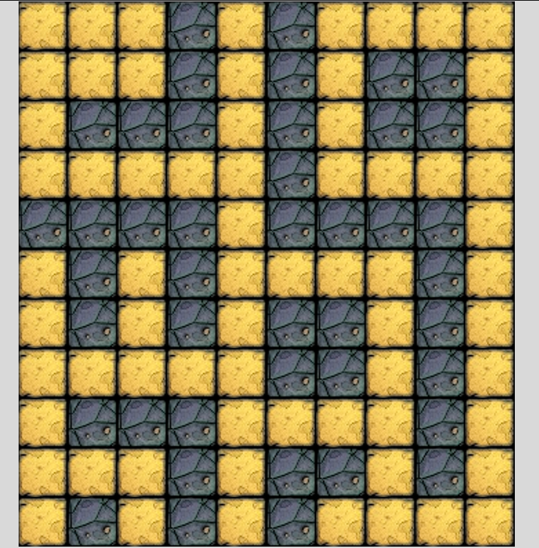
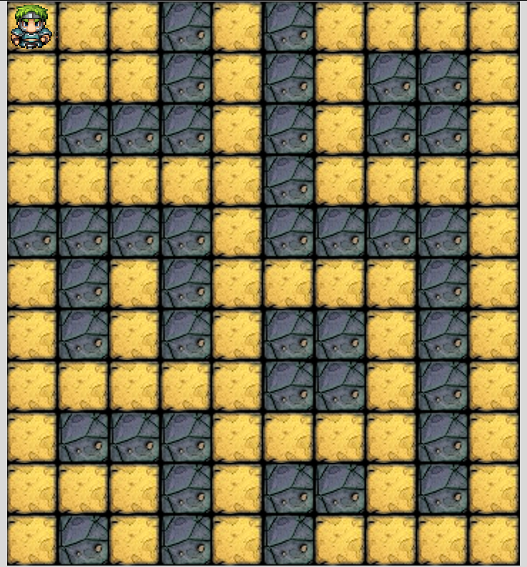

*Stories that should be followed by implementation. Each story contains a little progress on the project. Keep in mind, that all game has to be developed so when doing one specific story, you should be able to use the implementation later in the whole*

# Draw a screen with tiles

##### Tile
 - Given the launched game
 - Then it should show a tile like this:   

 |Floor tile|
 |----------|
 ||

##### Map
 - Given the launched game
 - Then it should show a map of tiles like this:

 

##### Walls
 - Given the launched game
 - When the map is rendered on the screen
 - Then it should show floor and wall type tiles as well:

Floor tile | Wall tile
---------- | ---------
 | 

# Place a character on it and move with key bindings

##### Hero
 - Given the launched game
 - When the map is rendered on the screen
 - Then it should show a hero on the top-left corner:

| Hero |
| ------ |
|  |

 

##### Move down
 - Given the launched game
 - When the "down arrow key" is pressed by the user
 - Then the hero should move down one tile

##### Move around
 - Given the launched game
 - When any of the arrow keys are pressed by the user
 - Then the hero should move to that direction

##### Hero direction
 - Given the launched game
 - When the hero is moved by the arrow keys
 - Then the hero should face the direction where he went

| Hero Up | Hero Right | Hero Down | Hero Left |
| ------- | ---------- | --------- | --------- |
|  |  |  |  |

##### Map boundaries
 - Given the hero on any edge of the map
 - When the hero is moved by the arrow keys towards the edge
 - Then it should not move, only its direction should change if necessary

##### Walls
 - Given the hero next to a wall tile
 - When the hero is moved by the arrow keys towards the wall tile
 - Then it should not move, only its direction should change if necessary

# Extend with different kinds of characters

##### Skeletons
 - Given the launched game
 - When the map is rendered on the screen
 - Then 3 skeletons should be on the map, somewhere on floor type tiles

| Skeleton |
| ---------- |
|  |

##### Boss
 - Given the launched game
 - When the map is rendered on the screen
 - Then a boss should be on the map, somewhere on floor type tiles

| Boss |
| ---- |
|  |

# Create fight & game logic

##### Stats
 - Given the launched game
 - When the map is rendered on the screen
 - Then stats should appear below the map in a white box as black strings
   - It should contain:
      - The level of the Hero
      - The max HP of the Hero
      - The current HP of the Hero
      - The DP of the Hero
      - The SP of the Hero
   - Like this: `Hero (Level 1)   HP: 8/10 | DP: 8 | SP: 6`

##### Strike
- Characters are able to strike as detailed in the specification

##### Battle logic
- After a hero character performed a strike the defender should strike back the same way

##### Level up
- When all enemies cleared from the map, the hero should enter the new level automatically

# Optional features

##### Random map
- When map is created the placement of walls should be random
- Make sure that all floor tiles are connected

##### Leveling
- Add more hp / damage to the hero according to the specification
- Add more hp / damage to the monsters
- Implement random events which happen when entering the new area

##### Monsters moving around
