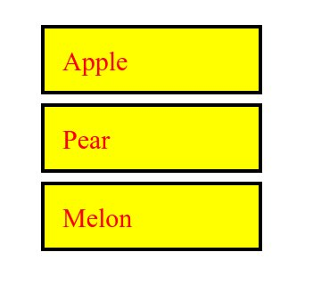
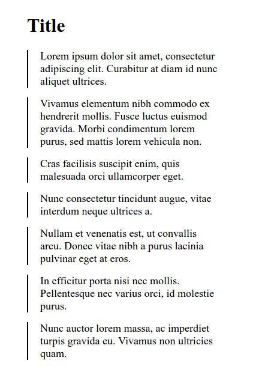
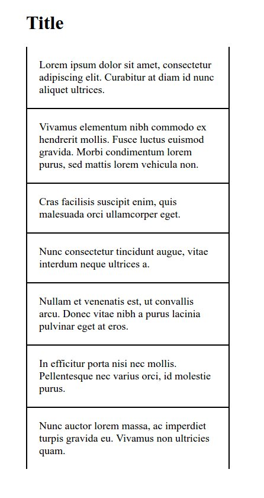

# HTML & CSS
Create small layouts with HTML and CSS.

## Objectives
 - Using classes and ids
 - Understanding sizes and the box-model in CSS
 - Using borders
 - Using background images

## Materials & Resources
### Training
#### HTML
| Material | Time |
|:---------|-----:|
| [HTML Tutorial for Beginners 01 - HTML Introduction](https://www.youtube.com/watch?v=Y1BlT4_c_SU) | 2:30 |
| [HTML Tutorial for Beginners 02 - What is HTML?](https://www.youtube.com/watch?v=cZCq8lQ-vZ0) | 6:07 |
| [HTML Tutorial for Beginners 03 - HTML Syntax & Structure](https://www.youtube.com/watch?v=IJWcX2EDAKg) | 13:09 |
| [HTML Tutorial for Beginners 04 - Your First Web Page](https://www.youtube.com/watch?v=MnaKa7igX7k) | 9:35 |
| [HTML Tutorial for Beginners 05 - Head and Body Tag](https://www.youtube.com/watch?v=mNRzWMH5xK0) | 7:22 |
| [HTML Tutorial for Beginners 06 - Headings and Text](https://www.youtube.com/watch?v=XxZPrn1VFTc) | 8:18 |
| [HTML Tutorial for Beginners 08 - Default Browser Styles](https://www.youtube.com/watch?v=OwC4xNWihoM) | 3:40 |
| [HTML Tutorial for Beginners 09 - The img Tag](https://www.youtube.com/watch?v=g6xsNHnAmlE) | 6:12 |
| [HTML Tutorial for Beginners 10 - HTML Links](https://www.youtube.com/watch?v=f8pAb3IuECk) | 12:24 |
| [HTML Tutorial for Beginners 11 - HTML Lists](https://www.youtube.com/watch?v=HeQvQEiGMKk) | 8:05 |
| [HTML Tutorial for Beginners 13 - The div Tag](https://www.youtube.com/watch?v=-XQlr727A8w) | 4:51 |
| [HTML Tutorial for Beginners 14 - ID's and Classes](https://www.youtube.com/watch?v=9UNmumTYuq8) | 8:13 |
| [HTML Tutorial for Beginners 15 - Adding CSS to HTML](https://www.youtube.com/watch?v=Tc4IsPFB01E) | 9:33 |

__NOTE!__ Pay special attention to determine the purpose of these tags: `<header>`, `<main>`, `<footer>`, `<section>`, `<article>`

#### CSS
| Material | Time |
|:---------|-----:|
| [CSS Tutorial For Beginners - What is CSS?](https://www.youtube.com/watch?v=4BEyFVufmM8) | 4:43 |
| [CSS Tutorial For Beginners 03 - Default Browser Styles](https://www.youtube.com/watch?v=iqTgros3FTc) | 4:46 |
| [CSS Tutorial For Beginners 04 - Basic CSS Syntax](https://www.youtube.com/watch?v=1CqHws4WZ-M) | 8:01 |
| [CSS Tutorial For Beginners 08 - Targeting Elements with CSS](https://www.youtube.com/watch?v=f7c7bTrqXic) | 4:28 |
| [CSS Tutorial For Beginners 09 - Targeting Classes and ID's](https://www.youtube.com/watch?v=hrqo_GOwHHs) | 7:24 |
| [CSS Tutorial For Beginners 10 - CSS Conflicts & the Cascade](https://www.youtube.com/watch?v=4oPvurjpcNw) | 8:04 |
| [CSS Tutorial For Beginners 11 - Inheritance](https://www.youtube.com/watch?v=ZMpaebQ3n6A) | 8:47 |
| [CSS Tutorial For Beginners 12 - Selector Specificty](https://www.youtube.com/watch?v=lZ6R_eYYxoE) | 10:17 |
| [CSS Tutorial For Beginners 14 - Targeting Multiple Elements](https://www.youtube.com/watch?v=3SOf8gZlBhI) | 4:40 |
| [CSS Tutorial For Beginners 15 - Descendant Selectors](https://www.youtube.com/watch?v=84KE7OwMjYY) | 6:22 |
| [CSS Tutorial For Beginners 36 - The Box Model](https://www.youtube.com/watch?v=Qx-yzUBqatQ) | 9:27 |
| [CSS Tutorial For Beginners 37 - Margins](https://www.youtube.com/watch?v=ggo0di5L6sA) | 10:38 |
| [CSS Tutorial For Beginners 38 - Padding](https://www.youtube.com/watch?v=4YF-eaX4P0k) | 4:41 |
| [CSS Tutorial For Beginners 40 - Borders](https://www.youtube.com/watch?v=sdn5p4kf91c) | 6:47 |

### Optional 
*If you've got time, consider the following:*
 - https://developer.mozilla.org/en-US/docs/Web/HTTP
 - https://developer.mozilla.org/en-US/Learn/Getting_started_with_the_web/HTML_basics
 - https://developer.mozilla.org/en-US/Learn/Getting_started_with_the_web/CSS_basics
 - http://alistapart.com/article/grokwebstandards

## Material Review 
 - Purpose of: 
   - `<html>`
   - `<head>`
   - `<link>`
   - `<script>`
   - `<body>`
   - `<meta>`
   - `<title>`
   - `<h1>` - `<h6>`
   - `
`
   - `<a>`
   - ``
   - `<article>`
   - `<aside>`
   - `<strong>`
   - `<em>`
   - ``
   - `
`
   - `<header>`
   - `<main>`
   - `<footer>`
   - `<section>`
   - `<ul>`
   - `<ol>`
   - `<li>`
   - `<dd>`
   - `<dt>`
   - `<pre>`
 - class
 - id
 - Descendant selector
 - Conflict 
 - Inheritance 
 - Specificity
 - The Box model
 - Shorthand
 - Default browser styles

## Workshop
In the sections that follow are a list of Exercises for you to build using simple layouts in HTML and CSS.

- Create each in its own, separate directory.
- Try to use the most simple method when selecting the element.
- Try to avoid duplicating code.
- Use paint, gimp, or something similar to figure out the sizes and colors.
- You can use any lorem ipsum generator for the texts, it is not necessary to have the same

### Exercise 1

Font size: 30 pixels

### Exercise 2

Font size: 30 pixels

### Exercise 3

Font size: 30 pixels

### Exercise 4

### Exercise 5

### Exercise 6

Font size: 18 pixels

### Exercise 7

Font size: 18 pixels

### Exercise 8

Font size: 18 pixels

Duck: 

## Project work
[CV template](https://invis.io/X575YEGVU#/155416515_Greenfox-Anakins-Cv) to follow
Try to make a build as similar as possible to the design.

## Individual Workshop Review
Please follow the styleguide: [Our HTML & CSS styleguide](../../styleguide/html-css.md)

 - Is the directory structure and the name of the files correct?
 - Is the doctype present and valid?
 - Is the semantic structuring good in the html file?
 - Are the color codes valid?
 - Is there unnecessary code duplication?
 - Is the indentation good in each file?
 - Are the attributes valid on each tag?
 - Are there unnecessary code or empty selectors?
 - Are the `<ul>` and `<li>` elements valid?
 - Are there id duplications?
 - The code should not show errors here: https://validator.w3.org/
 - Is the commit message meaningful?

