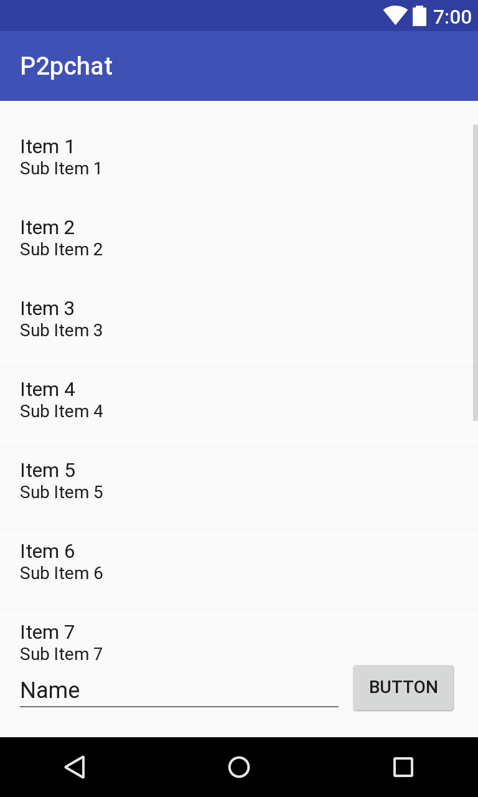

# Android
*Get the feeling of creating Android applications*

## Materials & Resources
### Resources
- [Install Android Studio](https://developer.android.com/studio/index.html)
- Follow the instructions on the [install page](https://developer.android.com/studio/install.html)
- Bring an Android phone for today with a data cable (USB-microUSB), if you have one
  - Try it with your computer. If connected the phone should appear as a file storage or camera.
  - The best is if the Android version is above 4.0.0. You can check that on the phone in Settings / About Phone / Android Version.
  - This is not mandatory, you can work with emulator on your computer, its just more fun

### Training
| Material | Time |
|:---------|-----:|
|[Writing your first Android app – everything you need to know](https://www.youtube.com/watch?v=mAJeK283j0I)|16:49|

## Material Review
- Activity
- Layout
- Handling Click events
- Toast
- Resources
  - strings
  - Id
- AndroidManifest
- Activity onCreate

## Workshop

We'll create an Android client for our existing p2p chat application step by step.
*This day the workshops include more information and detail, since this is a brand new topic and we didn't want to give you hours of material. Please note, if you need some more detail feel free to search on https://developer.android.com or anywhere else as usual*

### Initializing the project
- Create a new Android Project
- Select the minimum Android version, don't go higher than your phone's version, but preselected 4.0.3 should be fine.
  - Don't select TV or Wear or Auto compatibility
- Create an EmptyActivity called MainActivity
  - Have backwards compatibility and generate layout file selected
- If everything went well you should have opened:
  - `MainActivity` with an `onCreate` method
  - `activity_main.xml` with a drag'n'drop editor

### Design the Activity
- Remove the Hello World text from the middle
- Put a ListView, a Plain Text (EditText) and a Button and arrange it like this:
[](assets/views/app.png?raw=true)

- The ListView should be occupying the whole top area
- If you need more detail on [how layouts work](https://developer.android.com/training/constraint-layout/index.html)
- In your `MainActivity`'s `onCreate` method instantiate the placed widgets and store them as class fields
  - Don't touch anything that's already there, just do everything after
- Eg.
```java
Button sendButton = (Button) findViewById(R.id.button);
```
- Check the type of the widgets in the editor and store them in the correct type of field
  - (Button should be Button, ListView should be ListView, but the Plain Text should be EditText)
- Check the id of the widgets and use those ids
  - (Buttons and EditTexts will have generated ids by default, you can change those to your liking, but the ListView wont have any, so assign one)

### Create a simple layout for one message
- Find the layout folder and place a new Layout Resource file in it called `message.xml`
- Place two TextView inside of it, change their ID to `username` and `text`

### Create a Message model
- It should have the fields, you want to display: username and the text
- This will be used to map the json data sent from your server, so name your fields matching

### Create an Adapter
- Adapters are for filling an AdapterView with actual views
- In our case it will fill the ListView
- Just to imagine we will have an ArrayList of Messages and for every message the Adapter will create a view based on the layout you previously created ([more info](https://developer.android.com/guide/topics/ui/declaring-layout.html#AdapterViews))
- We just need to specify what to fill with what
- Create a new class called `MessageAdapter` and extend it from `ArrayAdapter<Message>`
- It will cry for a constructor, so fix it (Alt+Enter)
  - We wont actually use the second parameter, so the constructor should look like this:
```java
MessageAdapter(Context context) {
  super(context, 0);
}
```
- Override the `getView(...)` method
- This have a position parameter, which will be actually the position of the current row we're trying to create
- The ArrayAdapter has a built in ArrayList, so we don't need to create one, we can just use the existing one
  - since we defined the type of ArrayAdapter when extending, this list will contain Messages
- So get the current message, and store it in a local variable:
```java
Message current = getItem(position);
```
- Next we need to load the created layout
  - The ListView is clever, so it won't create more views than actually can be rendered on the screen if we're doing this right
  - So if something goes off the screen that view can be reused, just need to replace the content
  - The replaceable view is coming in the `convertView` parameter
- So first, check if the `convertView` is `null`
  - if it is, we are creating the first few rows of this list, hence we need to load the layout:
```java
convertView = LayoutInflater.from(getContext()).inflate(R.layout.message, parent, false);
```
- Now we have a loaded layout in our `convertView` variable
- Find the TextViews inside of it and set the proper content:
```java
TextView username = (TextView) convertView.findViewById(R.id.username);
username.setText(current.getUsername());
```

### Set it up
- In your `MainActivity`'s `onCreate` method instantiate a MessageAdapter
  - You will need to provide a context for the constructor, luckily the Activity you're working in actually is one
  - Save it as a field to the class
- Add some messages so you can see if its working
- Set your adapter as the ListView's adapter (hint: it has a standard setter for it)
- Run it! See it!

### Adding new message
- Now let's do some business
- We want to do something when the user hits the Button
- Lets create a listener for that:
```java
button.setOnClickListener(new View.OnClickListener() {
  @Override
  public void onClick(View v) {
    adapter.add(new Message("Aze", message.getText().toString()));
  }
});
```
- The `OnClickListener` is an interface with one defined method, we're implementing it on the flow here
- Inside its `onClick` method we can do what we want, for example adding a new message to our adapter
  - with our static username and getting the text the user provided

### Getting prepared with the backend
- First you need to add a RESTful get messages endpoint for your backend and deploy it to heroku:
`GET /api/messages`
```json
{
  "messages": [
    {
      "id": 7655482,
      "username": "Aze",
      "text": "How you doin'?",
      "timestamp": 1322018752992
    },
    ...
  ],
  "client": {
    "id": "Aze"
  }
}
```

### Android and Retrofit are best friends
- Add Retrofit to your projects dependencies in the app's gradle file (__not in the project's__)
- Don't forget to add a converter for json mapping (gson or jackson)
  - `compile 'com.squareup.retrofit2:converter-jackson:2.3.0'`
- Create a Retrofit interface for your backend's api
  - [Here's a sample for it, if you get stuck](assets/service/ApiService.java)
- Instantiate it in your `onCreate` method (and store it as a field):
```java
Retrofit retrofit = new Retrofit.Builder()
    .baseUrl("https://your-app-p2p.herokuapp.com")
    .addConverterFactory(JacksonConverterFactory.create())
    .build();

service = retrofit.create(ApiService.class);
```
- At the end of the creating the activity enqueue a get messages request:
```java
service.getMessages().enqueue(new Callback<MessageResponse>() {
  @Override
  public void onResponse(Call<MessageResponse> call, Response<MessageResponse> response) {
  }

  @Override
  public void onFailure(Call<MessageResponse> call, Throwable t) {
  }
});
```
- This callback will be used when the request is finished
- If it was successful, the `onResponse` method, else `onFailure` method will be called by Retrofit, passing the response from the request
- In the `onResponse` you can get the actual messages from the `response.body()`
  - Which will be converted to whatever you specified in the interface
  - Preferably a `MessageResponse` that contains a list of messages and a client (since that could be mapped to the json in the API spec above)
- After that clear the adapter from the temporary messages (`adapter.clear()`)
- And add the actual messages (`adapter.addAll(messages)`)

### Send the message to the server
- Change the current behaviour of your OnClickListener on the button
- Instead of locally adding the message to the adapter
- Send it with the retrofit service, if the request is successful, add it to the adapter as before

### Optional Tasks
- Make it more pretty, play with it :)
  - Different colors, nicer layout for messages, images
- Create a refresh button, that refreshes the list
  - Put it in the menubar
- Make it autorefresh every 5-10 seconds
- Create a username changer
- Anything you like :)
