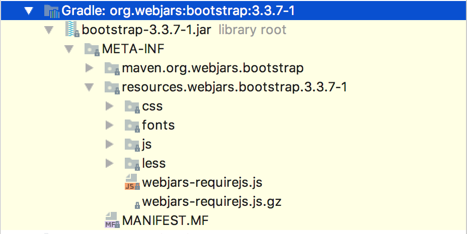
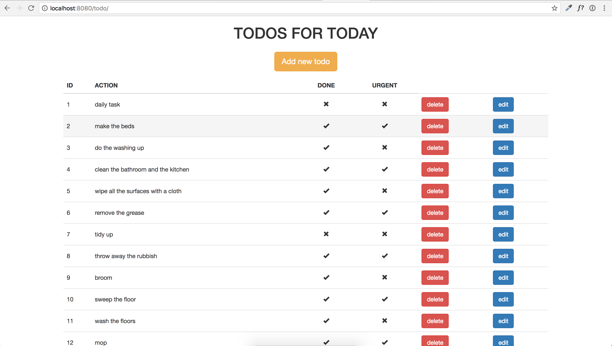

# Bootstrap
An easy way to make your webpages responsive and add better looking design to them by using predefined `class`-es.

## Materials & Resources

### Training
| Material | Time |
|:---------|-----:|
|[Introduction to Bootstrap](https://www.youtube.com/watch?v=wesUO81YX0U)|8:09|
|[Adding Bootstrap through Webjars](https://www.youtube.com/watch?v=Q45c61-tHV4)|11:50|
|[Grid system](https://www.youtube.com/watch?v=c5xVxSFoyQw)|5:51|
|[CSS posibilities](http://getbootstrap.com/css/)|just scroll through|
|[Component posibilities](http://getbootstrap.com/components/)|just scroll through|
|[Examples](http://getbootstrap.com/examples/theme/#)|just have a look at|


### Optional
More possibilities

| Material | Time |
|:---------|-----:|
|[JS related posibilities](http://getbootstrap.com/javascript/)|just scroll through|


## Material Review
- responsibility
- grid system
- Bootstrap
- jquery (just a few words)

## Help to start

1. To use Bootstrap, you'll need two new dependencies in your build.gradle file:
```
compile group: 'org.webjars', name: 'bootstrap', version: '3.3.7-1'
compile group: 'org.webjars.bower', name: 'jquery', version: '3.2.1'
```

2. After you added these dependencies, check your project's External Libraries / Gradle: org.webjars:bootstrap:3.3.7-1 libraby.
You should see the following content in it:


3. Use Bootstrap in your HTML templates by
- adding the `bootstrap.min.css` link to your `<head>`:
```
<link href="webjars/bootstrap/3.3.7-1/css/bootstrap.min.css" rel="stylesheet"/>
```
- and adding the `jquery.min.js` and the `bootstrap.min.js` scripts at the end of your `<body>`:
```
<script src="webjars/jquery/1.11.1/jquery.min.js"></script>
<script src="webjars/bootstrap/3.3.7-1/js/bootstrap.min.js"></script>
```

## Workshops
### 1. TODO redesign
- create a better looking design (like the one below) to your web TODO app with Bootstrap
- be sure that your web TODO app is responsive


### 2. Continue your Chat app project and feel free to use Bootstrap when you reach the "Better looking main page" subtask
