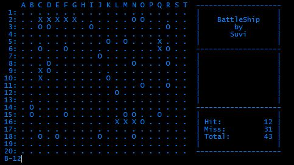

# Battleship Mini-Project
Create a Battleship Console Application!

## Specifications

### Map
 - Instead of the standard format, the map size is 20 * 20
 - The map is visualized with `.`(dots), hits with `X`, misses with `O`

### Ship
 - There are 5 types of ship:
   - Size: 1, amount: 4
   - Size: 2, amount: 3
   - Size: 3, amount: 3
   - Size: 5, amount: 2
   - Size: 8, amount: 1
 - These ships can be either horizontal placed or vertically

### Rules
 - Between 2 ships the minimum distance is 1, not 0
 - The game is finished, when all ship has sinked

### Gameplay
 - The ships are randomly placed on the map
 - The player is continously guessing in the following format:
   - `B-12`
 - The game count these attempts as:
   - Hit, if we hit a ship
   - Miss, if we not
   - Total, as total amount of guesses
 - When the game is finished, we exit the application

### Display
 - In each round display the following:
   - The map
   - The amount of hits
   - The amount of misses
   - The total amount of guesses

### Plus One
 - If the game has finished, take a screenshot and save that Bitmap into a file! (The Bitmap object is implementing the `IDisposable` interface)

 ### Possible preview

   