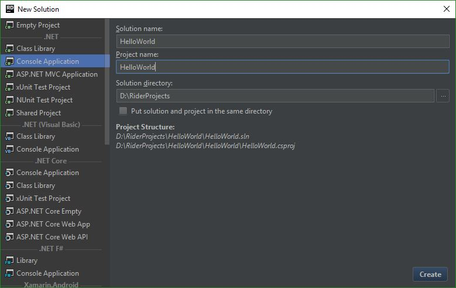

# C# Basics
*Introduction to the C# Language and the .NET Framework*

C# is an elegant and type-safe object-oriented language that enables developers to build a variety of secure and robust applications that run on the .NET Framework. You can use C# to create Windows client applications, XML Web services, distributed components, client-server applications, database applications, and much, much more.

## Materials & Resources
### Resources
- Install one of the following IDEs:
  - [Visual Studio 2017](https://www.visualstudio.com/downloads/) - Recommended IDE for Windows Users
  - [Project Rider](https://www.jetbrains.com/rider/download/) - Early Build IDE by JB
    - Prerequisites for ([Windows](https://rider-support.jetbrains.com/hc/en-us/articles/207288089-Using-Project-Rider-under-Windows-without-Visual-Studio-prerequisites) / [Mac](https://rider-support.jetbrains.com/hc/en-us/articles/208074835-Using-Project-Rider-on-Mac-prerequisites) / [Linux](https://rider-support.jetbrains.com/hc/en-us/articles/207335749-Using-Project-Rider-under-Linux-prerequisites))
- Let`s create a simple Hello World Application:
  - Open the installed IDE
  - Create a new `Console Application`
  
  - Open `Program.cs` and use `Console.WriteLine();` in our `Main()`, which works same as `System.out.println();`
  - Build and Run the solution!
  - If you see what we are expecting, then you are ready to go with the materials :)

### Materials
| Material | Time |
|:---------|-----:|
| [C# Coding Standards](http://www.dofactory.com/reference/csharp-coding-standards)| Text |
| [Properties](https://www.youtube.com/watch?v=NK3asFyC0d0) | 8:40 |
| [Properties](https://www.youtube.com/watch?v=DcooWmrDOqw) | 9:59 |
| [Enums](https://www.youtube.com/watch?v=wvdImlqg7e0) | 6:35 |
| [Structs](https://www.youtube.com/watch?v=XHwfWhhdO7I) | 7:08 |
| [Nullable Types](https://www.youtube.com/watch?v=Jjy9kCPu2fQ) | 2:31 |
| [Constructors](https://www.youtube.com/watch?v=G_ph0LOk1IY) | 8:27 |
| [Types](https://www.youtube.com/watch?v=DWRgT870wSU) | 4:30 |
| [Cross Projects](https://www.youtube.com/watch?v=BDQya1PqK0M) | 4:37 |
| [Interface](https://www.youtube.com/watch?v=xcS6JoY_etA) | 7:48 |
| [Polymorphism](https://www.youtube.com/watch?v=GU5P_03xOJw) | 11:04 |
| [GenericCollections](https://www.youtube.com/watch?v=2kFn2bwYDx8) | 10:21 |
| [Lists](https://www.youtube.com/watch?v=kVCJmFtxaLg) | 8:49 |
| [LINQ](https://www.youtube.com/watch?v=dOWU3zQp668) - "Don't freak out!" | 9:11 |
| [Extension Methods](https://www.youtube.com/watch?v=VYyuZ5lHpt0) | 5:46 |
| [LINQ and Anonymous types](https://www.youtube.com/watch?v=e7WLBXXmP7Y) | 9:58 |
| [Generics](https://www.youtube.com/watch?v=ohZ1ScxW3Sc) | 4:54 |
| [Exceptions](https://www.youtube.com/watch?v=iopBAZ3LZQU) | 7:10 |

## Optional
| Material | Time |
|:---------|-----:|
| [TutorialsPoint Basics](https://www.tutorialspoint.com/csharp/index.htm)| Text |
| [C# for Java developers](https://msdn.microsoft.com/en-us/library/ms228602(v=vs.90).aspx) | Text |

## Material Review
- Cross Project
- `static class`
- `var`
- nullable
- Properties
- Object Initializer
- Generic Collections
- LINQ
- `virtual`
- `IDisposable`
  - `using`
- Exceptions