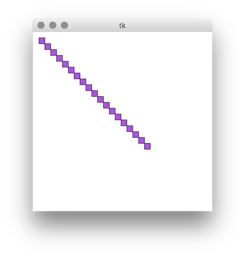
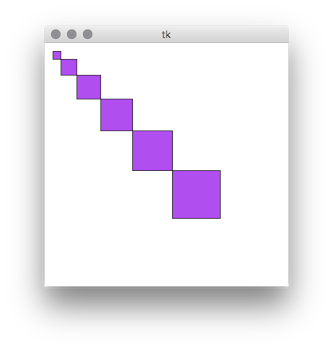
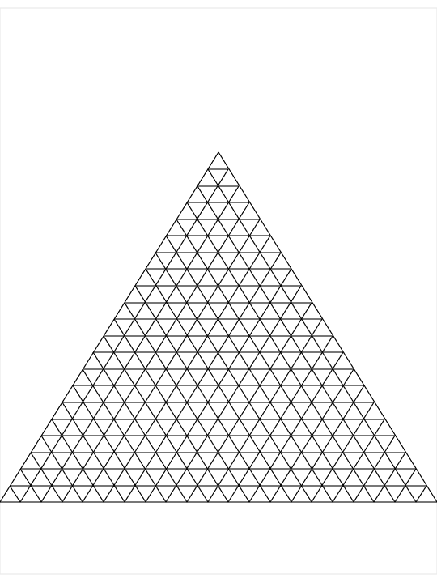

# Graphics
Draw on a canvas using our previous knowledge about control flow and functions

## Materials
| Material | Time |
|:---------|-----:|
| [WPF Introduction](https://www.youtube.com/watch?v=ImH_LvRMISw) | 9:10 |
| [Shapes and Basic Drawing in WPF](https://docs.microsoft.com/en-us/dotnet/framework/wpf/graphics-multimedia/shapes-and-basic-drawing-in-wpf-overview) | Read until `Using Path and Geometries` |
| [Line](https://docs.microsoft.com/en-us/dotnet/api/system.windows.shapes.line?view=netframework-4.7#Examples) | Example only |
| [Ellipse](https://docs.microsoft.com/en-us/dotnet/api/system.windows.shapes.ellipse?view=netframework-4.7#Examples) | Example only |
| [Rectangle](https://docs.microsoft.com/en-us/dotnet/api/system.windows.shapes.rectangle?view=netframework-4.7#Examples) | Example only |
| [Polygon](https://docs.microsoft.com/en-us/dotnet/api/system.windows.shapes.polygon?view=netframework-4.7#Examples) | Example only |

## Material Review
- WPF
- Canvas
- Stroke, StrokeThickness, Fill
- Line
- Ellipse
- Rectangle
- Polygon
- Point

## Workshop
As you saw in the examples, creating shapes and adding them to our canvas is not a few step exercise. That's why we created the [FoxDraw.cs](./boilerplate/FoxDraw.cs) to help you focus more on what we are aiming to learn today. If you are curious feel free to dig deeper into the FoxDraw.cs code!

*💪💪💪 Hardmode: If you feel comfortable drawing shapes with FoxDraw try to do few exercises without it!*

### WPF
```xml
<Window x:Class="Drawing.MainWindow"
        xmlns="http://schemas.microsoft.com/winfx/2006/xaml/presentation"
        xmlns:x="http://schemas.microsoft.com/winfx/2006/xaml"
        xmlns:d="http://schemas.microsoft.com/expression/blend/2008"
        xmlns:mc="http://schemas.openxmlformats.org/markup-compatibility/2006"
        mc:Ignorable="d"
        Title="Drawing" Height="331" Width="308">
    <Grid>
        <Canvas  Name="canvas"/>
    </Grid>
</Window>
```

```csharp
using System;
using System.Windows.Controls;  
using GreenFox;

namespace Drawing
{
    public partial class MainWindow : Window
    {
        public MainWindow()
        {
            InitializeComponent();
            var foxDraw = new FoxDraw(canvas);
        }
    }
}
```

### Lines
```csharp
    public static void DrawGreenLines(FoxDraw foxDraw)
    {
        foxDraw.StrokeColor(Colors.Green); 
        foxDraw.DrawLine(0, 10, 100, 10);

        var startPoint = new Point(0, 20);
        var endPoint = new Point(100, 20);
        foxDraw.DrawLine(startPoint, endPoint);
    }
```

### Ellipse
```csharp
    public static void DrawEllipse(FoxDraw foxDraw)
    {
        foxDraw.DrawEllipse(10, 10, 150, 50);
    }
```

### Rectangle
```csharp
    public static void DrawRectangle(FoxDraw foxDraw)
    {
        foxDraw.DrawRectangle(10, 10, 150, 50);
    }
```

### Polygons
```csharp
    public static void DrawGreenPolygon(FoxDraw foxDraw)
    {
        var points = new List<Point>();
        points.Add(new Point(10, 10));
        points.Add(new Point(40, 210));
        points.Add(new Point(170, 190));
        points.Add(new Point(130, 40));

        foxDraw.FillColor(Colors.Green);
        foxDraw.DrawPolygon(points);        
    }
```

### Exercises

- [01 Middle lines](line-in-the-middle/LineInTheMiddle.cs)
- [02 Colored box](colored-box/ColoredBox.cs)
- [03 Diagonals](diagonals/Diagonals.cs)
- [04 To the center](go-to-center/GoToCenter.cs)
- [05 Horizontal](horizontal-lines/HorizontalLines.cs)

- [06 Square in the center](centered-square/CenteredSquare.cs)
- [07 Fill with rectangles](four-rectangles/FourRectangles.cs)
- [08 Square positioning](position-square/PositionSquare.cs)
- [09 Centered boxes](center-box-function/CenterBoxFunction.cs)
- [10 Rainbow boxes](rainbow-box-function/RainbowBoxFunction.cs)

-
| [11 Purple steps](purple-steps/PurpleSteps.cs) |
|:--------------:|
|  |
-
| [12 Purple steps 3d](purple-steps-3d/PurpleSteps3d.cs) |
|:--------------:|
|  |


- [13 Checkerboard](checkerboard/Checkerboard.cs)
- [14 Everything goes to center](function-to-center/FunctionToCenter.cs)

-
| [15 Line play](line-play/LinePlay.cs) |
|:--------------:|
|  |

- [16 Line play quarters](line-play-quarters/LinePlayQuarters.cs)
-
| [17 Envelope star](envelope-star/EnvelopeStar.cs) |
|:--------------:|
|  |

- [18 Connect the dots](connect-the-dots/ConnectTheDots.cs)
- [19 Starry night](starry-night/StarryNight.cs)

-
| [20 Triangles](triangles/Triangles.cs) |
|:--------------:|
|  |

-
| [21 Super Hexagon](super-hexagon/SuperHexagon.cs) |
|:--------------:|
|  |


## Individual Workshop Review
Please follow the styleguide: [Our C# styleguide](../../styleguide/cs.md)

- Is the directory structure and the name of the files correct?
- Are the usings palced on the top of the files?
- Is the indentation good in each file?
- Is there unnecessary code?
- Can you find unnecessary code in comments?
- Is there unnecessary code duplication?
- Are there unnecessary empty blocks?
- Can you spot unused variables?
- Is the commit message meaningful?
- Are the names of things following the styleguide?
- Are all of the brackets in the perfect place?
- Whitespaces, where they should be, where shouldn't?
