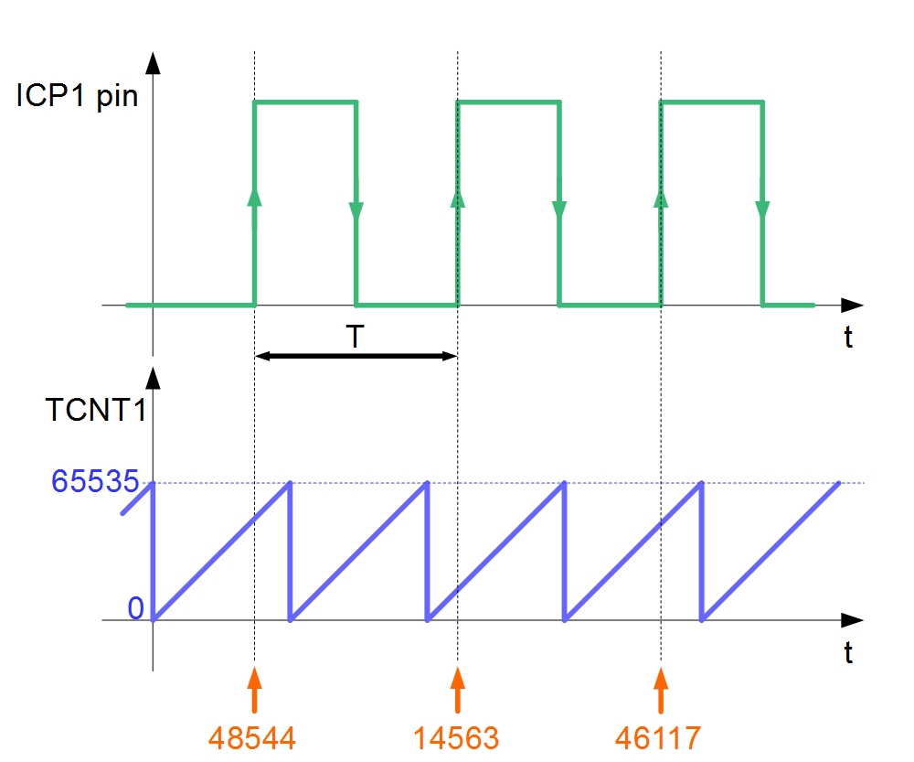
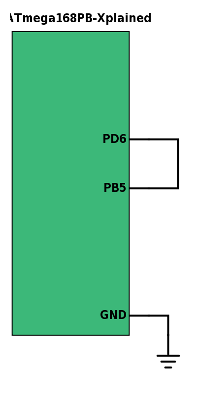
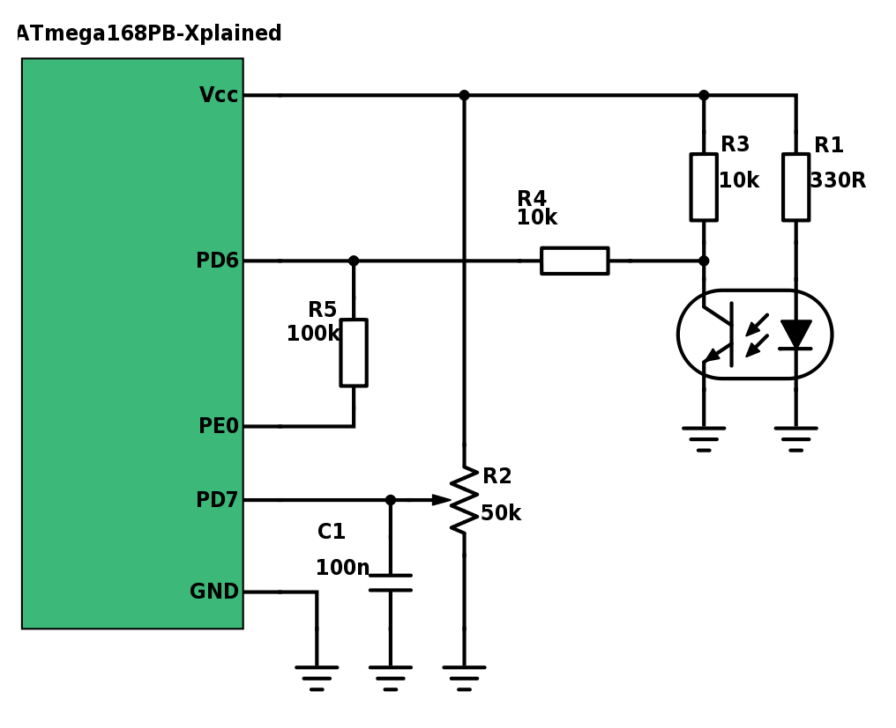

# Analog comparator peripheral
*TODO*

## Objectives
- Learn how to measure the frequency of an analog signal with an MCU
- Know more about the input capture timer mode
- Learn how does the AC peripheral works

## Materials & Resources
### Environment
- Make sure that Atmel Studio is installed on your machine

### Training
#### Input capture unit of timers
Usually MCU timers have an "Input Capture unit".

Take a look at the [ATmega168PB's datasheet](http://www.atmel.com/Images/Atmel-42176-ATmega48PB-88PB-168PB_Datasheet.pdf) at page 170. Let's talk about what you can see on Figure 21-3!

The timer has an input pin (ICP1), which is connected to an edge detector circuit.
This edge detector will emit an impulse on it's output if an edge (falling or rising, depending on the value of the ICES bit) is detected on the ICP1 pin. When this impulse is emitted, the value of the 16-bit wide TCNT1 register will be
copied to the 16-bit wide ICR1 register.

So basically the TC1 timer's counter register value is saved to another register
if an edge is detected on the ICP1 pin.

This feature could be very useful, for example you can measure the frequency of a
signal with it.

#### Measuring frequency with input capture unit
The basic idea behind this technique is to get a clock signal with a known period, then
count how many clock period will pass between two edges of the input signal. An
MCU timer can do the trick, basically it counts the periods of it's input clock.
If we could save the timer counter register's value on the edge of the input signal, than based on the clock period and the last two register value we could determine the
signal's period, and with that, the frequency:

signal's period = clock period * (latest register value - previous register value)

signal's frequency = 1 / signal's period

The input capture unit works exactly this way, but in real life there is a problem
with it: if the counter overflows between two input signal edge, then the difference
of the register values won't give us the correct result, we have to count the overflows.

Take a look the following diagram as an example. With green you can see the signal
on the ICP1 pin, it's period is marked with "T". With blue you can see the TC1
counter register's value as the time passes by, the vertical lines are representing
the register overflows.

</img>

Let's say that the counter input clock frequency, Tclk is 1us. The T period can be
calculated if the Tclk and the counter steps between two neighboring rising edges are
multiplied.

How many counter steps are between the first two rising edges? At the first
rising edge the counter value is 48544, then the counter overflows twice, then
the at the next rising edge the counter value is 14563. This can be written like:

steps = (65535 - 48544) + 65535 + 14563 = 2 * 65535 + 14563 - 48544

In general:

steps = overflows * counter_max + latest_counter_value - previous_counter_value

Then the T period can be calculated:

T = Tclk * steps

In this example:

T = 1us * 194177 = 194.177ms

f = 1 / T = 5.15 Hz

#### Reflective optical sensor
Our goal during the workshop to measure the rotational speed of a DC fan.
We are going to use a reflective optical sensor, the [TCRT5000](http://www.vishay.com/docs/83760/tcrt5000.pdf). It has two main components:
a LED which emits infrared light, and a phototransistor, which is basically an
infrared light controlled switch. If the light coming from the LED reflects to
the phototransistor, the transistor will turn on.

Please spend about 5 minutes with reading it's datasheet to get a global understanding of this device.

#### AC peripheral
We are going to use a comparator to convert the TCR5000's
periodic analog signal to a digital signal, which can be connected to the ICP1 pin.

Please watch and read the following materials:

| Material | Duration |
|:---------|-----:|
| [Analog Comparator Explanation](https://www.youtube.com/watch?v=Xc9hmoGeiLE) | 3:10 |
| [Hysteresis](https://www.youtube.com/watch?v=icFo5Zeydqg) | - |

There is an analog comparator in our MCU. Read the corresponding pages of the [ATmega168PB's datasheet](http://www.atmel.com/Images/Atmel-42176-ATmega48PB-88PB-168PB_Datasheet.pdf)(315-321).
Check the main things:
- 28.1. AC - Overview
    - Figure 28-1. Analog Comparator Block Diagram
- 28.2. Analog Comparator Multiplexed Input
- 28.3. Register Description
    - ACSR
    - ACSR0
    - DIDR1

## Material Review
### Input capture unit of timers
- How does it work
- Why is it useful

### Measuring frequency with input capture unit
- Calculation procedure
- Formula

### Reflective optical sensor
- TCRT5000 datasheet
- How does it works
- Demo with picoscope

### AC peripheral
- Physical layer
    - Basic comparator circuit
        - why we use it
        - for what we use it
    - Hysteresis
        - noise immunity
        - how does it works
- AC of ATmega168PB
    - registers
        - ACSR Analog Comparator Control and Status Register
        - ACSR0 Analog Comparator Control and Status Register C
        - DIDR1 Digital Input Disable Register 1
    - typical init procedure
        - digital input disable
        - selecting negative reference voltage
        - enable/disable AC0 output
        - enable/disable interrupt
        - enable/disable TC1 input capture triggering
        - interrupt mode selection

## Workshop
## Frequency measurement
### Setting up the hardware
Make the following connection on ATmega168PB Xplained board:

</img>

Whit this you connected the LED pin to the ICP1 pin.

[ATmega168PB Xplained user manual](http://www.atmel.com/Images/Atmel-42381-ATmega168PB-Xplained-Mini_UserGuide.pdf)

## Writing the code
The goal is to write a program, which can measure a digital signal's frequency, which
is connected to the ICP1 pin (PD6). You should use the TC1 timer's input capture unit!

Steps:
- create a new AtmelStudio project
- copy the [following files](#) to the project folder (next to the automatically generated main.c file)
- overwrite the files if asked
- add the files to the project
- write the code where asked (marked with "TODO")

## RPM measurement
### Setting up the hardware
Make the following connection between the reflective opto sensor and the ATmega168PB Xplained board:

</img>

[TCRT5000 datasheet](http://www.vishay.com/docs/83760/tcrt5000.pdf)

[ATmega168PB Xplained user manual](http://www.atmel.com/Images/Atmel-42381-ATmega168PB-Xplained-Mini_UserGuide.pdf)

#### Writing driver software
You are going to write a software which can measure time difference between two
impulses. This can be used to measure frequency.
It is useful to put all the hardware specific code in a separate .c and .h file, so it can be reused in another project just by copying those files.

Steps:
- create a new AtmelStudio project
- copy the [following files](#) to the project folder (next to the automatically generated main.c file)
- overwrite the files if asked
- add the files to the project
- write the code where asked (marked with "TODO")
    - always test the code after you wrote a few lines of code
    - write the needed functions in the following order
        - TODO
        - TODO
        - TODO
- test the driver with the FAN

## Individual Workshop Review
Please follow the styleguide: [Our C styleguide](https://github.com/greenfox-academy/teaching-materials/blob/master/styleguide/c.md)

 - Is the directory structure and the name of the files correct?
 - Are the includes placed on the top of the files?
 - Is the indentation good in each file?
 - Is there unnecessary code?
 - Can you find unnecessary code in comments?
 - Is there unnecessary code duplication?
 - Are there unnecessary empty blocks?
 - Can you spot unused variables?
 - Is the commit message meaningful?

## Solutions
[Solutions](#)
