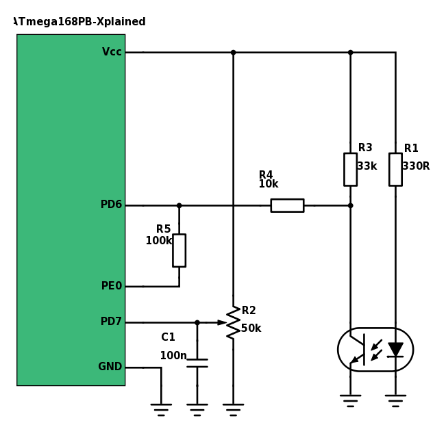

# Analog comparator peripheral
*Learn a new serial communication protocol*

## Objectives
- Learn how AC peripheral works, when use it

## Materials & Resources
### Environment
- Make sure that Atmel Studio is installed on your machine

### Training

#### AC peripheral
Read these articles on comparators.

Get a global understanding of the usage of the peripheral.

| Material | Duration |
|:---------|-----:|
| [Analog Comparator Explanation](https://www.youtube.com/watch?v=Xc9hmoGeiLE) | 3:10 |
| [Comparator](https://www.youtube.com/watch?v=Xc9hmoGeiLE) | - |

Also read the corresponding pages of the datasheet of ATmega168PB (315-321). Check the main things:
 - 28.1. AC - Analog Comparator overview
  - Figure 28-1. Analog Comparator Block Diagram

 - 28.2. Analog Comparator Multiplexed Input
 - 28.3. Register Description
  - ACSR
  - ACSR0
  - DIDR1
  - ADCSRB

## Material Review
### Analog comparator  
- Physical layer
    - Signals
        - -
        - +
        - ACO
 - Analog comparator vs. operational amplifiers
- AC of ATmega168PB
    - registers
        - ACSR Analog Comparator Control and Status Register
        - ACSR0 Analog Comparator Control and Status Register C
        - DIDR1 Digital Input Disable Register 1
        - ADCSRB ADC Control and Status Register B
    - typical init procedure
        - set master or slave mode
        - set slave address
        - set I2C mode
        - set bit rate
        - enable I2C interrupt if needed
        - enable I2C peripheral

## Workshop
### Analog Comparator
#### Setting up the hardware
Make the following connection between the reflective opto sensor and the ATmega168PB Xplained board:

</img>

[TCRT5000 datasheet](http://www.vishay.com/docs/83760/tcrt5000.pdf)

[ATmega168PB Xplained user manual](http://www.atmel.com/Images/Atmel-42381-ATmega168PB-Xplained-Mini_UserGuide.pdf)

#### Writing driver software
You are going to write a software which can measure time difference between two
impulses. This can be used to measure frequency.
It is useful to put all the hardware specific code in a separate .c and .h file, so it can be reused in another project just by copying those files.

Steps:
- create a new AtmelStudio project
- copy the [following files](#) to the project folder (next to the automatically generated main.c file)
- overwrite the files if asked
- add the files to the project
- write the code where asked (marked with "TODO")
    - always test the code after you wrote a few lines of code
    - write the needed functions in the following order
        - TODO
        - TODO
        - TODO
- test the driver with the FAN

## Individual Workshop Review
Please follow the styleguide: [Our C styleguide](https://github.com/greenfox-academy/teaching-materials/blob/master/styleguide/c.md)

 - Is the directory structure and the name of the files correct?
 - Are the includes placed on the top of the files?
 - Is the indentation good in each file?
 - Is there unnecessary code?
 - Can you find unnecessary code in comments?
 - Is there unnecessary code duplication?
 - Are there unnecessary empty blocks?
 - Can you spot unused variables?
 - Is the commit message meaningful?

## Solutions
[Solutions](#)
