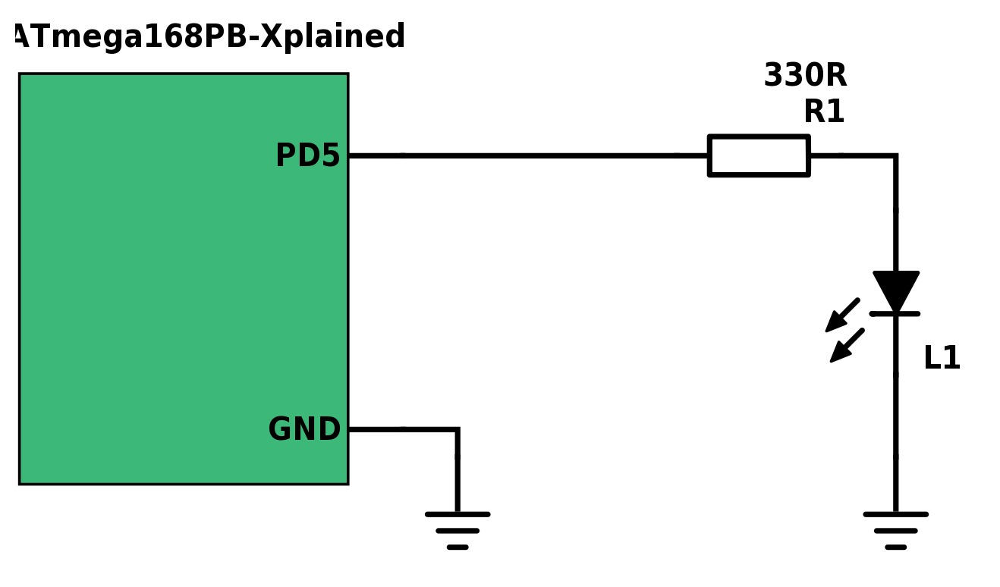
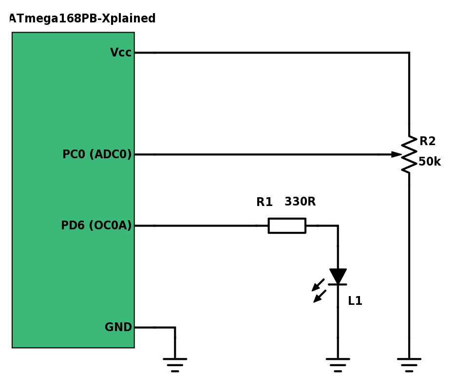
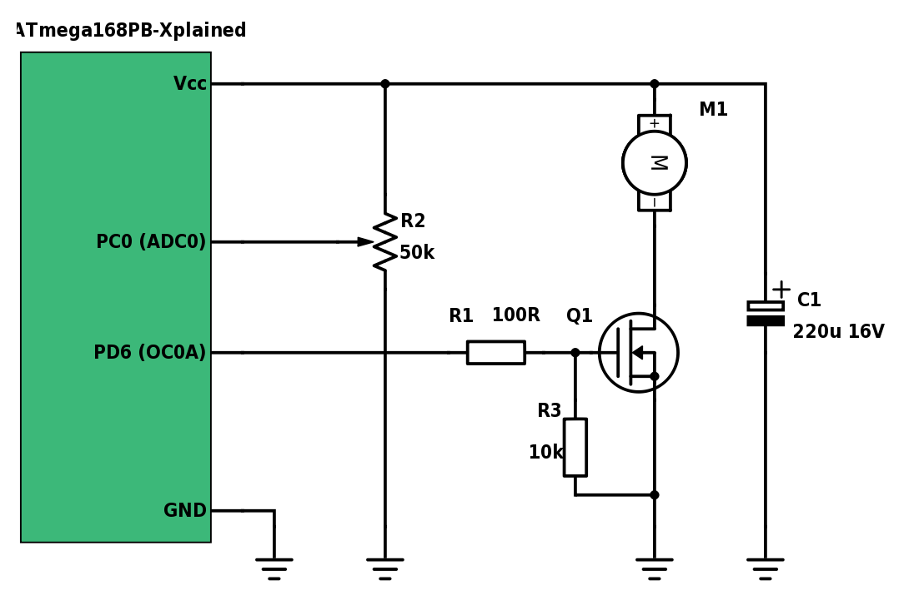

# PWM
*Learn how to use the timer peripheral of the ATmega168PB to generate PWM signals*

## Objectives
- know how to use the timer peripherals as PWM generators
- understand the concept of PWM

## Materials & Resources
### Environment
- Make sure that Atmel Studio is installed on your machine

### Training
#### PWM
| Material | Duration |
|:---------|-----:|
| [PWM (Pulse Width Modulation) as Fast As Possible](https://www.youtube.com/watch?v=ISzRh5eN_Pg) | 5:16 |
| [What is PWM? Pulse Width Modulation tutorial!](https://www.youtube.com/watch?v=YmPziPfaByw) | 3:06 |
| [MOSFETs and How to Use Them AddOhms #11](https://www.youtube.com/watch?v=GrvvkYTW_0k) | 7:45 |

#### PWM in AVR MCUs
| Material | Duration |
|:---------|-----:|
| [AVR Timers – PWM Mode – Part I](http://maxembedded.com/2011/08/avr-timers-pwm-mode-part-i/) | - |
| [AVR Timers – PWM Mode – Part II](http://maxembedded.com/2012/01/avr-timers-pwm-mode-part-ii/) | - |

## Material Review

### PWM
- What is it
- Why is it useful
- Duty cycle
    - usually measured in %
    - ton/T
- Changing the average of the output

### PWM in AVR MCUs
- Timers can generate PWM signals
- Timers have the following modes of operation
    - Normal
        - The counter counts up continuously
    - CTC (Clear Timer on Compare match)
        - The counter counts up until it reached the value of the OCRnx register
        - If the value is reached the counter will be set to zero
        - Figure 20-5.
    - Fast PWM
        - The counter counts up
        - The OCnx signal is high
        - If the counter value matches the value of the OCRnx register the OCnx signal goes low
        - The counter continuously count up until it overflows
        - When the overflow occurs the OCnx signal goes high
        - The cycle repeats
        - Figure 20-6. (Sawtooth signal compared to OCnx)
        - Tpwm = Tcntr
    - Phase correct PWM
        - The counter counts up
        - The OCnx signal is high
        - If the counter value matches the OCRnx register the OCnx signal goes low
        - The counter continuously count up until it reaches the TOP, than it starts to count down
        - If the counter value is equal to the OCRnx register the OCnx signal goes high
        - The counter counts down until it reaches BOTTOM, then it starts again to count up
        - The cycle repeats
        - Figure 20-7. (Triangle signal compared to OCnx, if equal the OCnx is toggled)
        - Tpwm = Tcnt*2
- The OCnx signals can be set/clear/toggle specific pins of the MCU
    - COMnx bits of TCCRxA register
    - Usually there is two compare register (OCRnA and OCRnB) -> two output pins

- Registers
    - TCCRnA
        - OCnA output pin behavior depending on OCRnA compare match
        - OCnB output pin behavior depending on OCRnB compare match
        - 2 bits of the 3 mode setup bits
    - TCCRnB
        - Force output compare in non PWM mode (not used feature in PWM mode)
        - 1 bit of the 3 mode setup bits
        - clock select bits
    - TIMSKn
        - interrupt mask register (overflow, compare match interrupts)
        - here you can enable/disable interrupts
    - TCNTn
        - counter register
    - OCRnA
        - A compare register
    - OCRnB
        - B compare register
    - TIFRn
        - interrupt flag register
        
### MOSFET
  - Why we use those magical things?
  - Pinout
  - How do we control them
  - Signals, and key features

## Workshop
### Dimming a LED in Fast PWM mode
In this exercise the goal is to change the light intensity of a LED with PWM. You will set the TC0 timer to Fast PWM mode to generate PWM signals on the
OC0A pin of the MCU.

Fist connect a LED (with a current limiting resistor) to the ATmega168PB to the OC0A pin!

[ATmega168PB Xplained user manual](http://www.atmel.com/Images/Atmel-42381-ATmega168PB-Xplained-Mini_UserGuide.pdf)

</img>

Exercise steps:
- Create a new AtmelStudio project
- Create the PWM related functions, definitions, variables etc. in a separate .c and .h file! This is necessary, because later on we will add more files to the project!
- Write a function which initializes the TC0 timer in Fast PWM mode
- Write a function which sets the duty cycle (0-100) of the PWM signal on the OC0A pin
    - The function should have one uint8_t parameter which value is between 0-100
- Try out the init function and the duty cycle setter function
    - You should change the light intensity of the LED

### Dimming a LED with a potentiometer
The goal is to change the LED's light intensity based on the potentiometer's voltage level.

At first add a potentiometer to the previous circuit.

</img>

Exercise steps:
- Create a new AtmelStudio project
- Copy the previous exercise's file to the new project and add them to the project
- Add the ADC driver files to the project
    - You can use your solution of a [previous workshop](https://github.com/greenfox-academy/teaching-materials/tree/master/workshop/hardware/SPI-communication-ADC) OR
    - You can use our solution of a [previous workshop](https://github.com/greenfox-academy/teaching-materials/tree/master/workshop/hardware/SPI-communication-ADC/workshop/AtmelStudio/ADC_DRIVER)
- In main write a code that reads the voltage from the potentiometer and based on that
changes the duty cycle of the PWM signal on the OC0A pin
- Test the code by rolling the potentiometer

### FAN control with PWM
It's time to control a FAN with PWM!

Make the following changes on the circuit:

</img>

You can use the previous exercise code to control the FAN.

### Controlling PWM duty cycle via UART
Let's control our PWM signal with UART.

Exercise steps:
- Add the UART driver files to the last project
    - You should use these [UART_driver files](workshop/)
- Add UART specific code to the main.c file
    - UART driver initialization
    - global interrupt enable
    - stdin/stdout [redirection commands](workshop/stdin_stdout.c) to main()
- Implement the UART command interface
    - The user can send a number (as a string) between 0-100 which represents the duty cycle
    - The program receives this string on UART and converts it to a number
    - The duty cyle is then set based on the number
- Try out the program with different duty cycle commands!

## Individual Workshop Review
Please follow the styleguide: [Our C styleguide](https://github.com/greenfox-academy/teaching-materials/blob/master/styleguide/c.md)

 - Is the directory structure and the name of the files correct?
 - Are the includes placed on the top of the files?
 - Is the indentation good in each file?
 - Is there unnecessary code?
 - Can you find unwnecessary code in comments?
 - Is there unnecessary code duplication?
 - Are there unnecessary empty blocks?
 - Can you spot unused variables?
 - Is the commit message meaningful?

## Solutions
