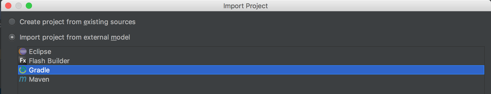

# Introduction To Spring
*Spring is a Web Backend Framework written in Java. We can use it to create rich and powerful Web Applications, with the power of Java.*

## Materials & Resources

### Training

#### HTTP, REST, JSON

| Material | Time |
|:---------|-----:|
|[Basic concepts of web applications, how they work and the HTTP protocol](https://www.youtube.com/watch?v=RsQ1tFLwldY)|7:46|
|[What is HTTP?](https://www.youtube.com/watch?v=SzSXHv8RKdM)|8:43|
|[HTTP request methods](https://www.youtube.com/watch?v=IhKteKvOr7k)|3:46|
|[REST API concepts and examples](https://www.youtube.com/watch?v=7YcW25PHnAA)|TILL 5:47|
|[JSON tutorial: What is JSON?](https://www.youtube.com/watch?v=40aKlrL-2V8)|3:27|

#### Spring

| Material | Time |
|:---------|-----:|
|[What is Spring Boot](https://www.youtube.com/watch?v=99Nw2smMTLg)|2:16|
|[Spring and some of its problems](https://www.youtube.com/watch?v=YXlSkWq04jk)|6:08|
|[What Spring Boot gives us](https://www.youtube.com/watch?v=cONbHJ9azvw)|1:53|
|[Creating a Spring Boot project](https://www.youtube.com/watch?v=bDtZvYAT5Sc)|9:52|
|[Starting a Spring Boot application](https://www.youtube.com/watch?v=bDtZvYAT5Sc)|6:07|
|[Spring Boot startup steps](https://www.youtube.com/watch?v=h581CNFdjDc)|3:26|
|[Adding a REST Controller](https://www.youtube.com/watch?v=oRFCeRVWCNE)|7:55|
|[Returning Objects From Controller](https://www.youtube.com/watch?v=gDHSLKmG8ZQ)|7:49|

### Optional

| Material | Time |
|:---------|-----:|
|[REST-JSON](https://www.youtube.com/watch?v=nrGUUXkCbjw)|7:55|
|[Introduction to Servlets](https://www.youtube.com/watch?v=7TOmdDJc14s)|TILL 2:32|
|[Building an Application with Spring Boot](http://spring.io/guides/gs/spring-boot/)|reading ~11 mins|


## Review
- Web Application
- Web server
- Web client
- Protocol
    - HTTP
    - FTP
- Request and response
    - methods: GET, POST, PUT, DELETE...
    - repsonse codes: 200, 400, 404, 500
- Headers
- static and dynamic response
- Spring Boot
    - `@SpringBootApplication`
        - `@Configuration`
        - `@ComponentScan`
        - `@EnableAutoConfiguration`
- `@Controller`
    - `@RestController`
    - `@RequestMapping`
        - value
    - `@ResponseBody`

## Workshops

### Create our first Spring Boot Application
- [Open Start Spring IO site](http://start.spring.io/)


- Use following settings:
  - Generate a Gradle with Spring Boot 1.5.3.
  - Group: com.greenfoxacademy
  - Artifact: springstart
  - Name: springstart
  - Package Name: com.greenfoxacademy.springstart
  - Packaging: jar
  - Java Version: 1.8
  - Language: java
  - Selected Dependencies: Lombok, Web, Thymeleaf, DevTools
- Generate Project
- Extract the downloaded zip to a directory (consider, btw, using the directory where you would like to have the code and not in Download as shown here)

- IntelliJ: Import project


- Use Gradle external model



- Use Auto import, Create directories for empty..., uncheck: Create separate modules per source set >> Finish


- Open build.gradle and remove line: "apply plugin: 'eclipse'"


*if, for any reason you are missing the dependencies, you can enter them in:-


- Open terminal from bottom of the IDE and start Spring boot app container with: `gradlew bootRun` (or `./gradelw bootRun`) command


@K okay?

- Open [localhost:8080](http://localhost:8080) in your webbrowser.  You should get the "Whitelabel Error Page".  This means your application is running.


*Note, to stop your webserver, in the Terminal, press Control-C.*

### HelloWorld
- Go find your generated Application Java file (where your `main` method is)
- Add `@Controller` to the class
- Add a new method called `hello`
    - make it public
    - return a `String` like Hello World!
    - add `@RequestMapping(value="/hello")` and `@ResponseBody` to your method
- Restart the server (Ctrl+C and `bootRun` again)
- Checkout your new fancy HelloWorld web application at http://localhost:8080/hello

### Hello World REST App
- Add "controllers" package to your Spring project.
- Create "Greeting" class with "long id" and "String content" fields. Getter and AllArgsConstructor. (Use Lombok)
- Add "HelloRESTController" class to controllers package and add @RestController annotation to this class.
- Add greeting method and use @RequestMapping annotation.
- Create and pass a Greeting object when it is called.
- Recompile app (use the "Make Project (Ctrl-F9" at the top of your project if you've edited the existing project and are restarting)
- Open [http://localhost:8080/greeting](http://localhost:8080/greeting) in your web browser
- Your output should look like: {"id":1,"content":"Hello, World!"}

### Hello User REST App
- Please improve your previous app to greet you and get the name from url query parameter.
- You should use @RequestParam annotation
- Recompile app
- Open [http://localhost:8080/greeting?name=Your%20name](http://localhost:8080/greeting?name=Your%20name) in your web browser
- Your output should look like: {"id":1,"content":"Hello, Your name!"}

### REST Greet counter app
- Lets improve your previous app to able to count the greet number. (count api calls)
- You should use AtomicLong class.
- Recompile app
- Open [http://localhost:8080/greeting?name=Your%20name](http://localhost:8080/greeting?name=Your%20name) in your web browser
- Your output should looks like: {"id":1,"content":"Hello, Your name!"}
- Then at next call your output should look like: {"id":2,"content":"Hello, Your name!"} and so on...

### Hello World Web App
- Lets create another controller "HelloWebController" to controllers package.
- Add greeting method like:
```java
@RequestMapping("/web/greeting")
    public String greeting(Model model) {
        model.addAttribute("name", " World");
        return "greeting";
    }
```
- Add following HTML template file to "resources/templates/greeting.html"
```html
<!DOCTYPE HTML>
<html xmlns:th="http://www.thymeleaf.org">
<head>
    <title>Getting Started: Serving Web Content</title>
    <meta http-equiv="Content-Type" content="text/html; charset=UTF-8"/>
</head>
<body>
<p th:text="'Hello, ' + ${name} + '!'"/>
</body>
</html>
```
- Recompile app
- Open [http://localhost:8080/web/greeting](http://localhost:8080/web/greeting) in your web browser
- Your output should look like:

```
Hello, World! (It is a web page.)
```


### Web Greet counter app
- Lets do a web app which can count the website load and greet the user as the previous counter task.
- Open [http://localhost:8080/web/greeting?name=Your%20name](http://localhost:8080/web/greeting?name=Your%20name) in your webbrowser
- Your output should look like: Hello, Your name! This site was loaded 3 times since last server start.

### Say Hello to all the world (Web App)
You are very happy and would say hello in different languages

According to previous tasks you should create a webb app which say hello in different languages and this hellos have different font sizes and colors.

- Use the following greetings:
```java
String[] hellos = {"Mirëdita", "Ahalan", "Parev", "Zdravei", "Nei Ho", "Dobrý den", "Ahoj", "Goddag", "Goede dag, Hallo", "Hello", "Saluton", "Hei", "Bonjour",
                "Guten Tag", "Gia'sou", "Aloha", "Shalom", "Namaste", "Namaste", "Jó napot", "Halló", "Helló", "Góðan daginn", "Halo", "Aksunai", "Qanuipit", "Dia dhuit",
                "Salve", "Ciao", "Kon-nichiwa", "An-nyong Ha-se-yo", "Salvëte", "Ni hao", "Dzien' dobry", "Olá", "Bunã ziua", "Zdravstvuyte", "Hola", "Jambo", "Hujambo", "Hej",
                "Sa-wat-dee", "Merhaba", "Selam", "Vitayu", "Xin chào", "Hylo", "Sut Mae", "Sholem Aleychem", "Sawubona"};
```

#Links
- [Parent - Java Spring](../README.md)
- [Next - Thymeleaf](../thymeleaf/README.md)
