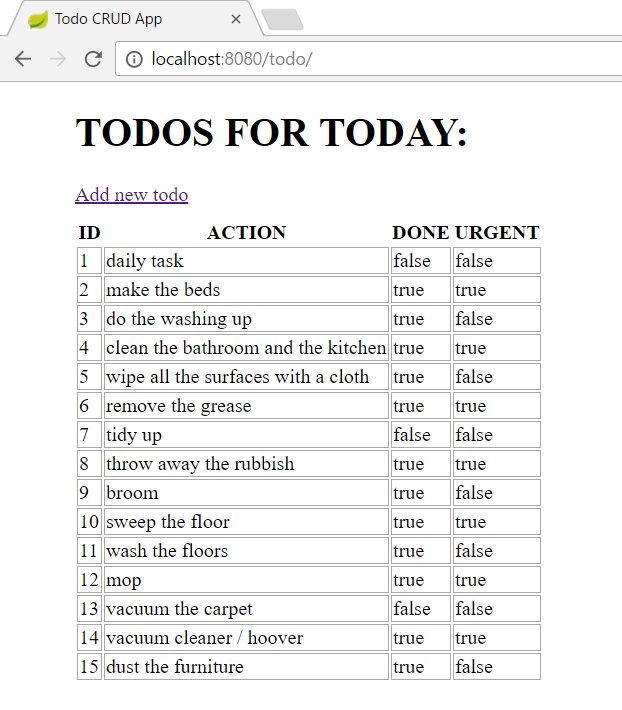
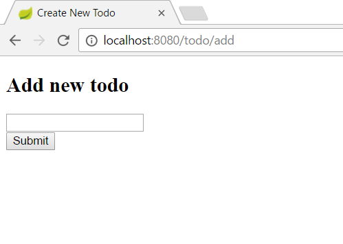

# Workshop04 Add creating function

- Work in the same project
- Extend the project and add a create todo view and method
- You will need two different methods(GET, POST) in controller
- After the user submitted the form and the Todo is saved then redirect to the list page
- Add a link to the `list` page which redirects to the `add todo` page

