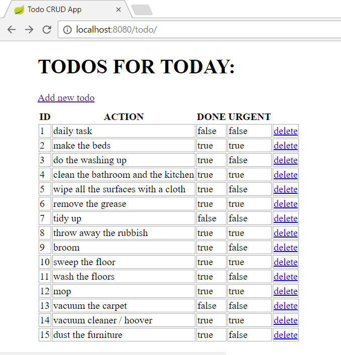

# Workshop05 Add deleting function

- Work on the same project
- Add new column to your view table with a "delete" text
- Make it possible to click on it
- Extend the controller class with `delete()` method mapping to `/{id}/delete`
- The aim is to delete the clicked item
- To do this the clicked item should be specified in the path, so we will need a uniq @PathVariable, which in our case is the `long id` of the todo item
- Use the `delete(id)` method of the repository passing the id in it
- Don't forget to specify the id in the template when you create the 'delete' link
- After the user deleted the item we should be redirected to the list page

