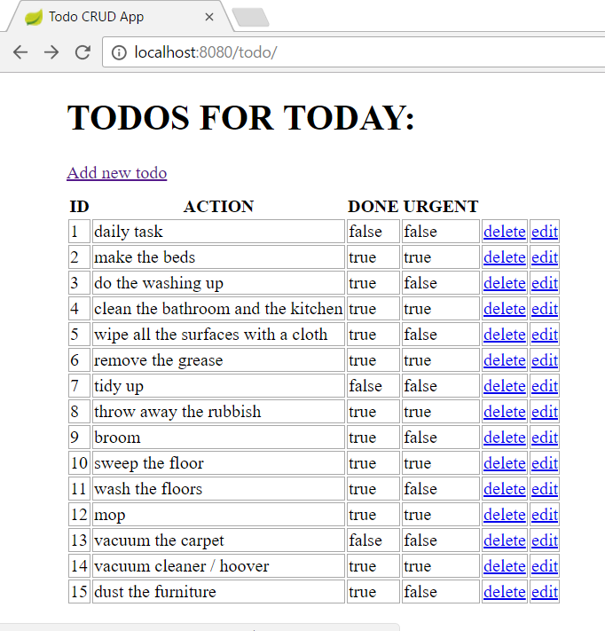

# Workshop06 Add updating function

- Work on the same project
- Add new column to your view table with "edit" text
- Make it possible to click on it
- Extend the controller class with two different methods (GET, POST) mapping to `/{id}/edit`
- The aim is to edit the clicked item on a redirected editing page
- The edit page should be a simple form
- The user should be able to edit the name of the todo item, and the status of urgent and done
- Then the new object should be passed back and saved with the repository
- You should think about the process like `find(the)One` object, setting its new data and `saving` to the repository, hence POST-ing it
To make it simple the 2 methods should look like:
  ```java
  @GetMapping(value = "/{id}/edit")
    public String edit(@PathVariable long id,
                       Model model) {
        //
        return //;
    }

    @PostMapping(value = "/{id}/edit")
    public String update(@PathVariable long id, @RequestParam("title") String title,
                         @RequestParam("isDone") boolean isDone, @RequestParam("isUrgent") boolean isUrgent) {
        //
        //
        ...
        //
        return //;
    }
    ```
- Don't forget to specify the id in the template when you create the 'edit' link
- After the user edited the item the list page should be returned


