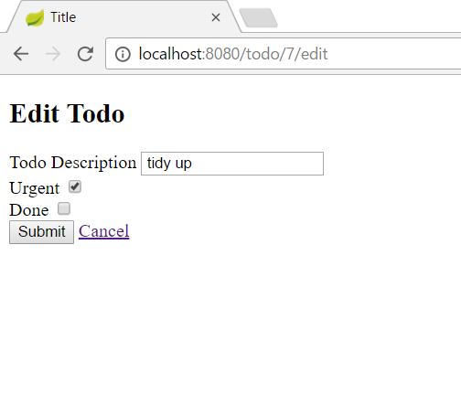

# Add updating function

- Work on the same project
- Add new column to your view table with "edit" text
- Make it possible to click on it
- Extend the controller class with two different methods (GET, POST) mapping to `/{id}/edit`
- The aim is to edit the clicked item on a redirected editing page
- The edit page should be a simple form
- The user should be able to edit the name of the todo item, and the status of urgent and done
- Then the new object should be passed back and saved with the repository
- One method should GET the object and send to view page to set it's properties
- The other method should POST it to the database. Here you should think about the process like `find(the)One` object, set its new data and `save` (POST) to the repository
- Don't forget to specify the id in the template when you create the 'edit' link
- After the user edited the item the list page should return

