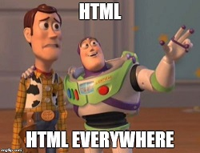

# Thymeleaf, Models, Views
*Thymeleaf is a modern server-side Java template engine for both web and standalone environments.*

## Materials & Resources

### Training
| Material | Time |
|:-------- |-----:|
| [Spring MVC with Thymeleaf](https://www.youtube.com/watch?v=2LqQwjGRx_A)| 6:58 |
| [Rapid Introduction to the essentials](https://medium.com/@trevormydata/week-5-thymeleaf-with-spring-mvc-rapid-introduction-to-the-essentials-799f1fba8c07)| Text |
| [Getting started with the Standard dialects in 5 minutes](http://www.thymeleaf.org/doc/articles/standarddialect5minutes.html)| Text |
| [Introduction to Using Thymeleaf in Spring](http://www.baeldung.com/thymeleaf-in-spring-mvc)| Text |
| [Spring MVC with Thymeleaf](https://www.youtube.com/watch?v=2LqQwjGRx_A)| 6:58 |
| [Spring Boot - 007 Thymeleaf Demo](https://www.youtube.com/watch?v=IDOblyh4RBA)| 19:52 |
| [Introduction to Thymeleaf (Broadleaf)](https://www.youtube.com/watch?v=GNteuJDo1KA&t=374) - focus on the section "Introduction to Thymeleaf", you can keep watching the "Intermediate" Chapter, but this is just to get the basic concepts (@27m00).| 38:00 |
| [Handling Form Submission](https://spring.io/guides/gs/handling-form-submission/) | Text |
| [Spring RequestMapping](http://www.baeldung.com/spring-requestmapping) | Text |
| [Spring ModelAttribue](http://www.baeldung.com/spring-mvc-and-the-modelattribute-annotation)| Text |

### Optional
| Material | Time |
|:-------- |-----:|
| [Spring Forms with Thymeleaf](http://www.thymeleaf.org/doc/tutorials/2.1/thymeleafspring.html#creating-a-form) | Text |
| [Thymeleaf in a nutshell](https://blog.zenika.com/2013/01/18/introducing-the-thymeleaf-template-engine/)| Text |
| [Using Thymeleaf (From Paragraph 3 to 7)](http://www.thymeleaf.org/doc/tutorials/2.1/usingthymeleaf.html) | Text |

## Material Review
- `@Controller`
  - `@RequestMapping`
  - `@RequestParam`
    - required
  - `@PathVariable`
  - `@ModelAttribute`
- Model
- View
- `xmlns:th="http://www.thymeleaf.org"`

HTML 
- Insertions
- `${...}` : Variable expressions.
  - `${session.user.name}` = OGNL (Open Graph Notation Language)
- `*{...}` : Selection expressions - used to replace one item for another, eg. a parent
- `#{...}` : Message (i18n) expressions - found in the properties file - *not critical for course*
- `@{...}` : Link (URL) expressions.
- `~{...}` : Fragment expressions. - *not critical for course*

- Extensions
  - `th:text` - will replace the text
  - `th:attrib` 
  - `th:utext`
  - `th:each` - `<li th:each= "book : ${books}>" iterating book which can be used beneath, for each item in the list books
  - `th:insert`
  - `th:replace`
  - `th:with`
  - `th:unless`

- Operators
  - use of `?`
    - to supply a default value ( `(value) ?: (defaultvalue)`)
	- for if then (`(if) ? (then)`)
	- for ternary (`(if) ? (then) : (else)`)
  - `__` - preprocessor - eg `#{selection.__${sel.code}__}` where `{sel.code}` = "ALL" becomes `#{select.ALL}` before evaluating