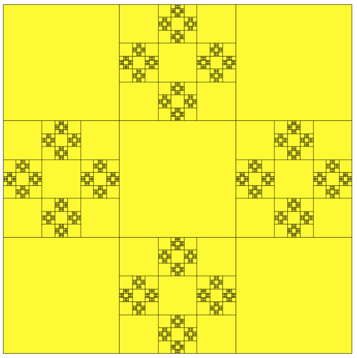

# Recursion
What happens when a function calls itself?

## Materials & Resources
| Material | Time |
|:---------|-----:|
| [How Recursion Works](https://www.youtube.com/watch?v=ozmE8G6YKww) | 11:40 |
| [Algorithms: Recursion](https://www.youtube.com/watch?v=KEEKn7Me-ms)| 5:40 |
| [Java Recursion](https://www.youtube.com/watch?v=neuDuf_i8Sg)| 14:11 |
| [Fractals](https://www.youtube.com/watch?v=WFtTdf3I6Ug) | |
| [Green Fox Teaching Materials on Recursion](java.md) | ∞ |


### Optional
*If you've got time and/or want to dig deeper, consider the following:*

| Material | Time |
|:---------|-----:|
|[Hanoi-tower](https://www.youtube.com/watch?v=5_6nsViVM00)| 7:18 |
| [Benoit BM Mandelbrot: Fractals and the art of roughness](https://www.ted.com/talks/benoit_mandelbrot_fractals_the_art_of_roughness?language=en) | 17:09 |


## Material Review
 - recursion
 - base case

## Workshop


### Factorial with loop

```java
public static int factorialWithLoop(int n) {
  int factorial = 1;
  for (int i = 1; i  < n + 1; i++) {
    factorial *= i;
  }
  return factorial;
}
```


### Factorial with recursion

```java
public static int factorialWithRecursion(int n) {
  if (n == 1) {
    return 1;
  } else {
    return n * factorialWithRecursion(n - 1);
  }
}
```

### Exercises

 - [01 Counter](counter/Counter.java)
 - [02 Numberadder](numberadder/Numberadder.java)
 - [03 Sumdigit](sumdigit/Sumdigit.java)
 - [04 Power](power/Power.java)
 - [05 Bunnies](bunnies/Bunny1.java)
 - [06 Bunnies again](bunnies2/Bunny2.java)
 - [07 Strings](strings/String1.java)
 - [08 Strings again](strings2/String2.java)
 - [09 Strings again and again](strings3/String3.java)
 - [10 Fibonacci](fibonacci/Fibonacci.java)
 - 11: reproduce this:   

 - 12: reproduce this:   

