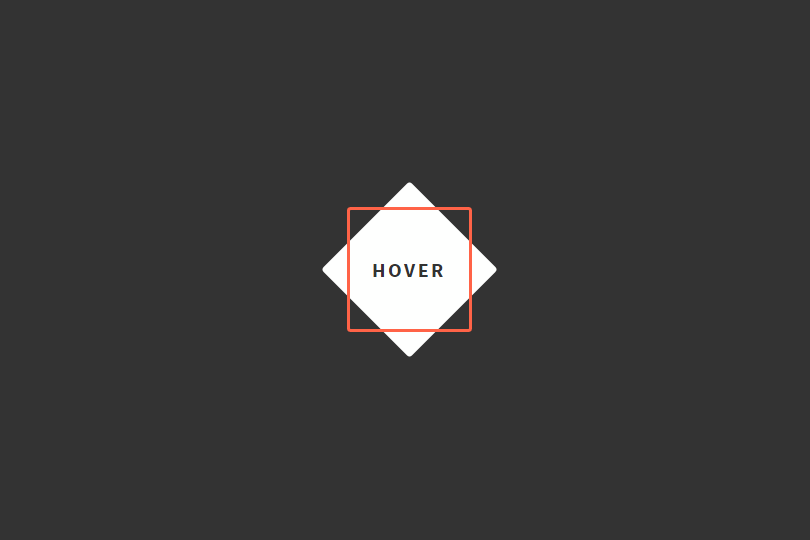

# CSS Animation

## Materials
| Material | Time |
|:---------|-----:|
| [CSS Animation Tutorial #1 - Introduction](https://www.youtube.com/watch?v=jgw82b5Y2MU) | 3:45 |
| [CSS Animation Tutorial #2 - Transforms](https://www.youtube.com/watch?v=PH35-BDak0M) | 10:19 |
| [CSS Animation Tutorial #3 - Transitions](https://www.youtube.com/watch?v=oYlJR4Le228 ) | 7:30 |

### Optional
| Material | Time |
|:---------|-----:|
| [CSS Animation Tutorial #4 - Keyframes](https://www.youtube.com/watch?v=jgw82b5Y2MU) | 6:07 |

## Material Review
- transform, rotate, scale, translate
- transition, transitionable properties, timing-function

## Workshop
### Exercise: Hover button

- Build this button, make it animate on hover

## Individual Workshop Review
Please follow the styleguide: [Our HTML & CSS styleguide](../../styleguide/html-css.md)

- What HTML element did you use for the button and why?
- Are you sure you don't have unnecessary duplications in your code?
