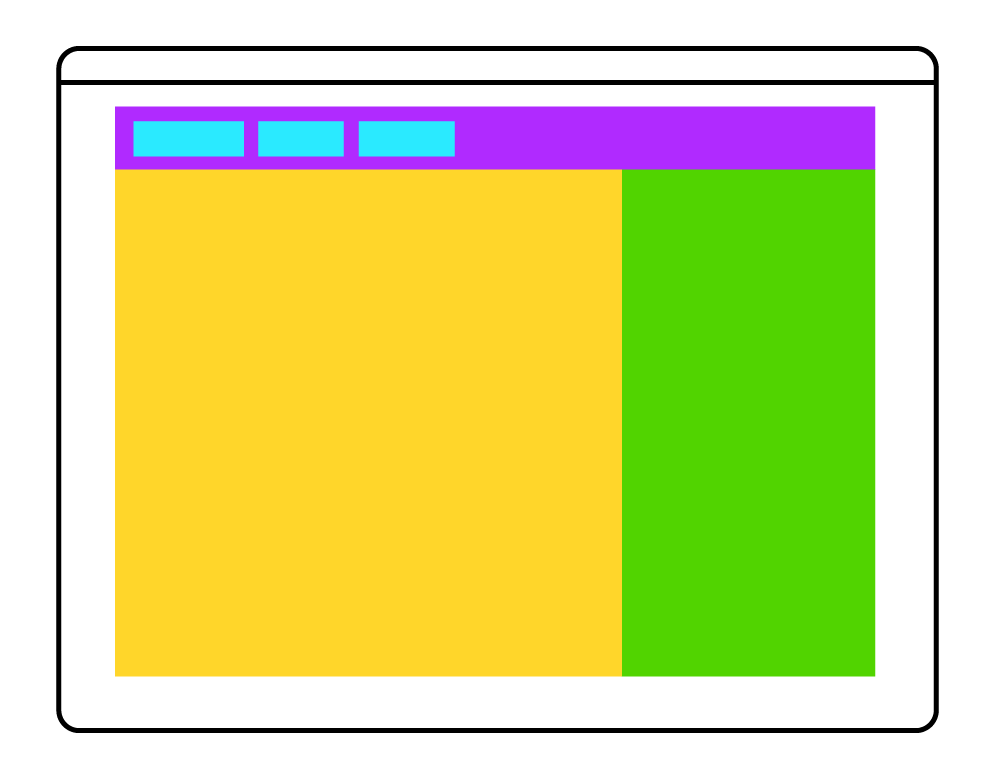

# CSS Layout
Practice layout and positioning with CSS

## Objectives
- Understand the box model
- Learn about css positioning
- Get to know flexbox

## Materials & Resources
| Material | Time |
|:---------|-----:|
| [Box-sizing article](https://css-tricks.com/box-sizing/) |  |
| CSS positioning |  |
| [1 - Positioning Introduction](https://www.youtube.com/watch?v=7ZXsPj43heo&index=1&list=PL4cUxeGkcC9hudKGi5o5UiWuTAGbxiLTh) | 2:17 |
| [2 - Box Model Review](https://www.youtube.com/watch?v=d601NaSSqSE&list=PL4cUxeGkcC9hudKGi5o5UiWuTAGbxiLTh&index=2) | 5:57 |
| [3 - Normal Document Flow](https://www.youtube.com/watch?v=l8NH6YppJFA&list=PL4cUxeGkcC9hudKGi5o5UiWuTAGbxiLTh&index=3) | 3:05 |
| [4 - Floating Elements](https://www.youtube.com/watch?v=VwxGKpvW8Zk&list=PL4cUxeGkcC9hudKGi5o5UiWuTAGbxiLTh&index=4) | 10:12 |  
| [5 - Clearing Floats](https://www.youtube.com/watch?v=nE9lIRbIfI0&list=PL4cUxeGkcC9hudKGi5o5UiWuTAGbxiLTh&index=5) | 8:50 |  
| [6 - Floating Columns](https://www.youtube.com/watch?v=bJJ7jgfSvZY&index=6&list=PL4cUxeGkcC9hudKGi5o5UiWuTAGbxiLTh) | 5:06 |  
| [7 - Text Columns](https://www.youtube.com/watch?v=W77geg_3B5o&index=7&list=PL4cUxeGkcC9hudKGi5o5UiWuTAGbxiLTh) | 3:44 |  
| [8 - Position Relative](https://www.youtube.com/watch?v=YBJqKWXL2vg&index=8&list=PL4cUxeGkcC9hudKGi5o5UiWuTAGbxiLTh) | 4:57 |  
| [9 - Absolute Position](https://www.youtube.com/watch?v=2JMGG_8T-vY&list=PL4cUxeGkcC9hudKGi5o5UiWuTAGbxiLTh&index=9) | 5:21 |  
| [10 - Fixed Position](https://www.youtube.com/watch?v=8fQWx-d5qc8&index=10&list=PL4cUxeGkcC9hudKGi5o5UiWuTAGbxiLTh) | 4:34 |  
| [11 - Z - Index & Stacking Order](https://www.youtube.com/watch?v=k4taTzkhzHc&index=11&list=PL4cUxeGkcC9hudKGi5o5UiWuTAGbxiLTh) | 8:31 |  
| [12 - Clipping Content](https://www.youtube.com/watch?v=ED1mhlAVAGU&list=PL4cUxeGkcC9hudKGi5o5UiWuTAGbxiLTh&index=12) | 8:31 |  
| [CSS flex-box playlist](https://www.youtube.com/playlist?list=PL4cUxeGkcC9i3FXJSUfmsNOx8E7u6UuhG) |  |

### Optional
*If you've got time and/or want to dig deeper, consider the following:*

| Material | Time |
|:---------|-----:|
| [All about floats](https://css-tricks.com/all-about-floats/) |  |
| [CSS positioning 101](http://alistapart.com/article/css-positioning-101) |  |
| [CSS positioning screencast](http://www.barelyfitz.com/screencast/html-training/css/positioning/) |  |

## Material Review
- box sizing
- display:
  - block
  - inline
  - inline-block
  - none
- float
- clear
- after, before
- clearfix
- vendor prefix
- position:
  - static
  - relative
  - absolute
  - fixed
- z-index
- flex-box
  - purpose
  - orientation
  - positioning
- overflow

## Workshop
Build these simple layouts in HTML and CSS

- Create each in its own, separate directory
- Try to use the most simple selector when selecting an element
- Try to avoid duplicating code
- Use paint, gimp, irfanview or something similar to figure out the sizes and colors
- You can use any lorem ipsum generator for the texts, *it is not necessary to have the same text*

- Duck: 

### Bookmarks
- https://css-tricks.com/snippets/css/a-guide-to-flexbox/
- http://yoksel.github.io/flex-cheatsheet/

### Flexbox

#### Exercise 1.1.

#### Exercise 1.2.

#### Exercise 1.3.

#### Exercise 1.4.

#### Exercise 1.5.

#### Exercise 1.6.

#### Exercise 1.7.

#### Exercise 1.8.

### Layouts

#### Exercise 2

 - It should be centered on the page.
 - It should have fixed width.
 - Consider the roles of the boxes:
   - Aqua (light blue): Header
   - Orange: Left sidebar (not main content)
   - Red: Main Content
   - Black: Fixed content on the bottom right of the Main content
   - Purple: Right sidebar (not main content)
   - Blue: Footer

#### Exercise 3

 - It should be wall to wall with fluid width.
 - The sidebars should have fixed with.

#### Exercise 2.1

#### Exercise 2.2

#### Exercise 2.3

#### Exercise 2.4

#### Exercise 4

 - You can reuse the 1st exercise as background

#### Exercise 5

 - Pay attention to the spacing, it will help you eventually
 - The middle rectangle is intentionally off placed
 - Try different approaches to center text in the rectangles

#### Exercise 6

 - Header should be fixed at the top
 - Use a class to highlight the active state in the navigation

## Individual Workshop Review
Please follow the styleguide: [Our HTML & CSS styleguide](../../styleguide/html-css.md)

- Did you create a separate directory for each exercise?
- How complex are your CSS selectors? Can you write a shorter one that still works?
- Are you sure you don't have unnecessary duplications in your code?
