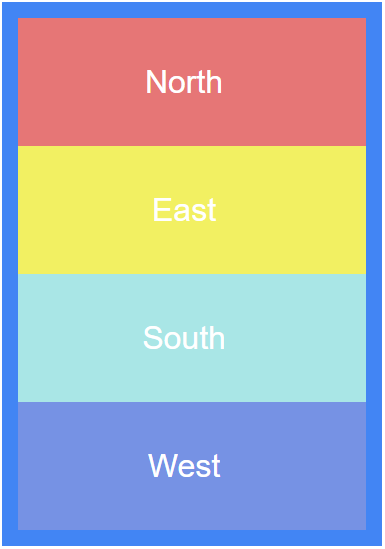
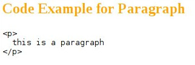
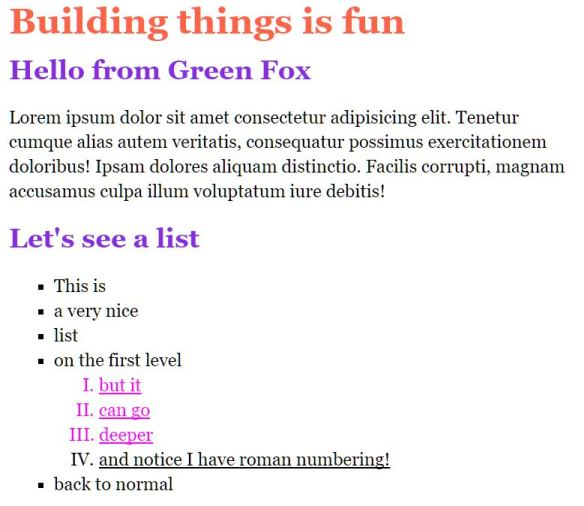

# Sitebuild basics

## Materials & Resources
### Training

#### CSS
| Material | Time |
|:---------|-----:|
| [CSS Tutorial For Beginners 07 - CSS Comments and Where to Use Them](https://www.youtube.com/watch?v=qfpo_XsM0hM) | 4:40
| [CSS Tutorial For Beginners 16 - Child Selectors](https://www.youtube.com/watch?v=MlJrAhGVIis) | 3:45 |
| [CSS Tutorial For Beginners 17 - Adjacent Selectors](https://www.youtube.com/watch?v=K92X4yyyfNY) | 4:20 |
| [CSS Tutorial For Beginners 18 - Attribute Selectors](https://www.youtube.com/watch?v=GVocONem9lw) | 10:38 |
| [CSS Tutorial For Beginners 19 - Pseudo Selectors](https://www.youtube.com/watch?v=SlqUbzvuqDg) | 5:38 |
| [CSS Tutorial For Beginners 20 - Hover, Active & Visited Effects](https://www.youtube.com/watch?v=XT2PFpOyDzY) | 4:17 |
| [CSS Tutorial For Beginners 21 - First & Last Child Selectors](https://www.youtube.com/watch?v=UxHFB5_CSXc) | 5:31 |
| [CSS Tutorial For Beginners 22 - First & Last of Type Selectors](https://www.youtube.com/watch?v=7eVUWLv6gz4) | 3:53 |
| [CSS Tutorial For Beginners 23 - nth Child Selectors](https://www.youtube.com/watch?v=TVj1avJj8a8) | 8:11 |
| [CSS Tutorial For Beginners 24 - nth of Type Selectors](https://www.youtube.com/watch?v=E45xQZTgaUI) | 5:42 |
| [CSS Tutorial For Beginners 25 - Combining Selectors](https://www.youtube.com/watch?v=rK54iCKi6TE) | 3:59 |
| [CSS Tutorial For Beginners 26 - The Universal Selector](https://www.youtube.com/watch?v=EO4ToIX-ZQk) | 7:14 |
| [CSS Tutorial For Beginners 27 - Font Size](https://www.youtube.com/watch?v=799zrGVpfA8) | 7:59 |
| [CSS Tutorial For Beginners 28 - Font Family](https://www.youtube.com/watch?v=v2o8LJWnoxI) | 5:26 |
| [CSS Tutorial For Beginners 29 - Text Decoration](https://www.youtube.com/watch?v=dm54To0EOpw) | 4:51 |
| [CSS Tutorial For Beginners 30 - Font Weight](https://www.youtube.com/watch?v=qeh4UeaGTnc) | 8:14 |
| [CSS Tutorial For Beginners 31 - Text Transform](https://www.youtube.com/watch?v=j0FS2hCoIjs) | 5:00 |
| [CSS Tutorial For Beginners 32 - Text Colour](https://www.youtube.com/watch?v=QzKu1qG4p5A) | 5:32 |
| [CSS Tutorial For Beginners 33 - Styling Links](https://www.youtube.com/watch?v=w_1pQGfrHT8) | 4:35 |
| [CSS Tutorial For Beginners 34 - Letter Spacing & Line Height](https://www.youtube.com/watch?v=4Gyd8hbrcBk) | 9:04 |
| [CSS Tutorial For Beginners 35 - Paragraph Spacing](https://www.youtube.com/watch?v=DdcD9otFk4A) | 3:46 |
| [CSS Tutorial For Beginners 39 - Padding & Margin Long-hand](https://www.youtube.com/watch?v=0Sm7MkZXT-8) | 3:57 |
| [CSS Tutorial For Beginners 41 - Block-level Elements](https://www.youtube.com/watch?v=HuiPIK-0-_A) | 11:08 |
| [CSS Tutorial For Beginners 42 - Width & Height](https://www.youtube.com/watch?v=b9lWNg8lwW4) | 6:26 |
| [CSS Tutorial For Beginners 43 - Rounded Corners](https://www.youtube.com/watch?v=7WPgQVMayWI) | 7:20 |
| [CSS Tutorial For Beginners 45 - Background Shorthand](https://www.youtube.com/watch?v=0CkSJVl_g00) | 4:01 |
| [CSS Tutorial For Beginners 46 - Multiple Backgrounds](https://www.youtube.com/watch?v=Sj7Hs94uZjE) | 4:58 |

## Assignment Review
 - Multiple elements selector
 - Combine selectors
 - Universal selector
 - Attribute selector
 - Child selector
 - Adjacent selector
 - Pseudo selector
 - first-child, last-child, nth-child, nth-type
 - font-size
 - font-family
 - text-decoration
 - font-weight
 - text-transform
 - block element
 - inline element
 - inline-block
 - comments

## Workshop
 In the sections that follow are a list of Exercises for you to build using simple layouts in HTML and CSS.

 - Create each in its own, separate HTML file
 - Try to use the most simple method when selecting the element, use `class` or `id` only when needed
 - Try to avoid duplicating code
 - Use paint, gimp, irfanview or something similar to figure out the sizes and colors
 - You can use any lorem ipsum generator for the texts, *it is not necessary to have the same text*

### Exercise 1


Font size: 36 pixels

### Exercise 2


Font size: 36 pixels

### Exercise 3


Font size: 36 pixels

### Exercise 4


### Exercise 5


Do NOT use classes!

### Exercise 6


Font size: 18 pixels

### Exercise 7
Given the following HTML structure:
```HTML
<div class="container">
  <div id="b325" class="asteroid">The King</div>
  <div class="asteroid b326">The Conceited Man</div>
</div>
<p class="asteroid big">The Businessman</p>
<div class="asteroid b329 big">The Lamplighter</div>
```

- make 'The Businessman' and 'The Lamplighter' blue colored
- add 'The King' and 'The Conceited Man' a 1 pixel wide green border each
- make 'The King', 'The Conceited Man' and 'The Lamplighter' bold
- add 'The Businessman' a yellow background

for each task, figure out the simplest selector possible.   
the result should look like this:


### Exercise 8


### Exercise 9
 

 Try to change the color of the blocks when the mouse is over it.

 Font size: 18 pixels

### Exercise 10
 

 Font size: 16 pixels, Font family: courier

 Artwork: [grab the duck](duck.png)

 Don't resize the image with an external tool, use CSS

 
## Individual Workshop Review
 Please follow the styleguide: [Our HTML & CSS styleguide](../../../styleguide/html-css.md)

  - Is the directory structure and the name of the files correct?
  - Is the doctype present and valid?
  - Is the semantic structuring good in the html file?
  - Are the color codes valid?
  - Is there unnecessary code duplication?
  - Is the indentation good in each file?
  - Are the attributes valid on each tag?
  - Are there unnecessary code or empty selectors?
  - Are the `<ul>` and `<li>` elements valid?
  - Are there id duplications?
  - The code should not show errors here: https://validator.w3.org/
  - Is the commit message meaningful?
